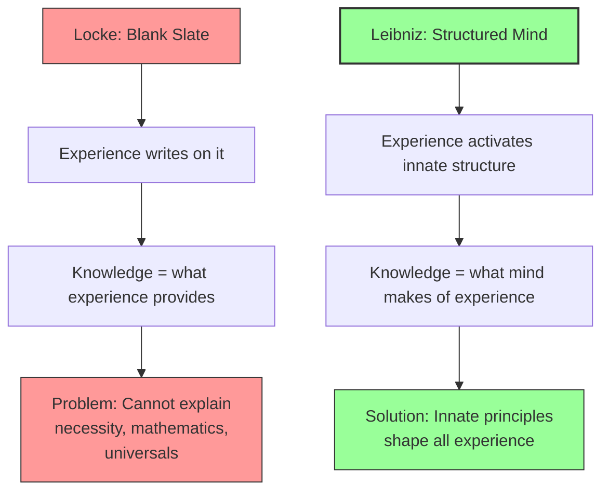

# Module 05 — Leibniz: Monads, Harmony, and the Unconscious

*Module 5 of 9 — Chapter 8: Rationalism: The Geometry of the Mind*

---

In 1704, the same year that John Locke died, Gottfried Wilhelm von Leibniz completed a manuscript that would not be published for another sixty-one years. The *New Essays on the Understanding* was a direct, point-by-point rebuttal of Locke'"'"'s *Essay Concerning Human Understanding* — a work that Leibniz had been drafting since 1688, when Locke'"'"'s *Essay* first came to his attention. He refused to publish it during Locke'"'"'s lifetime, unwilling to argue with a ghost. But the arguments it contained — against the blank slate, against the primacy of experience, against the reduction of mind to matter — would prove as durable as any in the history of philosophy. And Leibniz'"'"'s positive vision — a universe composed of infinitely many unique substances, each reflecting the whole from its own perspective — would introduce concepts that psychology would not fully appreciate for two centuries.

---

## Nothing Except the Intellect Itself

Locke had begun Book II of his *Essay* with the central claim of all empiricists:

> "Suppose the mind to be, as we say, white paper, void of all characters, without any ideas; how comes it to be furnished? Whence comes it by that vast store, which the busy and boundless fancy of man has painted on it with an almost endless variety? Whence has it all the materials of reason and knowledge? To this I answer, in one word, from experience."

Leibniz'"'"'s reply is the rationalist response in its purest form: only something that *already has* an experience can be said to *have* an experience, and such a thing must be a mind somehow prepared to have experiences of a given sort. He identifies Locke'"'"'s position with Aristotle'"'"'s, and attributes to Aristotle a statement: "Nothing is in the intellect which was not first in the senses." To this Leibniz replies: **"Nothing except the intellect itself."**

This is the core of the rationalist challenge. Experience is necessary, Leibniz admits, "in order that the soul be determined to such or such thoughts, and in order that it take notice of the ideas which are in us." But experience cannot *produce* ideas, for the simple reason that experience involves the physical confrontation of matter and the organs of sense, and an idea has nothing to do with these mechanical transactions.

> [!TIP]
> **Stop and Think:** Imagine a computer that has never been programmed. You can feed it data (experience), but without software (innate structure), it cannot process that data into anything meaningful. Leibniz'"'"'s argument is analogous: the mind must have innate structure before experience can furnish it with content. Is this a good analogy? Or does it beg the question by assuming the mind works like a computer?

## The Tabula Rasa as Fiction

In the *New Essays*, Leibniz has his rationalist character, Theophilus, respond to the empiricist Philalethes (who represents Locke):

> "This tabula rasa, of which so much is said, is in my opinion only a fiction which nature does not admit.... Uniform things and those which contain no variety are never anything but abstractions, like time, space, and other entities of pure mathematics. There is no body whatever whose parts are at rest, and there is no substance whatever that has nothing by which to distinguish it from every other."

The mind is not a blank slate. It is an active, structured, differentiated substance — already furnished with principles and dispositions that determine how experience will be processed. Experience provides the *content*; the mind provides the *form*.

*Figure 5.1: The blank slate vs. the structured mind — Leibniz argues that experience alone cannot explain the richness of human knowledge.*

> [!TIP]
> **Stop and Think:** Imagine a computer that has never been programmed. You can feed it data, but without software it cannot process data into meaning. Leibniz argues the mind must have innate structure before experience can furnish content. Is this a good analogy?

## Monads: The Atoms of Reality

Leibniz'"'"'s positive vision of reality is built on the concept of the **monad** — a simple substance that is the fundamental unit of existence. Monads are dimensionless, not subject to modification from without, and each one is unique. "No two simple substances are alike. Each monad not only has a distinguishing quality but is the very 'unit' of quality."

The monad has no window through which an external agency might enter and change it. It is self-contained, self-sufficient, and eternal. Body as it is perceived is a composite whose extension arises from the assembly of simple substances. The limit of the body is also a simple substance — a monad.

This vision eliminates the mind-body problem that had plagued Descartes. Since each monad is unique, independent, and ultimately unextended, it makes no sense to speculate on the kind of interaction taking place between "mind" and "body." Each, properly conceived, is unique and independent. Body and mind coexist, and the relation between them is not causal but **harmonic**.

> [!TIP]
> **Stop and Think:** Leibniz'"'"'s monads are like the ultimate atoms of reality — but they are not physical atoms. They are *qualitative* units, each one unique and self-contained. Is this a scientific theory or a metaphysical fantasy? Modern physics has its own "atoms of reality" — quarks, leptons, fields. Are Leibniz'"'"'s monads really so different?

## Pre-Established Harmony

If monads have no windows — if nothing external can enter or change them — then how do mind and body appear to interact? Leibniz'"'"'s answer is **pre-established harmony**: the universe is a collection of simple substances for which harmonic associations were established prior to their coming into being.

His analogy is elegant: if a note is loudly sounded in the presence of two resonators, we do not ask which resonator established the sympathetic vibrations in the other. The two resonate in parallel as a result of being so constituted that, in the presence of the proper stimulus, each satisfies the conditions of its nature. So too with mind and body. Each, according to a pre-established harmony, exists compatibly with the other.

This is not occasionalism — the doctrine that God constantly intervenes to keep mind and body in sync. Nor is it interactionism — the doctrine that mind and body causally affect each other. It is harmony — a coordination built into the structure of reality itself.

## Perception, Apperception, and the Unconscious

The monad whose internal principle allows both memory and perception may be called a **soul**. Animals have souls — they can perceive and retain the trace of former, consecutive perceptions. But they do not have rational souls (minds), because they are unaware of necessary truths.

Leibniz introduces a crucial distinction between **perception** and **apperception** (consciousness). Perception is the internal state of the monad — its awareness of its own contents. Apperception is the awareness *that* we are aware — reflective consciousness. Every monad has perception, but not every monad has apperception.

Even in dreamless sleep, the monad does not perish and, therefore, perception takes place. However, we are not aware of this perception because it is not accompanied by memory. A number of unconscious perceptions, stored in the mind, can add up in such a way as to break into consciousness. "The present is big with the future and laden with the past."

> [!TIP]
> **Stop and Think:** Leibniz introduced the concept of the **unconscious** more than a century before Freud. He argued that we retain all that has happened to us, even though we might not be actively aware of much of it. Is this the same as Freud'"'"'s unconscious? Or is it something different — a perceptual unconscious rather than a motivational one?

> [!TIP]
> **Stop and Think:** Walk through the great mill of the mind and you find nothing by which the mill could have a perception. This is the modern hard problem of consciousness. Did Leibniz solve it, or merely state it?

## Leibniz'"'"'s Mill

Leibniz'"'"'s most famous argument against materialism is the **mill analogy**:

> "Moreover, it must be confessed that perception and that which depends upon it are inexplicable on mechanical grounds.... And supposing there were a machine, so constructed as to think, feel, and have perception; it might be conceived as increased in size, while keeping the same proportions, so that one might go into it as into a mill. That being so, we should, on examining its interior, find only parts which work one upon another, and never anything by which to explain a perception."

Walk through the great mill of the mind, observing the spinning wheels and crashing hammers, and you find nothing by which the mill could have a perception. The materialist can describe the mechanism in infinite detail and still not explain *why there is something it is like* to be that mechanism. This is, in essence, the modern "hard problem of consciousness" — and Leibniz stated it with extraordinary clarity three centuries ago.

## Speaking of Leibniz...

- The concept of "muscle memory" — the idea that your body "remembers" how to ride a bike even when your conscious mind has forgotten — is a Leibnizian phenomenon: perception and memory operating below the threshold of consciousness.
- When you walk into a room and immediately feel "something is off" without being able to articulate what, you may be experiencing what Leibniz called *petites perceptions* — tiny perceptions that influence consciousness without entering it.
- The modern debate about whether artificial intelligence can be conscious echoes Leibniz'"'"'s mill argument: can any amount of information processing produce genuine *experience*?

---

Leibniz had introduced the unconscious, challenged the blank slate, and proposed a universe of infinitely many unique substances reflecting the whole from their own perspectives. But neither his system nor those of Descartes and Spinoza had adequately answered the challenge posed by David Hume — the challenge that causation is a habit, necessity is an illusion, and reason itself is a product of experience. It would take Immanuel Kant, the greatest philosopher of the eighteenth century, to formulate what he called his "answer to Hume."

---

## References

- Robinson, D. N. (1995). *An Intellectual History of Psychology* (3rd ed.). University of Wisconsin Press. Chapter 8.
- Leibniz, G. W. (1714/1898). *The Monadology*. In *Leibniz — The Monadology and Other Philosophical Writings* (R. Latta, Trans.). Oxford University Press.
- Leibniz, G. W. (1765/1898). *New Essays on the Understanding*. In *Leibniz — The Monadology and Other Philosophical Writings* (R. Latta, Trans.). Oxford University Press.

---

*Module 5 of 9 — Chapter 8: Rationalism: The Geometry of the Mind*
