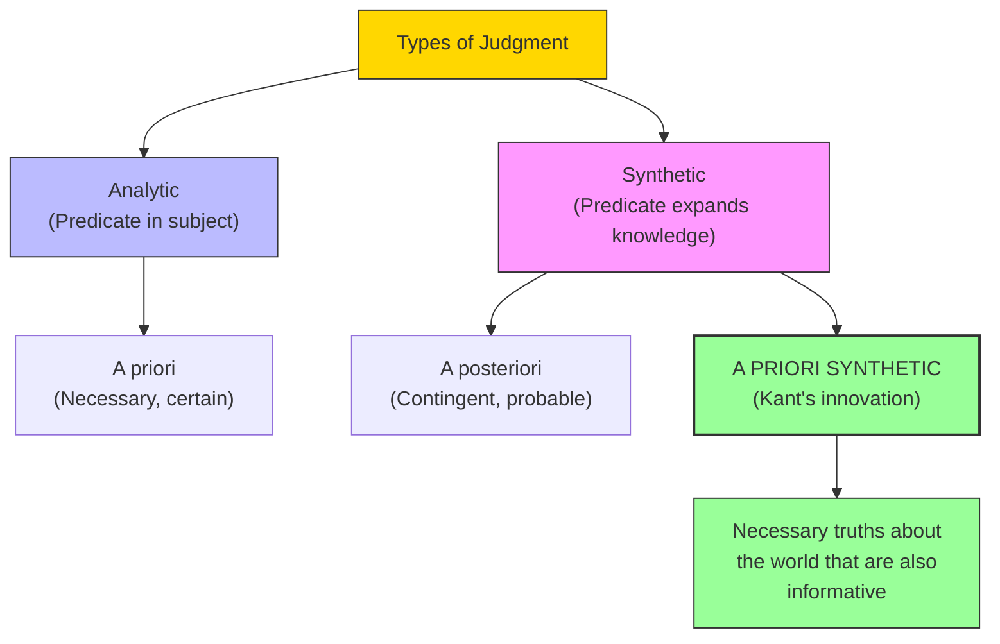

# Module 06 — Kant's Awakening: The Problem Hume Posed

*Module 6 of 9 — Chapter 8: Rationalism: The Geometry of the Mind*

---

In the late 1760s, a professor of logic and metaphysics at the University of Königsberg in Prussia read a work that, by his own account, "interrupted my dogmatic slumber." The work was David Hume's *Treatise of Human Nature*, and the professor was Immanuel Kant. Hume had argued that causation is merely a habit of the mind, that necessity is an illusion, and that moral distinctions are grounded in feeling rather than reason. If Hume was right, then the entire rationalist tradition — from Descartes through Leibniz — was built on sand. Kant set out to prove that Hume was both right and wrong: right that experience alone cannot yield necessity, but wrong that necessity is therefore an illusion. The answer, Kant believed, lay in the structure of the mind itself.

---

> [!TIP]
> **Stop and Think:** Hume argued we never perceive causation itself — only constant conjunction. You see lightning, then thunder, a thousand times. But you never see the force connecting them. If true, what happens to the idea of natural law?

## The Position Hume Left Behind

Hume's *Treatise* had stripped natural science of "must" and moral science of "ought." It denied that necessity could be proved to exist in nature. It denied that logic confirms such necessity and that the senses ever perceive it. It affirmed the existence of subjective necessity as a habit of the mind — we judge B to be the effect of A when the two occur together, always in an invariant order.

The position was devastating: "In a word, the Treatise removed moral precepts from the domain of the rationally deducible, removed necessity from the domain of cause and effect, and removed reason itself from the domain in which we locate the determinants of knowledge, feeling, and conduct."

If we are to appreciate the lasting contribution Kant made to psychology, we begin by examining the question: What was Kant's answer to Hume?

> [!TIP]
> **Stop and Think:** Hume argued that we never perceive *causation* itself — only the constant conjunction of events. You see the lightning, then you hear the thunder. You see it a thousand times. But you never see the *force* that connects them. If this is true, what happens to science? What happens to the very idea of natural law?

## Analytic vs. Synthetic Judgments

All the major philosophers of the eighteenth century recognized a distinction between two types of propositions. **Analytic propositions** are those in which the predicate is contained in the concept of the subject: "A body is an extended substance." The predicate (extended substance) adds nothing new; it merely unpacks what is already contained in the concept of "body."

**Synthetic propositions** are those whose predicates are not logically implied by their subjects: "All bodies are heavy." Being a body does not logically entail being heavy — this is a claim that expands our factual knowledge.

The empiricists — Locke, Berkeley, and Hume — all agreed that analytic propositions are (a) logically necessary, (b) certain, and (c) *a priori* (known before experience). Synthetic propositions are (a) contingent, (b) only probable, and (c) *a posteriori* (known after experience).

This is where the trouble begins. If all factual knowledge is synthetic and all synthetic knowledge is merely probable, then there can be no certain knowledge about the world. Hume placed all knowledge of morals, epistemology, and ethics in the domain of synthetic judgments — and thereby reduced all of philosophy to psychology.

> [!TIP]
> **Stop and Think:** Consider the statement "All bachelors are unmarried." This is analytic — the predicate (unmarried) is contained in the concept of "bachelor." Now consider "All bachelors are unhappy." This is synthetic — being unmarried does not logically entail being unhappy. The first is necessarily true; the second is merely probable. Where does most of your knowledge fall — in the analytic or the synthetic?

> [!TIP]
> **Stop and Think:** Try to imagine experiencing the world without any sense of time — without distinguishing "before" from "after." You cannot. Temporal ordering is not learned from experience; it is brought to experience. This is what Kant means by a priori.

## Kant's Mission: A Priori Synthetic Truths

Kant's task is to prove that **some synthetic judgments are true a priori** — that there are truths about the world that are both informative (synthetic) and certain (a priori). Put another way, Kant's mission is to return necessity to morals and to epistemology and thereby rescue metaphysics from mere opinion.

Kant stands in agreement with Hume on many counts. He insists that all judgments of experience are synthetic, that objects are given to us by means of the senses, and that thought itself, directly or indirectly, finally relates back to sensibility. Kant is not seeking to overturn empiricism but to **determine its limits**.

"It is in this regard that one might judge the empiricist movement as culminating in the *Critique of Pure Reason* rather than being swept aside by it."

*Figure 6.1: Kant's innovation — the category of a priori synthetic judgments. These are truths about the world that are both certain (a priori) and informative (synthetic).

## The Problem of Causation

Kant's critical analysis of Hume's claims focuses on the Humean account of causation. Hume's account is empirical — causation is explained in terms of contiguity, constant conjunction, and succession. Kant must determine the principles according to which experience yields the concept of cause.

"Alas, experience cannot yield the concept; experience assumes the concept."

This is the core of Kant's answer. Hume's account of causation requires — and logically requires — the very thing it claims to derive from experience. For us to perceive constant conjunction, we must already possess the concept of temporal ordering. For us to judge that A precedes B, we must already have the capacity to order events in time. And this capacity is not given by experience — it is the condition *for* experience.

> [!TIP]
> **Stop and Think:** Try to imagine experiencing the world without any sense of time — without the ability to distinguish "before" from "after," "first" from "next." You cannot. The ordering of events in time is not something you *learn* from experience; it is something you *bring to* experience. This is what Kant means by a priori: the mind's structure precedes and shapes experience.

## Hume Implies Kant

The philosopher L. W. Beck summarized Kant's argument with elegant simplicity:

- **P**: Events can be distinguished from objective enduring states of affairs, even though our apprehension of each is serial.
- **H**: Among events, we find empirically some pairs of similar ones which tend to be repeated, and we then make the inductive judgment: events like the first members of the pairs are causes of events like the second.
- **K**: Everything that happens, that is, begins to be, presupposes something upon which it follows by rule.

"P implies K... H implies P, since if events cannot be distinguished, pairs of events cannot be found, and thus P is a necessary condition of H. Hence: H implies P and P implies K, therefore H implies K."

This means that Hume's own argument *logically requires* Kant's Second Analogy. Hume is not wrong — but he can be right only if the Second Analogy is granted. And the Second Analogy confers on the understanding an a priori synthetic judgment.

## Speaking of Kant...

- When you catch a ball, you are not computing trajectories. You are using a built-in sense of temporal ordering — the ability to predict where the ball will be *next*. This is Kant's a priori category of time in action.
- The fact that every human language has tenses (past, present, future) suggests that temporal ordering is not culturally learned but innately structured. This is empirical support for Kant's claim.
- The debate over whether artificial intelligence can "understand" the world is essentially a Kantian question: does the AI bring a priori structure to its data, or does it merely process patterns?

---

Kant had shown that the mind brings its own structure to experience — that certain concepts (like causation, substance, and temporal ordering) are not derived from experience but are the conditions *for* experience. But what exactly are these structures? Kant's answer — the Table of Categories — would provide the most systematic account of the mind's a priori architecture ever proposed.

---

## References

- Robinson, D. N. (1995). *An Intellectual History of Psychology* (3rd ed.). University of Wisconsin Press. Chapter 8.
- Kant, I. (1781/1965). *Critique of Pure Reason* (N. K. Smith, Trans.). St. Martin's Press.
- Kant, I. (1783/1950). *Prolegomena to Any Future Metaphysics* (L. W. Beck, Intro.). Bobbs-Merrill.
- Beck, L. W. (1967). Once more unto the breach: Kant's answer to Hume, again. *Ratio, 9*(1), 33–37.

---

*Module 6 of 9 — Chapter 8: Rationalism: The Geometry of the Mind*
