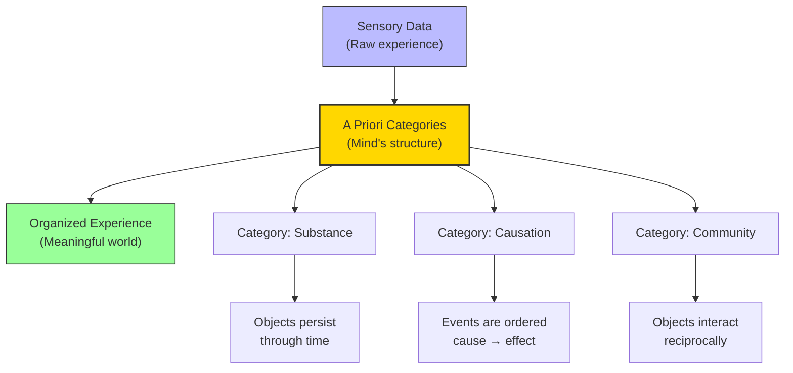

# Module 07 — Kant's Categories and the Architecture of Mind

*Module 7 of 9 — Chapter 8: Rationalism: The Geometry of the Mind*

---

Imagine trying to read a book in a language you have never seen before. The marks on the page are meaningless — not because the marks are meaningless in themselves, but because you lack the interpretive framework needed to make sense of them. Now imagine being born into a world without any interpretive framework at all — without any way of organizing the flood of sensory data that pours in through your eyes, ears, and skin. This, Kant argued, would be the human condition if the mind did not bring its own structure to experience. The mind is not a blank slate waiting to be written on. It is an active architect, imposing order on the chaos of sensation through a set of **a priori categories** that are the conditions for all possible experience.

---

## The Table of Categories

Kant's *Critique of Pure Reason* seeks to discover the foundations and principles of all knowledge, accepting at the outset that one foundation is, of course, the empirical. But as the Humean account is insufficient to explain causation, Kant argues that the empirical account is insufficient to explain anything about human understanding except the conditions by which it becomes furnished with objects.

What the understanding achieves is **judgment**. Judgment is based on logical functions. These logical functions are imposed upon the evidence of sense and are necessary *prior* to experience if experience is to have any meaning at all. These logical functions — which we possess intuitively — are the **pure concepts of the understanding**, and Kant presents them in his famous Table of Categories:

| Category Group | Categories |
|---------------|------------|
| **I. Quantity** | Unity, Plurality, Totality |
| **II. Quality** | Reality, Negation, Limitation |
| **III. Relation** | Inherence & Subsistence, Cause & Effect, Community |
| **IV. Modality** | Possibility/Impossibility, Existence/Nonexistence, Necessity/Contingency |

*Table 7.1: Kant's Table of Categories — the a priori concepts through which the mind organizes all experience.*

These are the pure concepts of synthesis that the understanding possesses *a priori* and without which coherent experience would be impossible. We confront the world of sensibility with an understanding already possessed of such pure concepts as: either a thing exists or it does not exist; either A is possible or it is impossible; either it happens to follow B or it *must* follow B.

> [!TIP]
> **Stop and Think:** Can you imagine a world without causation — where events happen without any connection to what came before? Can you imagine a world without substance — where there are properties but nothing that *has* the properties? Kant would say you cannot, because these categories are built into the structure of your understanding. They are the lenses through which you see the world.

> [!TIP]
> **Stop and Think:** Can you imagine a world without causation — where events happen without any connection to what came before? Kant would say you cannot, because causation is built into the structure of your understanding.

## The Second Analogy: Causation

The most important of Kant's categories for psychology is **cause and effect** — and it is here that Kant delivers his decisive answer to Hume. The Second Analogy states: "Everything that happens, that is, begins to be, presupposes something upon which it follows according to a rule."

Hume had argued that we never perceive causation — only the constant conjunction of events. Kant replies that Hume's own account of experience *requires* the concept of causation. For us to perceive "constant conjunction," we must already be able to order events in time. For us to judge that A precedes B, we must already possess the category of temporal ordering. And this category is not derived from experience — it is the condition *for* experience.

A boat floating downstream could, in principle, float upstream. But we never apprehend the event in any but a fixed order: the boat now is here, next is there, next is there. What is the empirical basis of "next"? Unless the understanding already possessed (a priori) the category of time, there could be no succession or constant conjunction. Conjunctions occur *in* time, but time is not given by the object.

> [!TIP]
> **Stop and Think:** When you hear a knock at the door, you immediately assume something caused the knock — you do not consider the possibility that the knock caused the door. This ordering — cause before effect — is not something you learned from experience. You bring it to every experience. This is Kant's Second Analogy in action.

*Figure 7.1: Kant's architecture — raw sensory data is organized by a priori categories into meaningful experience.*

## Substance and Permanence

Kant's First Analogy addresses the concept of **substance**: "In all change of appearances, substance is permanent." We can only call an appearance a "substance" because we are able to presuppose the existence of substance throughout time.

Consider: we discover the weight of smoke by weighing the wood, burning the wood, and weighing the ashes. Matter is not conserved in the senses — the wood is gone and no smoke can be seen. Still, because of the a priori category of permanence, we know that the weight of the smoke is just the difference between the weight of the wood and the weight of the ashes. Without this category, we could not even form the concept of "matter" — we would have only a stream of disconnected sensations.

> [!TIP]
> **Stop and Think:** Piaget's "object permanence" is essentially a developmental version of Kant's category of substance. The infant does not learn that objects persist when hidden; rather, the capacity for persistence is a prerequisite for meaningful experience.

## The Categories as Psychology

Kant's categories are not merely philosophical abstractions. They are, implicitly, a theory of cognitive development — a description of the innate structures that make learning possible. Consider:

- **Unity** allows us to perceive objects as coherent wholes rather than disconnected parts.
- **Causation** allows us to predict consequences and plan actions.
- **Substance** allows us to track objects through time and change.
- **Necessity** allows us to distinguish between what merely *happens* to be true and what *must* be true.

These categories are not learned from experience; they are the preconditions for experience. A baby does not learn that objects persist when hidden; the baby *expects* persistence — and is surprised (as Piaget documented) when objects seem to disappear. This expectation is Kant's category of substance at work.

> [!TIP]
> **Stop and Think:** Piaget's concept of "object permanence" — the understanding that objects continue to exist when out of sight — is essentially a developmental version of Kant's category of substance. The infant does not learn object permanence from experience; rather, the capacity for object permanence is a prerequisite for meaningful experience. Is this a fair reading of both Kant and Piaget?

## The Transcendental Aesthetic

Kant's analysis extends beyond the categories to the **transcendental aesthetic** — his account of the a priori forms of sensibility. Space and time, Kant argues, are not properties of the external world. They are the *forms* through which we experience the world — the grid that the mind imposes on sensation before any content is received.

We do not experience space and time; we experience *in* space and time. They are the conditions for the possibility of experience, not objects of experience themselves. This is why geometry (the science of space) and arithmetic (the science of time/number) can yield certain knowledge — they describe the structure of the mind itself, not the structure of the external world.

## Speaking of Categories...

- When you see a dog catch a ball, you are using multiple Kantian categories simultaneously: *unity* (the dog is one entity), *causation* (the dog's movement causes the ball to change direction), *substance* (the dog persists through the act of catching), and *community* (the dog and ball interact reciprocally).
- The legal concept of "mens rea" (guilty mind) assumes Kant's category of causation — that the defendant's *intention* caused the *action*. Without the category of causation, the concept of criminal responsibility would be incoherent.
- The fact that every human culture has concepts of time, space, causation, and substance — even if they fill these concepts with different content — suggests that Kant was right about their a priori status.

---

Kant had established that the mind brings its own structure to experience — that categories like causation, substance, and temporal ordering are not derived from experience but are the conditions for experience. But this raised an even more profound question: if the mind's structure determines how we experience the world, what does this imply about morality? Are moral truths — like the wrongness of murder or the obligation to keep promises — also a priori? Kant's answer — the **categorical imperative** — would be the most ambitious attempt in history to ground morality in reason alone.

---

## References

- Robinson, D. N. (1995). *An Intellectual History of Psychology* (3rd ed.). University of Wisconsin Press. Chapter 8.
- Kant, I. (1781/1965). *Critique of Pure Reason* (N. K. Smith, Trans.). St. Martin's Press.
- Kant, I. (1783/1950). *Prolegomena to Any Future Metaphysics*. Bobbs-Merrill.

---

*Module 7 of 9 — Chapter 8: Rationalism: The Geometry of the Mind*
