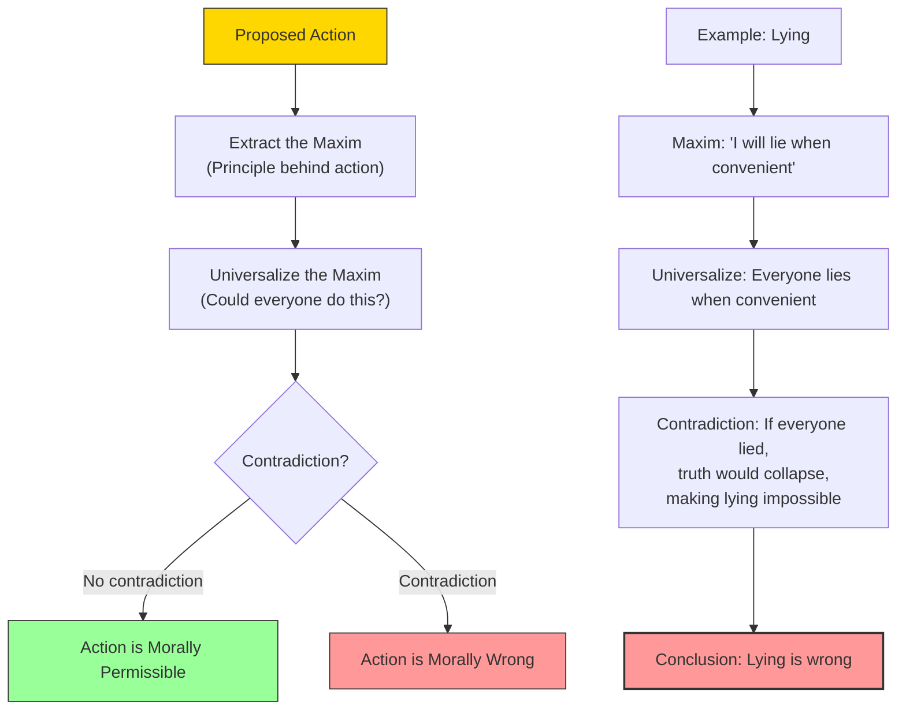

# Module 08 — Kant's Moral Psychology: The Categorical Imperative

*Module 8 of 9 — Chapter 8: Rationalism: The Geometry of the Mind*

---

In 1785, Immanuel Kant published a slim volume that would become one of the most influential works in the history of moral philosophy. The *Groundwork of the Metaphysic of Morals* opened with a sentence of striking boldness: "There is nothing it is possible to think of anywhere in the world, or indeed anything at all outside it, that can be held to be good without limitation, except a *good will*." Intelligence, courage, wealth, power — all of these can be used for evil. Only the will to do good is unconditionally good. And this will, Kant argues, is not guided by experience, by feeling, or by the calculation of consequences. It is guided by reason alone — by a principle so fundamental that it cannot be derived from anything more basic. Kant called it the **categorical imperative**.

---

> [!TIP]
> **Stop and Think:** Consider the difference between "I prefer chocolate" and "Murder is wrong." The first is a preference; the second is a moral conviction. What accounts for this difference? Kant says: the necessity of moral judgments — a necessity that cannot come from experience.

## The Empiricist Challenge to Morality

Kant agrees with the empiricists that if epistemology were reducible to experience, morality would be likewise reducible. If all knowledge comes from sensation, then our moral knowledge comes from sensation — and morality is nothing more than a set of feelings, preferences, and habits shaped by experience.

This is the position of Hume, who argued that moral distinctions are grounded in feeling rather than reason. We do not love because logic compels it; we are not benevolent because we have intellectual grounds for rejecting selfishness. These sentiments are produced in us by a history of associations, by the rewarding and punishing consequences of our conduct.

Kant finds this position intolerable. If morality is merely a matter of feeling, then there is no basis for distinguishing between a moral conviction and a personal preference. The feeling that murder is wrong and the feeling that chocolate tastes good would be, in principle, the same kind of thing — subjective responses shaped by experience. But this cannot be right. Moral obligations feel *necessary* in a way that preferences do not.

> [!TIP]
> **Stop and Think:** Consider the difference between "I prefer chocolate to vanilla" and "Murder is wrong." The first is a personal preference — you would not say that someone who prefers vanilla is *morally mistaken*. The second is a moral conviction — you *would* say that someone who thinks murder is acceptable is morally wrong. What accounts for this difference? Kant says: the difference lies in the *necessity* of moral judgments — a necessity that cannot come from experience.

## The Categorical Imperative

Kant's answer to the empiricist challenge is the **categorical imperative** — a moral law that is binding on all rational beings, regardless of their feelings, desires, or circumstances. It is "categorical" because it applies unconditionally, without exceptions or qualifications. And it is "imperative" because it commands — it does not merely advise or suggest.

The most famous formulation of the categorical imperative is:

> "Act in such a way that the maxim of your action could serve as a universal law of nature."

This means: before you act, ask yourself whether the principle behind your action could be adopted by everyone without contradiction. If you are considering lying, ask: could everyone lie all the time? The answer is no — if everyone lied, the very concept of truth would collapse, and lying itself would become impossible. Therefore, lying is morally wrong — not because it produces bad consequences, but because it cannot be universalized.

*Figure 8.1: The categorical imperative in action — test whether your maxim can be universalized without contradiction.*

## The Second Formulation: Humanity as End

Kant offers a second formulation of the categorical imperative that is equally famous:

> "Act so that you treat humanity, whether in your own person or in that of another, always as an end and never merely as a means."

This means: never use people merely as tools for your own purposes. Every human being has intrinsic worth — a dignity that cannot be violated. To treat someone merely as a means — to use them without regard for their own interests and autonomy — is to deny their humanity.

This formulation has enormous implications for psychology. It implies that human beings are not merely objects to be studied, manipulated, and predicted. They are subjects — rational agents with their own purposes, their own dignity, their own moral worth. Any psychology that treats human beings as mere mechanisms — as stimulus-response machines or as biological automata — violates the categorical imperative.

> [!TIP]
> **Stop and Think:** The principle that people should never be treated merely as means is the foundation of modern research ethics — the requirement of informed consent, the prohibition against deception, the right to withdraw from experiments. Where did this principle come from? Not from experience or feeling, Kant would say, but from reason itself.

> [!TIP]
> **Stop and Think:** The ethical principle of informed consent — requiring participants to understand and voluntarily agree to experiments — is a direct application of Kant's second formulation: never treat people merely as means.

## Freedom of the Will

The categorical imperative would be meaningless unless human beings were free to choose their actions. If our behavior is entirely determined by prior causes — by our biology, our upbringing, our environment — then the concept of moral obligation makes no sense. We cannot be *obligated* to do something we are *unable* to do.

Kant therefore argues that the will must be free. But this freedom is not the absence of all constraint. It is, rather, the capacity to act according to reason — to be guided by the categorical imperative rather than by desires, impulses, or external forces. A free will is a rational will — a will that acts from duty rather than inclination.

This is a subtle and profound point. Freedom, for Kant, is not doing whatever you want. It is doing what reason demands — regardless of what you want. The person who tells the truth because it is their duty is freer than the person who tells the truth because they happen to enjoy honesty. The first acts from reason; the second from inclination.

## Reverence for Law

Kant argues that reverence for law is not acquired through experience. The categorical imperative could not be acquired through experience. The factual world of events could not be judged on a moral basis if there were not, *a priori*, pure moral concepts in the understanding.

We are not "usually" or "contingently" ends in ourselves and not means toward some other end. We are *necessarily* ends in ourselves. We do not await the consequences of our actions in order to determine whether we should do unto others as we would have them do unto us. We understand that this is so — or else we could never know guilt as long as we "got away" with what we did.

There may be those who preach situation ethics, but they still draw the line at anarchy. And even those who argue for anarchy, if they are to argue at all, will begin with a principle — and if that principle is ever to enjoy logical force, it will finally reduce to the categorical imperative, at which point it will contradict the claims of the anarchist.

> [!TIP]
> **Stop and Think:** Kant argues that you know, *a priori*, that it is wrong to use people merely as means. You do not need to run an experiment or consult your feelings. This knowledge is built into the structure of rational thought itself. Is this convincing? Or is Kant smuggling in moral intuitions that are actually products of experience and culture?

## Kant's Influence on Psychology

Kant's influence on psychology has been far greater than is generally recognized. It is a commonplace to acknowledge his fame as a philosopher and to point to his nativistic emphasis. But his influence runs much deeper:

- The **innate, logical structure of thought and language** — the idea that the mind has built-in organizational principles — is a Kantian legacy.
- The **a priori principles of perceptual organization** — the Gestalt psychologists' claim that the mind organizes sensations into meaningful patterns — is directly indebted to Kant.
- The **stages of cognitive and moral understanding** — Piaget's developmental stages and Kohlberg's moral stages — are modern versions of Kant's categorical framework.
- The concept of **culture-neutral or culture-free methods of psychological assessment** assumes, with Kant, that certain mental structures are universal.

Kant did not set out to save rationalism. He set out to establish the limits of knowledge and the conditions by which it takes place. In the process, he saved consciousness.

## Speaking of the Categorical Imperative...

- The Universal Declaration of Human Rights (1948) is essentially a political expression of Kant's categorical imperative — the principle that every human being has inherent dignity and must never be treated merely as a means.
- When a whistleblower risks their career to expose wrongdoing, they are acting from Kantian duty — doing what reason demands regardless of personal consequences.
- The ethical principle of "informed consent" in medical research — the requirement that participants understand and voluntarily agree to what will happen to them — is a direct application of Kant's second formulation: never treat people merely as means.

---

Kant had established that the mind brings its own structure to experience and that morality is grounded in reason, not feeling. The rationalist tradition — from Descartes through Spinoza, Leibniz, and Kant — had produced a vision of the human mind as active, structured, and capable of certain knowledge. But what did this tradition actually bequeath to psychology? The answer is more complex — and more surprising — than most textbooks suggest.

---

## References

- Robinson, D. N. (1995). *An Intellectual History of Psychology* (3rd ed.). University of Wisconsin Press. Chapter 8.
- Kant, I. (1785/1964). *Groundwork of the Metaphysic of Morals* (H. J. Paton, Trans.). Harper and Row.
- Kant, I. (1781/1965). *Critique of Pure Reason* (N. K. Smith, Trans.). St. Martin's Press.

---

*Module 8 of 9 — Chapter 8: Rationalism: The Geometry of the Mind*
