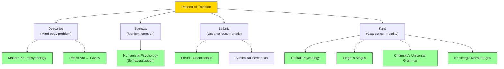

# Module 09 — The Rationalist Legacy in Psychology

*Module 9 of 9 — Chapter 8: Rationalism: The Geometry of the Mind*

---

By the end of the eighteenth century, the rationalist tradition had produced four of the most powerful philosophical systems in Western history. Descartes had given psychology its central problem — the mind-body question. Spinoza had collapsed dualism into monism and introduced the distinction between passion and emotion. Leibniz had proposed a universe of infinitely many unique substances and introduced the concept of the unconscious. Kant had shown that the mind brings its own structure to experience and grounded morality in reason. But what, if anything, did this tradition actually contribute to the science of psychology? The answer, Robinson argues, is both less obvious and more profound than most historians acknowledge.

---

## The Rationalist Issues at the Heart of Modern Psychology

By 1970, Robinson notes, the three most influential theoretical issues in psychology involved:

1. **Stage-specific cognitive capacities** during development from infancy
2. **A priori faculties** that must be granted if human language is to be understood
3. **Species-specific processes** that must be assumed to account for emotional, intuitive, and moral dispositions

The third issue received its direct impetus from Darwin. But the first two "stem unadorned from the rationalist tradition." It is only in the *methods* employed to investigate these issues that contemporary concerns can be described as "empirical." They are rationalist issues at the core.

This is a remarkable observation. The questions that dominate modern cognitive science and developmental psychology — how children develop the capacity for abstract thought, how the mind acquires language, what innate structures make learning possible — are the same questions that Descartes, Leibniz, and Kant were asking three centuries ago. The methods have changed; the fundamental questions have not.

> [!TIP]
> **Stop and Think:** Noam Chomsky's theory of universal grammar — the idea that the human brain is innately equipped with a "language acquisition device" — is essentially a modern version of Leibniz's claim that "nothing is in the intellect except the intellect itself." The rationalist question (what does the mind bring to experience?) is still the central question of cognitive science.

> [!TIP]
> **Stop and Think:** Noam Chomsky's theory of universal grammar — the idea that the brain is innately equipped for language — is essentially a modern version of Leibniz's claim that "nothing is in the intellect except the intellect itself." The rationalist question is still the central question of cognitive science.

## What Rationalism Bequeathed

The rationalist bequest to psychology is not a set of experimental findings but a set of *questions* and *assumptions*:

**The assumption of innate structure.** The mind is not a blank slate. It comes equipped with organizational principles — categories, faculties, dispositions — that shape how experience is processed. This assumption, which Descartes articulated and Kant systematized, is the foundation of modern cognitive psychology, developmental psychology, and the psychology of language.

**The assumption of necessary truths.** Some things are known with certainty — not because experience has confirmed them, but because the mind's structure requires them. Mathematical truths, logical principles, and perhaps moral axioms are known *a priori*. This assumption challenges the radical empiricist claim that all knowledge is probabilistic.

**The assumption of active cognition.** The mind is not a passive receiver of sensory data. It is an active processor — selecting, organizing, interpreting, and constructing the world we experience. This assumption, which runs from Descartes through Kant, is the foundation of constructivist and cognitive approaches to learning.

**The assumption of moral agency.** Human beings are not merely stimulus-response mechanisms. They are rational agents capable of acting from duty, of recognizing moral obligations, and of choosing to do what is right regardless of inclination. This assumption, which Kant articulated with unmatched rigor, is the foundation of moral psychology and the ethics of human research.

*Figure 9.1: The rationalist legacy — each major rationalist contributed specific ideas that became foundations of modern psychology.

> [!TIP]
> **Stop and Think:** These debates remain unresolved after three centuries. Perhaps the rationalist-empiricist tension is not a problem to be solved but a dialectic to be managed. Psychology needs both: the insight that the mind has structure, and the insistence that this structure must be investigated through experience.

## The Unresolved Tension

The rationalist tradition also bequeathed an unresolved tension to psychology: the tension between the mind as a product of experience (empiricism) and the mind as a prerequisite for experience (rationalism). This tension is still alive in contemporary debates:

- **Nature vs. nurture**: Are cognitive capacities products of experience or of innate structure?
- **Domain-general vs. domain-specific**: Is the mind a general-purpose learning device, or does it come equipped with specialized modules for language, social cognition, and moral reasoning?
- **Constructivism vs. nativism**: Does the child construct knowledge from experience, or does the child discover knowledge that was always there?

These debates cannot be resolved by experiment alone, because they involve assumptions about the nature of mind that are, in Kant's sense, *transcendental* — they are the conditions for the possibility of doing psychology at all.

> [!TIP]
> **Stop and Think:** The fact that these debates are still unresolved after three centuries suggests that the rationalist-empiricist tension is not a problem to be solved but a *dialectic* to be managed. Perhaps psychology needs both perspectives — the rationalist insight that the mind has structure, and the empiricist insistence that this structure must be investigated through experience.

> [!TIP]
> **Stop and Think:** When a cognitive psychologist argues that perception is active and constructive — that the mind organizes sensations into meaningful patterns — they are assuming what all the rationalists assumed: the mind is an active agent, not a passive receiver.

## The Marriage of Reason and Experience

Science could not have been developed by way of a radical empiricism; nor could it have flourished if extreme forms of rationalism were adopted at the expense of systematic observation and classification. The greatest scientific achievements — from Copernicus to Newton — were marriages of the two perspectives.

The same is true of psychology. The discipline could not have emerged from pure rationalism (which would have produced only armchair speculation) or from pure empiricism (which would have produced only data without theory). It emerged from the productive tension between the two — from the recognition that the mind has structure *and* that this structure must be investigated through careful observation and experiment.

Wundt sought the best of two worlds in attempting to build an empirical science on the foundation of (rational) introspection. The Gestalt psychologists combined Kantian a priori principles with experimental investigation of perception. Piaget combined rationalist assumptions about cognitive stages with meticulous empirical observation of children. The most productive psychologists have always been those who refused to choose between reason and experience — who insisted, with Kant, that experience without concepts is blind, and concepts without experience are empty.

## The Rationalist Legacy in Summary

| Rationalist | Contribution | Modern Psychology |
|-------------|-------------|-------------------|
| **Descartes** | Mind-body problem; reflex arc | Neuropsychology; Pavlovian conditioning |
| **Spinoza** | Monism; passion vs emotion; self-actualization | Humanistic psychology; emotional regulation |
| **Leibniz** | Unconscious; monads; pre-established harmony | Freudian psychoanalysis; subliminal perception |
| **Kant** | A priori categories; moral law; stages | Gestalt psychology; Piaget; Kohlberg; Chomsky |

*Table 9.1: The rationalist legacy — specific contributions from each philosopher that became foundations of modern psychology.*

## Speaking of the Legacy...

- When a neuroscientist assumes that the brain has specialized modules for language, face recognition, or moral reasoning, they are assuming what Leibniz assumed: that the mind is not a blank slate but a structured substance with innate capacities.
- When a developmental psychologist proposes that children pass through universal stages of cognitive development, they are assuming what Kant assumed: that the mind's structure unfolds according to an internal logic that is not entirely dependent on experience.
- When a cognitive psychologist argues that perception is an active, constructive process — that the mind does not merely receive sensory data but organizes it into meaningful patterns — they are assuming what all the rationalists assumed: that the mind is an active agent, not a passive receiver.

---

The rationalist tradition that Descartes inaugurated in 1637 and Kant brought to its culmination in 1781 had, by the end of the eighteenth century, established the fundamental questions and assumptions that would guide psychology for the next two centuries. But it had also generated a powerful counter-movement. Materialism — the doctrine that everything, including the mind, reduces to matter — would challenge both empiricism and rationalism with a vision of human nature so radical it would reshape the landscape of psychology entirely.

---

## References

- Robinson, D. N. (1995). *An Intellectual History of Psychology* (3rd ed.). University of Wisconsin Press. Chapter 8.
- Chomsky, N. (1965). *Aspects of the Theory of Syntax*. MIT Press.
- Piaget, J. (1952). *The Origins of Intelligence in Children*. International Universities Press.
- Kohlberg, L. (1981). *The Philosophy of Moral Development*. Harper & Row.

---

*Module 9 of 9 — Chapter 8: Rationalism: The Geometry of the Mind*
