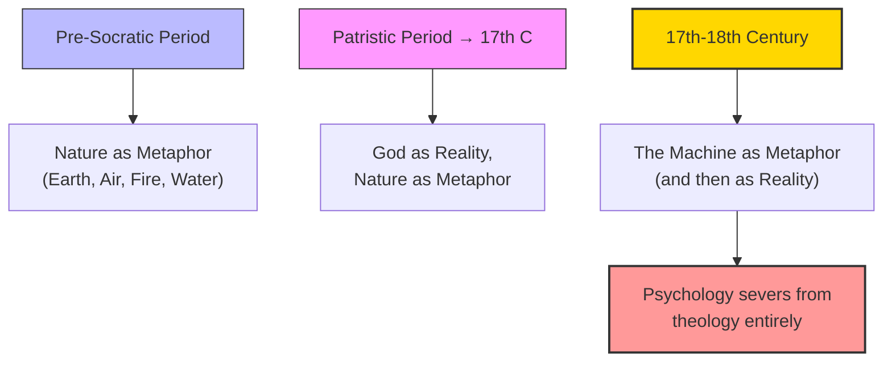

# Module 01 — The Metaphor of the Machine

*Module 1 of 7 — Chapter 9: Materialism: The Enlightened Machine*

---

For fifteen centuries — from roughly AD 200 to the seventeenth century — every serious psychological work written in the Western world contained religious allusion. The soul, the divine spark, the immortal mind — these were not optional add-ons but the very foundation of any account of human nature. Then, in a historical blink of an eye, it all changed. By 1930, there was not a major psychological work expressing a need for spiritual terms to comprehend the psychological dimensions of humanity. What happened? Robinson argues that the answer lies not in any single discovery or argument but in the seduction of a metaphor: the metaphor of the machine.

---

## Nature as Metaphor, God as Reality

Every age of philosophical energy is animated by metaphors. The pre-Socratics, with their interest in hydraulics, understood psychology in terms of earth, air, fire, and water. Platonism focused on spiritual metaphors. Aristotle advanced a dualistic psychology according to which some functions of the mind were "like" biological processes and others "like" eternal logical verities.

From the pre-Socratic period until the Age of Faith, the metaphor was *nature*. All the divisions of competing philosophies were different views of the nature of nature: Is it material only or spiritual as well? Is it eternal or was there a beginning? Then, from the Patristic period until the seventeenth century, **God was the reality and nature was the metaphor**. Revelation was the ultimate authority. Those eager to understand at another level could study the Thomistic synthesis — the synthesis of Aristotle and Christian belief, of reason and faith.

> [!TIP]
> **Stop and Think:** Consider how you explain your own behavior. Do you say "I chose to help because it was the right thing to do" (a spiritual/moral explanation) or "I helped because my brain released oxytocin when I saw someone in need" (a material/mechanical explanation)? The shift from the first to the second is the shift Robinson is describing — and it happened in a historical instant.

## The Renaissance Did Not Change Everything

The Renaissance did not alter the essential temper of the Western mind. The debates from 1350 to 1600 were between those who found God in "natural magic" and those who found Him in "spirit." Ficino's Academy sought to restore Platonism to Christianity, not to challenge scripture. The most significant scientific event of the Renaissance — Copernicus's theory of the earth's revolution — was judged by its author as no more than a footnote to God's great design. The same may be said of Kepler, Newton, Galileo, Locke, Descartes, Leibniz, and perhaps even Spinoza.

Nature, as the metaphor, and God, as the reality, remained in their historic places. But something was about to change — something so fundamental that it would sever psychology from its theological ancestry entirely.

*Figure 1.1: The great metaphoric shift — from nature to God to machine. Each shift redefines what counts as an acceptable explanation of the mind.*

> [!TIP]
> **Stop and Think:** Every generation has its dominant metaphor for the mind — the chariot, the soul, the machine, the computer. Does the metaphor we choose determine what questions we ask and what answers we find?

## The Seductive Metaphor

The cautious reader will complain that the physicalistic outlook is hardly recent — that Zeno and Epicurus were beholden to it, that Ptolemy rendered it cosmic, and that the Scholastics were wed to the machine-like precision of celestial motion. This is historically correct, but it fails to distinguish between the **mere metaphor** and the **seductive metaphor**: between the metaphor that confirms one's existing beliefs and the metaphor that *creates new beliefs*; between the metaphor invented to represent reality and the metaphor so compelling that it *is accepted as reality*.

The machine metaphor was seductive in a way that no previous metaphor had been. It did not merely describe nature; it *explained* nature. And once it explained the planets, the tides, and the falling of rocks, it was a short step to explaining the mind.

> [!TIP]
> **Stop and Think:** Every generation has its dominant metaphor for the mind. For the Greeks, it was the chariot (reason controlling passion). For the Christians, it was the soul (a divine spark). For the mechanists, it was the machine. What is today's dominant metaphor? Is it the computer? The neural network? The algorithm? Does the metaphor we choose determine what questions we ask — and what answers we find?

> [!TIP]
> **Stop and Think:** Voltaire asked: how can a little animal five feet high defy the eternal laws that govern all nature? Is this a valid argument for materialism? Or does it assume what it needs to prove — that the mind must obey the same laws as planets?

## Galileo's Challenge

The wedge that separated psychology from its intellectual ancestry was fashioned not by a philosopher but by a scientist. Galileo's laws of accelerated motion and Newton's general laws of motion provided an irrefutable, scientific illustration of the failure of Aristotelian metaphysics.

Among the Thomistic proofs for the existence of God, the phenomenon of motion was central. The Scholastic argument held that that which is in motion will seek a resting state unless impelled by a force external to itself — therefore, eternal motion is impossible, and heavenly dynamics can be understood only in terms of a Prime Mover who constantly supplies the needed power.

Newton's laws changed everything. No longer was it necessary to require a different physics for the heavens and the earth. The same laws that describe the motion of billiard balls describe the motion of planets. And if the same laws describe everything in the universe, then perhaps the same laws describe the mind as well.

> [!TIP]
> **Stop and Think:** Voltaire remarked that "it would be very singular that all nature, all the planets, should obey eternal laws, and that there should be a little animal, five feet high, who, in contempt of these laws, could act as he pleased, solely according to his caprice." Is this a valid argument for materialism? Or does it beg the question by assuming that the mind must obey the same laws as planets?

## Speaking of Metaphors...

- When a therapist says "you need to reprogram your thinking," they are using a computational metaphor for the mind — a direct descendant of the machine metaphor.
- The popular phrase "I'm just wired this way" reveals how deeply the machine metaphor has penetrated our self-understanding. We describe ourselves in the language of circuits and wiring, not souls and spirits.
- The debate over whether artificial intelligence can be "conscious" is really a debate about whether the machine metaphor is *complete* — whether mind can be fully captured by mechanism.

---

The metaphor of the machine was seductive, but it needed scientific authority to become reality. That authority came from two towering figures: Galileo, who invented the science of mechanics, and Newton, who universalized it. Together, they provided the intellectual foundation for the most radical claim in the history of psychology: that the mind is nothing but matter in motion.

---

## References

- Robinson, D. N. (1995). *An Intellectual History of Psychology* (3rd ed.). University of Wisconsin Press. Chapter 9.
- Voltaire (1766). *The Ignorant Philosopher*. Cited in Dampier, W. C. (1966). *A History of Modern Science*. Cambridge University Press.
- Galilei, G. (1632/1927). *Dialogue Concerning the Two Great Systems of the World*. In *Classics of Modern Science* (W. S. Knickerbocker, Ed.). Appleton-Century-Crofts.

---
*Module 1 of 7 — Chapter 9: Materialism: The Enlightened Machine*
