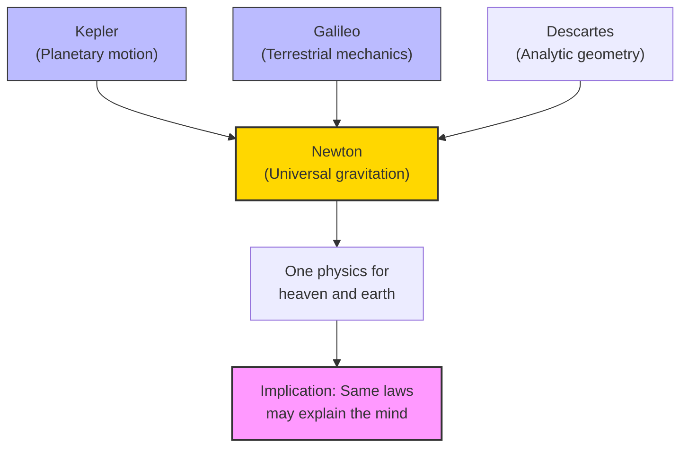

# Module 02 — Galileo, Newton, and the New Science

*Module 2 of 7 — Chapter 9: Materialism: The Enlightened Machine*

---

In 1632, Galileo Galilei published a book that would get him hauled before the Inquisition. The *Dialogue Concerning the Two Great Systems of the World* was not merely a defense of Copernican astronomy — it was a systematic demolition of Aristotelian physics, presented with such wit and clarity that even the Pope, who had initially approved its publication, turned against its author. But Galileo's real crime was not heliocentrism. It was the implicit claim that nature could be understood without reference to Aristotle, to the Church, or to God. The same claim, extended to its logical conclusion, would eventually encompass the mind itself.

---

> [!TIP]
> **Stop and Think:** Galileo distinguished between "priority of observation" and "rigor of demonstration." A farmer knows seeds grow better in some soils; a soil scientist explains why through controlled experiments. Which kind of knowledge does psychology need more of?

## Galileo's Mechanics

Had Galileo's contribution been limited to the unearthing of mere factual errors in Aristotle's science, his influence would have been negligible. The health of Christian belief never depended on the speed with which rocks and feathers fall to the earth. What Galileo threatened was something far more fundamental: the *manner in which we go about discovering the truth*.

In his *Discourse on the Two New Sciences*, Galileo virtually invented the science of mechanics and tied each of its theorems to an experimental demonstration. Throughout his work, Aristotle falls on hard times. Galileo acknowledged Aristotle's observation on the law of the lever — but with a qualification: "Yes, I am willing to concede him priority in point of time; but as regards rigor of demonstration the first place must be given to Archimedes."

This is not a minor point. Galileo is saying that *priority of observation* is less important than *rigor of demonstration*. It is not enough to notice that levers work; you must *prove* why they work, and prove it in a way that anyone can verify. This is the empirical method in its purest form.

> [!TIP]
> **Stop and Think:** Galileo distinguished between "priority of observation" and "rigor of demonstration." A farmer knows that seeds grow better in some soils than others — that is priority of observation. A soil scientist explains *why* through controlled experiments — that is rigor of demonstration. Which kind of knowledge does psychology need more of?

## Newton's Universal Laws

By far the greatest contribution to science in the seventeenth century was Isaac Newton's *Principia* (1687). Newton combined the theories of Kepler and Galileo in a triumphant synthesis: the universal law of gravitation. No longer was it necessary to require a different physics for the heavens and the earth.

Newton's "rules of reasoning" in philosophy established the methodological principles that would govern science for the next two centuries:

- **Rule I**: We are to admit no more causes of natural things than such as are both true and sufficient to explain their appearances.
- **Rule II**: Therefore to the same natural effects we must, as far as possible, assign the same causes.
- **Rule IV**: In experimental philosophy we are to look upon propositions inferred by general induction from phenomena as accurately or very nearly true, notwithstanding any contrary hypotheses.

These rules have a devastating implication for psychology. If the same causes should be assigned to the same effects, and if the laws of physics explain the motion of everything in the universe, then the motion of human bodies — and perhaps human minds — should be explained by the same laws.

*Figure 2.1: The Newtonian synthesis — one set of laws for everything in the universe. If this works for planets, why not for minds?

> [!TIP]
> **Stop and Think:** The Royal Society's motto — "On the words of no man" — is the founding principle of modern science. But when a psychology student cites a textbook or a professor cites a famous theorist, are they following this motto?

## The Royal Society and the New Method

The inscription adopted by the Royal Society, formed in 1662, is a testimony to Galileo's influence: **Nullius in verba** — "On the words of no man." This was a direct rejection of the Aristotelian-Scholastic tradition of appealing to authority. Truth was to be found after a test, not at the end of a dispute.

Between 1609 and 1686 — within a single lifetime — Kepler had published his laws of planetary motion (1609), Galileo had described sunspots and the moon's rough surface (1609) and invented mechanics (1632), Harvey had published his essay on the circulation of blood (1628), Descartes his *Discourse on Method* (1637), and Robert Hooke the *Micrographia* (1665), which laid the ground for microscopic anatomy.

The implications of this creative storm for the enlightened bystander were captured by Voltaire: "It would be very singular that all nature, all the planets, should obey eternal laws, and that there should be a little animal, five feet high, who, in contempt of these laws, could act as he pleased, solely according to his caprice."

> [!TIP]
> **Stop and Think:** The Royal Society's motto — "On the words of no man" — is the founding principle of modern science. But consider: when a psychology student cites a textbook or a professor cites a famous theorist, are they following this motto? Or has psychology retained more of the Aristotelian appeal to authority than it cares to admit?

> [!TIP]
> **Stop and Think:** The Aristotelian-Scholastic tradition provided not just physics but a complete account of reality, including the soul and morality. When the physics collapsed, the metaphysics went with it. Is psychology still carrying metaphysical baggage from its philosophical ancestors?

## The Collapse of Aristotelian Authority

The combined effect of Galileo and Newton was the collapse of Aristotelian authority — not just in physics but in every domain of knowledge. If Aristotle was wrong about the motion of the planets, wrong about the speed of falling bodies, wrong about the distinction between terrestrial and celestial physics, then perhaps he was wrong about the mind as well.

This is the crucial link between the new science and the new psychology. The Aristotelian-Scholastic tradition had provided not just a physics but a *metaphysics* — a complete account of reality, including the nature of the soul, the purpose of human life, and the foundations of morality. When the physics collapsed, the metaphysics went with it. And when the metaphysics collapsed, the door was open for a completely new account of human nature — one based not on Aristotle's authority but on the methods of Galileo and Newton.

## Speaking of the New Science...

- When a psychologist designs an experiment with a control group, random assignment, and statistical analysis, they are applying Newton's Rule I: admit no more causes than are sufficient to explain the observations.
- The modern scientific paper's structure — introduction, method, results, discussion — is a descendant of Galileo's approach: state the hypothesis, describe the experiment, present the data, draw conclusions.
- The phrase "trust the science" echoes the Royal Society's *Nullius in verba* — but with a tension. Science asks us to trust the *method*, not the *authority*. When we confuse the two, we slide back toward Scholasticism.

---

The new science had established that nature obeys universal laws. But this raised an immediate question: if nature obeys universal laws, and human beings are part of nature, do human beings obey the same laws? The materialists — from Gassendi through Hobbes to La Mettrie — would answer with an emphatic yes. And their first target was the dualism of Descartes.

---

## References

- Robinson, D. N. (1995). *An Intellectual History of Psychology* (3rd ed.). University of Wisconsin Press. Chapter 9.
- Galilei, G. (1638/1914). *Discourse on Two New Sciences* (H. Crew & A. de Salvio, Trans.). Macmillan.
- Newton, I. (1687/1953). *Philosophiae Naturalis Principia*. In *Newton's Philosophy of Nature* (H. S. Thayer, Ed.). Hafner.

---
*Module 2 of 7 — Chapter 9: Materialism: The Enlightened Machine*
