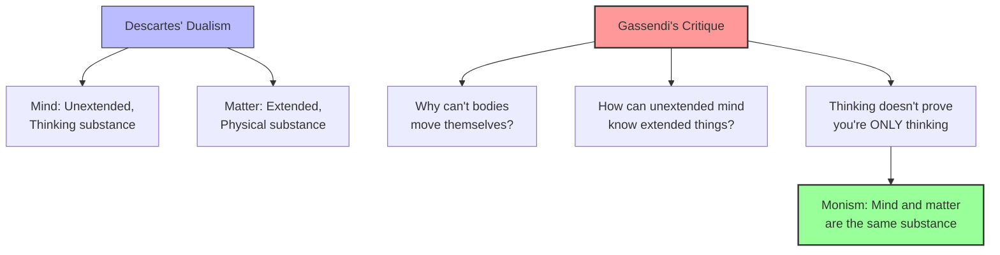

# Module 03 — From Dualism to Monism: Gassendi's Challenge

*Module 3 of 7 — Chapter 9: Materialism: The Enlightened Machine*

---

Three years before Descartes died, he received a pamphlet published anonymously in Belgium by a former disciple named Regius. The pamphlet was written in a form suitable for nailing on the door of a church, and it recommended a radical materialism: the mind is no more than that which permits thought to human beings; logic does not require any distinction between mind and matter; all notions enter the mind through observation and tradition; no idea is innate; perception is a process of the brain. Descartes was furious. He rejected the propositions point by point. But the genie was out of the bottle — and the man who had done the most to release it was not Regius but Pierre Gassendi, the most formidable philosophical opponent Descartes ever faced.

---

> [!TIP]
> **Stop and Think:** Descartes argued that "nothing reaches our mind from external objects beyond certain corporeal movements." If all we receive is physical motion, and this produces our thoughts, what role is left for an immaterial soul?

## Regius's Manifesto

Regius arrived at his materialist position through his own inclinations and, probably, from a hasty reading of Descartes' *Passions of the Soul*. Several of the articles in that work could be construed as supporting materialism: the origins of the animal spirits are traced to the brain; stimulation can produce orderly action without any intervention by the soul; even perception, dreams, and daydreams are quite possible as a result of bodily actions.

Descartes quickly recorded his disagreement, but his rebuttal inadvertently strengthened the materialist case. He argued that "nothing reaches our mind from external objects through the organs of sense beyond certain corporeal movements" — a claim that, stripped of its dualist context, sounds remarkably like the materialism it was meant to refute.

> [!TIP]
> **Stop and Think:** Descartes argued that "nothing reaches our mind from external objects beyond certain corporeal movements." If all we receive from the world is physical motion, and if this physical motion produces our thoughts, then what role is left for an immaterial soul? Descartes intended to preserve the soul; his critics argued he had eliminated it.

> [!TIP]
> **Stop and Think:** Gassendi asked: "How can the mind reason without a brain?" Modern neuroscience shows brain damage alters personality, memory, and reasoning. Does this prove Gassendi right? Or is it compatible with a sophisticated dualism?

## Gassendi: The Epicurean Revival

Pierre Gassendi (1592–1655) was ranked among the greatest philosophers of his age. His following was large, his writings influential, and his command of science and mathematics expert. He established his credentials early, authoring a text of *Paradoxes* against the Aristotelians in 1624. More significantly, he became the center of a revival of interest in Epicurus and the later Roman Epicureans.

The thrust of this revived Epicureanism was to install observational science in the place of Cartesian deductive science, to accept nature (including human nature) as matter, and to oppose the authority of Aristotle at every turn. Gassendi's critique of Descartes' dualism was published in the form of rebuttals answered, in print, by Descartes himself — a six-year intellectual duel.

Gassendi's objections to dualism were devastating:

1. Why deny bodies the power to move themselves without the aid of a soul? Does not water flow, and do not animals (judged to be without souls) move?
2. Since it is obvious that whatever acts has being, why all the "beating around the bush" to establish that you are?
3. What does it mean to say you are "only a thinking thing"? Even if it be granted that you think, it does not follow that you are not other things as well.
4. How can the mind reason without a brain, since even Descartes requires that the brain organize and unite perceptions?
5. Even though the senses sometimes deceive, they often do not, and we usually can determine whether a perception is valid.
6. If the mind is without extension, it can have no idea of extended things.

*Figure 3.1: Gassendi's challenge — each objection targets a specific weakness in Cartesian dualism, leading toward monism.*

## The Gassendist Legacy

More than the specific objections to dualism, Gassendi's writings reflect the impatient tone that every modernist displays toward a departing age. Gassendi was the most illustrious of the circle of visionaries brought together by Father Marsenne in Paris. They were all imbued with the spirit of Galileo, whose experimental and theoretical science constituted the final and invincible challenge to authority.

Gassendi's works were known to and admired by Locke, whose empirical philosophy borrowed the spirit, if not the letter, of Gassendi's scholarship. Newton acknowledged Gassendi's priority in advancing the law of inertia. Descartes' ambition to rest biology on a Keplerian foundation — while sparing the soul from materialism — was the ambition of the Gassendists but *without the spiritual restrictions*.

"The Gassendists were the first natural monists of the modern era." When we refer to the origins of this perspective as "French Materialism," we are simultaneously acknowledging the role of Pierre Gassendi in the history of scientific psychology.

> [!TIP]
> **Stop and Think:** Gassendi asked: "How can the mind reason without a brain?" This question — the dependence of thought on physical processes — is still the central question in the philosophy of mind. Modern neuroscience has shown that brain damage alters personality, memory, and reasoning. Does this prove Gassendi right? Or is it compatible with a sophisticated dualism?

> [!TIP]
> **Stop and Think:** If dualism is true, the mind is free from physics — free will is possible, the soul may survive. If monism is true, behavior is determined, the soul dies with the body. These are not abstract questions — every psychologist implicitly answers them.

## The Philosophical Stakes

The dispute between Descartes and Gassendi was not merely academic. It had profound implications for how we understand human nature, morality, and freedom. If dualism is true, then the mind is free from the laws of physics — free will is possible, the soul may survive death, and morality has a non-material foundation. If monism is true, then the mind is subject to the same laws as everything else — behavior is determined, the soul dies with the body, and morality must be grounded in something other than divine command.

These are not abstract philosophical questions. They are the questions that every psychologist must answer — implicitly if not explicitly — when they design an experiment, interpret a finding, or recommend a treatment.

## Speaking of Gassendi...

- When a neuroscientist maps the brain regions involved in moral decision-making, they are implicitly adopting Gassendi's position: moral reasoning is a physical process, not an immaterial one.
- The modern debate about free will — whether our choices are determined by prior brain states — is a direct descendant of the Gassendi-Descartes dispute.
- Gassendi's insistence that "whatever acts has being" is the philosophical foundation of functionalism in psychology: if a mental process produces observable effects, it is real — regardless of whether it is "material" or "immaterial."

---

Gassendi had shown that dualism was vulnerable to empirical critique. But the most systematic materialist philosophy of the seventeenth century would come not from a French philosopher but from an English one: Thomas Hobbes, whose *Leviathan* would propose that human beings are nothing but matter in motion — and that society is nothing but matter in motion in groups.

---

## References

- Robinson, D. N. (1995). *An Intellectual History of Psychology* (3rd ed.). University of Wisconsin Press. Chapter 9.
- Brush, C. R. (Ed. & Trans.). (1970). *The Selected Works of Pierre Gassendi*. Johnson Reprint.
- Descartes, R. (1637/1901). *Discourse on Method*. In *The Method, Meditations, and Philosophy of Descartes* (J. Veitch, Trans.). Tudor.

---
*Module 3 of 7 — Chapter 9: Materialism: The Enlightened Machine*
