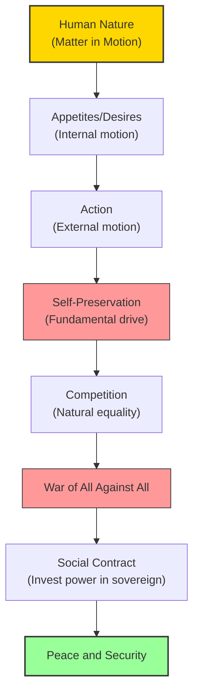

# Module 04 — Hobbes and the Social Machine

*Module 4 of 7 — Chapter 9: Materialism: The Enlightened Machine*

---

In 1651, two years after the execution of Charles I, a sixty-three-year-old English philosopher published a book that would terrify and fascinate Europe for the next century. Thomas Hobbes's *Leviathan* opened with a declaration of war on every form of metaphysical thinking: "Words may be called metaphorical: Bodies and Motions cannot." If you want to understand humanity, Hobbes argued, you must understand bodies and motions — and nothing else. The mind is matter in motion. Society is matter in motion in groups. And the laws governing both are discoverable by the same methods that Galileo used to discover the laws of falling bodies.

---

## The Man and His Moment

Hobbes's earliest writings and training were in classics. His translations of Thucydides were authoritative. For five years (1621–1626) he served as a student-secretary to Francis Bacon, and later as tutor to Charles II. Through Father Marsenne's circle of "libertines," he visited Florence and met Galileo (1634–1637) — an encounter that would shape his entire philosophical program.

*Leviathan* appeared in 1651, when England was reeling from civil war. The execution of Charles I had produced a mixture of lingering anti-royalism and the guilt of regicide. Hobbes had exiled himself in France, where he tutored the future Charles II. His book was an attempt to establish the principles by which civil strife might be averted — and it required, as a foundation, a complete theory of human nature.

> [!TIP]
> **Stop and Think:** Hobbes wrote *Leviathan* during a civil war — a time when the question "what is human nature?" was not academic but existential. If humans are naturally cooperative, then peace is possible. If they are naturally competitive, then only an absolute sovereign can prevent chaos. How does the political context shape the psychological theory?

> [!TIP]
> **Stop and Think:** Hobbes declared "Words may be called metaphorical: Bodies and Motions cannot." If man is to be understood scientifically, he must be understood as matter in motion. Is this a discovery about human nature, or a decision about what counts as "scientific"?

## Materialism as Method

Hobbes considered the cardinal absurdities of his age to include: (1) attempting to reason before agreeing on the meaning of terms; (2) confusing the immaterial with the material — "nothing can be poured or breathed into any thing but body; and that extension is body"; (3) continuing to believe in the reality of universals; (4) using metaphor instead of reality; (5) devotion to Scholastic terms with no basis in experience.

He would have none of these. "Words may be called metaphorical: Bodies and Motions cannot." If man is to be understood scientifically, he is to be understood as **matter in motion**. If society is to be understood scientifically, it is to be understood as **men in motion**.

Hobbes's plan was to establish a biophysical behaviorism and, from this, to deduce sociology. The scientific analysis begins in Chapter VI of *Leviathan*. The major variable is motion. Animal motion takes two forms: involuntary ("vitall") and intentional ("animal"). The latter is the cause of all our grief and joy — it is motion "first fancied in our minds" before being executed by our limbs.

*Figure 4.1: Hobbes's system — from matter in motion to the social contract. Human psychology determines political theory.*

> [!TIP]
> **Stop and Think:** Hobbes argued that natural equality leads to conflict, not cooperation. If no one is strong enough to dominate, everyone has reason to fear everyone else. Is this pessimism or realism? Consider modern international relations.

## Natural Equality and the State of Nature

Hobbes arrived at his defense of absolute monarchy from a surprising starting point: the **natural equality** of all humanity:

> "Nature hath made me so equal, in the faculties of body, and mind; as that though there be found one man sometimes manifestly stronger in body, or of quicker mind than another; yet when all is reckoned together, the difference between man and man is not so considerable, as that one man can thereupon claim to himself any benefit, to which another may not pretend, as well as he."

Even the weakest has strength enough to kill the strongest — "either by secret machination, or by confederacy with others." And as to the faculties of the mind: "Prudence is but Experience; which equal time, equally bestows on all men."

This essential equality creates confidence and enmity. Because each person has approximately the same chances of success as every other, the seeds of war are planted everywhere. Natural equality produces the "war of all against all" — not because humans are evil, but because they are *equal*.

> [!TIP]
> **Stop and Think:** Hobbes argued that natural equality leads to conflict, not cooperation. This seems counterintuitive — shouldn't equality promote fairness? But Hobbes's logic is precise: if no one is strong enough to dominate everyone else, then everyone has reason to fear everyone else. Is this pessimism, or realism?

> [!TIP]
> **Stop and Think:** Hobbes claimed that "the VALUE or WORTH of a man is his Price" — what others will give for the use of his power. Modern economics assumes the same: your value is your productivity. Is this degrading? Or is it simply honest?

## The Egoistic Foundation

Hobbes's psychology is unambiguously egoistic. We judge ultimate good and evil in terms of our own desires. The chief desire is the preservation of life. We value that which possesses power or confers power upon us. "The VALUE or WORTH of a man, is as of all other things, his Price; that is to say, so much as would be given for the use of his Power."

What we call dignity is no more than this. The commonwealth prizes a man for what he can do for them. His status is neither absolute nor permanent — it lasts as long as his power does. What is honorable is victory; dishonorable, defeat.

This egoistic ethics would undergo revision in later thinkers — Mandeville, Hutcheson, and the utilitarians would all grapple with it. But the basic insight — that human motivation is rooted in self-interest — would persist as one of the foundational assumptions of both economics and psychology.

## Speaking of Hobbes...

- When an economist assumes that consumers act to maximize their utility, they are assuming what Hobbes assumed: that human behavior is driven by self-interest.
- The "tragedy of the commons" — the idea that individuals acting in their own self-interest will deplete shared resources — is a modern formalization of Hobbes's state of nature.
- Hobbes's claim that "prudence is but experience" — that practical wisdom comes from lived experience, not from innate ideas — is an empiricist insight embedded in an otherwise materialist system.

---

Hobbes had established a materialist philosophy of human nature and society. But his system was still largely deductive — derived from first principles rather than from experimental investigation. The next step was to discover the actual *mechanism* by which matter produces mind — the physiological pathway from sensation to action. That pathway was the **reflex arc**, and its discovery would transform materialism from a philosophical position into a scientific program.

---

## References

- Robinson, D. N. (1995). *An Intellectual History of Psychology* (3rd ed.). University of Wisconsin Press. Chapter 9.
- Hobbes, T. (1651/1974). *Leviathan* (C. B. Macpherson, Ed.). Penguin Books.

---
*Module 4 of 7 — Chapter 9: Materialism: The Enlightened Machine*
