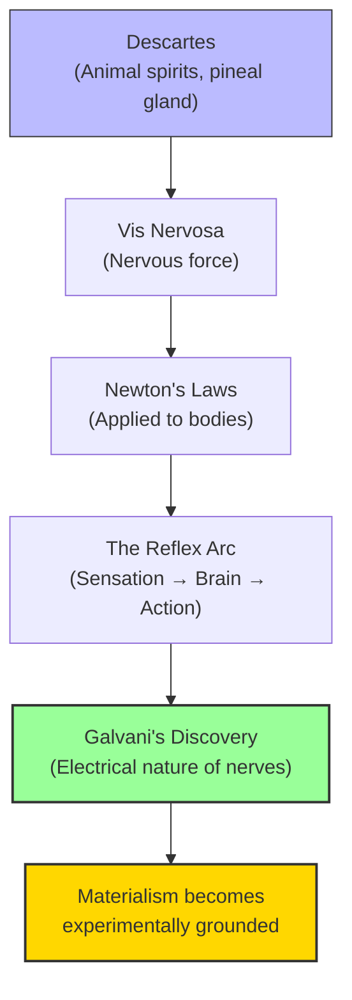

# Module 05 — The Reflex: From Descartes to Galvani

*Module 5 of 7 — Chapter 9: Materialism: The Enlightened Machine*

---

In 1786, an Italian physician named Luigi Galvani was dissecting a frog when he noticed something extraordinary. When he touched the frog's leg nerve with a metal scalpel during an electrical storm, the leg twitched — as if alive. Further experiments confirmed that an electrical pulse, applied directly to the muscle, could produce the same effect. The implications were revolutionary: the interaction between nerves and muscles was *electrical*. The mystery that had protected Descartes' dualism for over a century — how does the soul move the body? — suddenly had a material answer. The soul was not needed. The body was a machine, and the machine ran on electricity.

---

> [!TIP]
> **Stop and Think:** Descartes described a "machineman" that imitates a real person "no more nor less than do the movements of a clock." Except for reason, this machine simulates nearly perfectly a real man. Has Descartes already conceded the materialist case?

## Descartes' Optical Model

Descartes had envisaged the mechanism of the reflex to operate as follows: the arrow's image is conveyed by the optic nerves to the brain. The inverted image is set aright within the optic chiasm, whence it passes to the pineal gland. Motor nerves receive "spirits" from the pineal gland in amounts determined by the force of the visual impression.

Descartes considered the mechanism by which the nerves are actually energized by the spirits to be unfathomable. But his *Treatise of Man* — published posthumously in 1662 — went further than anything he had allowed in print during his lifetime. The work invokes the idea of a model or "machineman" with a body like a statue, equipped with sensory, motor, and reflex mechanisms. The essay includes the operation of feedback, emphasizes the muscular foundations of attention, and relates the quality of our experiences to the action of the spirits flowing in and out of the pores of the brain.

> "I desire you to consider... that these functions imitate those of a real man as perfectly as possible and that they follow naturally in this machine entirely from the disposition of the organs — no more nor less than do the movements of a clock."

> [!TIP]
> **Stop and Think:** Descartes described a "machineman" that imitates a real person "no more nor less than do the movements of a clock." Except for the faculty of reason, this machine simulates nearly perfectly a real man. Is this dualism? Or has Descartes, in his most biological work, already conceded the materialist case?

## Newton's Laws Applied to Bodies

Newton's laws of motion were ideally suited to account for such a system. Every body continues in its state of rest or uniform motion unless compelled to change by forces impressed upon it. The change of motion is proportional to the motive force impressed. For every action there is an equal and opposite reaction.

In the seventeenth century, these were laws of "science" — potentially as applicable to the mechanics of mental life as to billiard balls. Descartes' notion of "animal spirits" was transformed into the **vis nervosa** (nervous force), and the laws of the reflex were relegated to the science of physics. Increasingly, English empiricism and French materialism looked alike.

*Figure 5.1: From animal spirits to electricity — the reflex arc becomes a material mechanism, not a metaphysical mystery.*

> [!TIP]
> **Stop and Think:** Galvani's discovery that nerves carry electrical signals was the moment materialism gained its strongest empirical foundation. Does understanding the mechanism settle the philosophical question? Or can dualists argue the signals are correlated with but not identical to mental states?

## Galvani's Discovery

The most significant discovery of the eighteenth century for psychological materialism was made by Luigi Galvani, who in 1786 reported the results of experiments on the stimulation of frog muscles by electrical pulse. Until the essentially electrical nature of nerve-muscle interactions was discovered, the mystery in Descartes' system was preserved.

The effect was dismissed by some scientists — including Alessandro Volta — who insisted that the human body was not even able to conduct a charge. This complaint was ingeniously set aside by one of the more elegant demonstrations in the history of the neural sciences: a small boy was suspended by a long rope, with gold leaves hung just in front of his nose. A glass rod rubbed with cat's fur was placed against the boy's bare toes. The gold leaves were immediately drawn to the boy's nose, proving electrical conduction by the human body. Experiment had triumphed over dogma.

> [!TIP]
> **Stop and Think:** Galvani's discovery that nerves carry electrical signals was the moment when materialism gained its strongest empirical foundation. Before Galvani, the mechanism connecting mind and body was mysterious. After Galvani, it was measurable. Does understanding the mechanism settle the philosophical question? Or can dualists still argue that the electrical signals are *correlated with* mental states but not *identical to* them?

> [!TIP]
> **Stop and Think:** Hartley combined the physics of Newton, the physiology of Descartes, and the associationism of Locke into a single system. Is this integration a strength of materialism — its ability to unify diverse phenomena? Or is it a weakness — forcing everything into one framework?

## Hartley's Associationism

David Hartley (1705–1757) published his *Observations on Man*, which presented psychology as the science concerned with the mechanics of associationism. Hartley's thesis was self-consciously Newtonian: vibrations are established in the nerves by stimulation and conveyed to the brain. After the stimulus has been removed, the vibrations persist, diminishing as a function of time. Memory is the fading vibration induced by a bygone event. Learning is the establishment of a connection between physical events in the brain.

Hartley's theorem: "If any sensation A, idea B, or muscular motion C, be associated for a sufficient number of times with any other sensation D, idea E, or muscular motion F, it will, at last, excite d, the simple idea belonging to the sensation D, the very idea E, or the very muscular motion F."

Hume had said as much. Events occurring together, in unaltered sequence, will come to be treated as causally related. Descartes had specified the anatomical arrangements. Newton's "vibrations" were the earliest form of a vis nervosa. Hartley's essay was one of the great syntheses of the eighteenth century — combining the physics of Newton, the physiology of Descartes, the parallelism of Leibniz, and the empirical associationism of Locke and Hume.

## Whytt's Decapitated Frogs

Robert Whytt (1714–1766) repeated an experiment performed earlier by Stephen Hales: the decapitated frog could be induced to move its limbs by pinching them. Even without a brain, the frog would avoid a painful stimulus delivered to the extremities. A surgical severing of the spinal cord, however, eliminated the response.

Whytt argued that the spinal cord was able to mediate stimuli and responses in the absence of brain activity. This was a devastating finding for dualism: if the body can respond to stimuli without a brain — without a "soul" — then the soul is not necessary for the most basic forms of behavior.

## Speaking of the Reflex...

- When a doctor taps your knee and your leg kicks automatically, you are experiencing the reflex arc that Descartes first described and Whytt experimentally confirmed. The response happens without conscious control — without the "soul."
- Modern neuroscience has shown that many of our daily actions — driving a familiar route, typing on a keyboard, catching a ball — are largely reflexive, requiring minimal conscious involvement. This is Hobbes's "matter in motion" in action.
- The debate over whether consciousness is necessary for behavior — or whether behavior can be fully explained by reflexes and conditioning — is the modern version of the debate between Descartes and the mechanists.

---

The reflex arc had provided materialism with its mechanism — a physiological pathway from sensation to action that did not require an immaterial soul. But the most radical statement of materialism would come not from a physiologist but from a physician-philosopher: Julien Offray de La Mettrie, whose *L'Homme Machine* (1748) would declare, with breathtaking audacity, that the human being is nothing but a machine.

---

## References

- Robinson, D. N. (1995). *An Intellectual History of Psychology* (3rd ed.). University of Wisconsin Press. Chapter 9.
- Hartley, D. (1749/1970). *Observations on Man*. In *Between Hume and Mill* (R. Brown, Ed.). Random House.
- Descartes, R. (1662/1972). *Treatise of Man* (T. S. Hall, Trans.). Harvard University Press.

---
*Module 5 of 7 — Chapter 9: Materialism: The Enlightened Machine*
