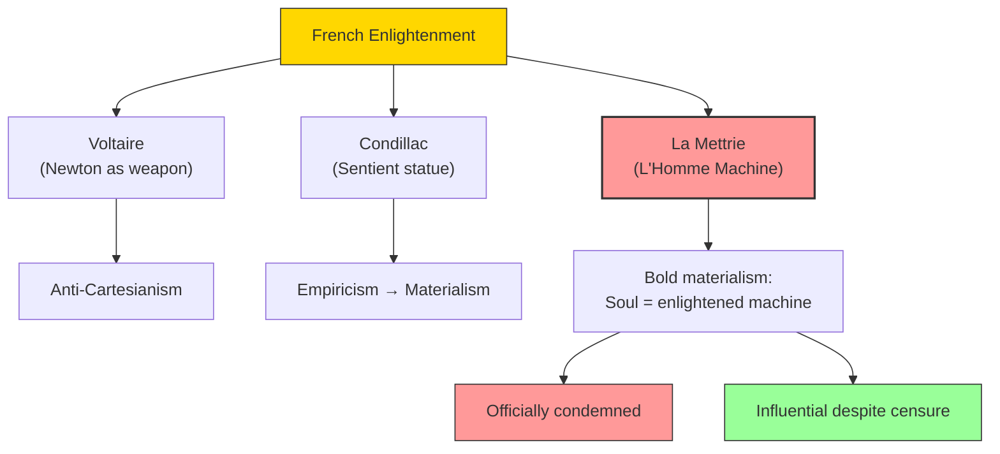

# Module 06 — L'Homme Machine: La Mettrie and French Materialism

*Module 6 of 7 — Chapter 9: Materialism: The Enlightened Machine*

---

In 1748, a book appeared in Leiden bearing the title *L'Homme Machine* — "Man a Machine." Its author, Julien Offray de La Mettrie (1709–1751), was a physician, a self-exiled member of the court of Frederick the Great, and the boldest psychological materialist France had produced. The book caused a commotion even greater than his earlier *Historie Naturelle de l'Ame* (1745), whose infamy had already driven him to Bavaria. Both works were short, highly polemical, and hardly either philosophical or scientific in the proper sense. But *L'Homme Machine* said something that no one had said quite so bluntly before: the soul is nothing but an "enlightened machine," and all human psychological faculties reduce to mere physiology.

---

> [!TIP]
> **Stop and Think:** The Enlightenment thinkers used science as a political weapon against religious authority. Is this legitimate? Do modern psychologists ever use their science to advance political agendas? Is that always wrong?

## The Enlightenment Context

The French Enlightenment — whether atheist or theist, monarchist or anarchist — all shared contempt for dogma. Voltaire was the center and the engine. He admired England, praised the English for their egalitarianism and their tolerance, and found in Newton's physics another reason to oppose Cartesianism.

The Enlightenment in France was essentially a political movement posing as an intellectual enterprise. The real interests of its leaders in Newton's physics were extrascientific. They found in the new science a weapon against the excesses of orthodoxy — a way to drive a wedge between the received truths of religion and the complacent mass of believers.

Condillac (1715–1780) translated Locke's *Essay* into French and proposed the famous "sentient statue" — a statue standing in the path of a universe of stimuli, taking on psychological characteristics as a result of experience. Condillac's statue served as the template for much of the materialistic philosophy of late eighteenth- and early nineteenth-century France.

> [!TIP]
> **Stop and Think:** The Enlightenment thinkers used science as a political weapon — a tool for opposing religious authority. Is this a legitimate use of science? Or does it corrupt science by making it serve ideological ends? Consider: do modern psychologists ever use their science to advance political agendas? Is that always wrong?

> [!TIP]
> **Stop and Think:** To prove that everything is material, you need a method that transcends materialism — which materialism cannot provide. Is this a fatal flaw? Or is it an unavoidable limitation of any philosophical system?

## La Mettrie's Argument

La Mettrie's "proofs" for materialism are drawn from observations like the ability of a chicken to continue running after its head has been removed, and the fact that a freshly removed heart will "jump" out of boiling water. His authorities include military officers who have told him tales of battle casualties and several of his own clinical observations.

There is nothing in either book that the modern neurophysiologist would take seriously, and less that modern philosophers would pause to reread. The importance of *L'Homme Machine* is historical — and it lies in its *style*: porous, haughty, devoid of self-critical strains. It is the sort of book one writes on a dare.

But the underlying argument is not trivial. If a chicken can run without a brain, then the brain is not necessary for all behavior. If a heart can beat after being removed from the body, then the body's functions are not dependent on a soul. These observations do not *prove* materialism, but they shift the burden of proof: if complex behaviors can occur without a brain or a soul, then what, exactly, is the soul *for*?

*Figure 6.1: The French materialist tradition — from Voltaire's political use of Newton to La Mettrie's radical declaration that man is a machine.*

## The Politicization of Philosophy

The import of *L'Homme Machine* lies not in its science but in its *politics*. It is the sort of book one writes on a dare or as a challenge. It is defiant but seldom clear on the issue to be defied. If the enemy were those who insisted that man is endowed with an immortal soul, the fact that chickens run after decapitation is irrelevant. If the antagonist was the Cartesian who believed the soul directs the will through the brain, the behavior of hearts dropped into water is beside the point.

La Mettrie, in summarizing the respects in which man is matter, insisted that he is *only* matter — but this cannot be established by materialist methods without committing the fallacy of *petitio principii* (begging the question). To prove that everything is material, you would need a method that transcends materialism — which materialism cannot provide.

> [!TIP]
> **Stop and Think:** La Mettrie argued that man is *only* matter. But how can you prove this using only material methods? If your tools are material (microscopes, scalpels, experiments), and if your conclusion is that everything is material, then you have assumed what you set out to prove. Is this a fatal flaw in materialism? Or is it an unavoidable limitation of any philosophical system?

> [!TIP]
> **Stop and Think:** Condillac showed that everything that makes us human — thoughts, feelings, moral sense — can be built from sensory experience alone. But can it? Can the experience of beauty, or the feeling of guilt, be fully explained by the accumulation of sensations?

## Condillac's Sentient Statue

Condillac was not simply a disciple of Locke's. He was captivated by the anti-metaphysical alternative of the English school and by the philosophy of experience celebrated by Voltaire. But Condillac was a priest — his enemy was not the Church but *dogma*, and especially philosophical dogma disguised as religion.

Condillac's "sentient statue" is a thought experiment: imagine a statue equipped with a single sense — say, smell. As the statue encounters different odors, it develops the capacity for attention, memory, judgment, and desire. One by one, the other senses are added, and the statue becomes, in all respects, a human being — without ever needing an immaterial soul.

This is materialism in its most elegant form: everything that makes us human — our thoughts, our feelings, our moral sense — can be built up from sensory experience alone. No soul required.

## Speaking of La Mettrie...

- When a modern neuroscientist says "consciousness is just what the brain does," they are restating La Mettrie's thesis in updated language. The soul has become "consciousness"; the machine has become "the brain." But the claim is the same.
- The debate over whether artificial intelligence can be conscious is essentially a replay of the La Mettrie-Cartesian dispute: is mind just a very complex machine, or is there something more?
- La Mettrie's book was officially condemned — which made it enormously popular. The Streisand effect is not new.

---

La Mettrie and the French materialists had declared that the mind is nothing but matter in motion. But this claim needed a scientific context — a set of discoveries and methods that would make materialism not just a philosophical position but a research program. That context was provided by the extraordinary scientific achievements of the eighteenth century.

---

## References

- Robinson, D. N. (1995). *An Intellectual History of Psychology* (3rd ed.). University of Wisconsin Press. Chapter 9.
- La Mettrie, J. O. de (1748/1912). *L'Homme Machine* (M. W. Calkins, Trans.). Open Court.
- Condillac, É. B. de (1746/1971). *An Essay on the Origin of Human Knowledge*. Scholars' Facsimiles and Reprints.

---
*Module 6 of 7 — Chapter 9: Materialism: The Enlightened Machine*
