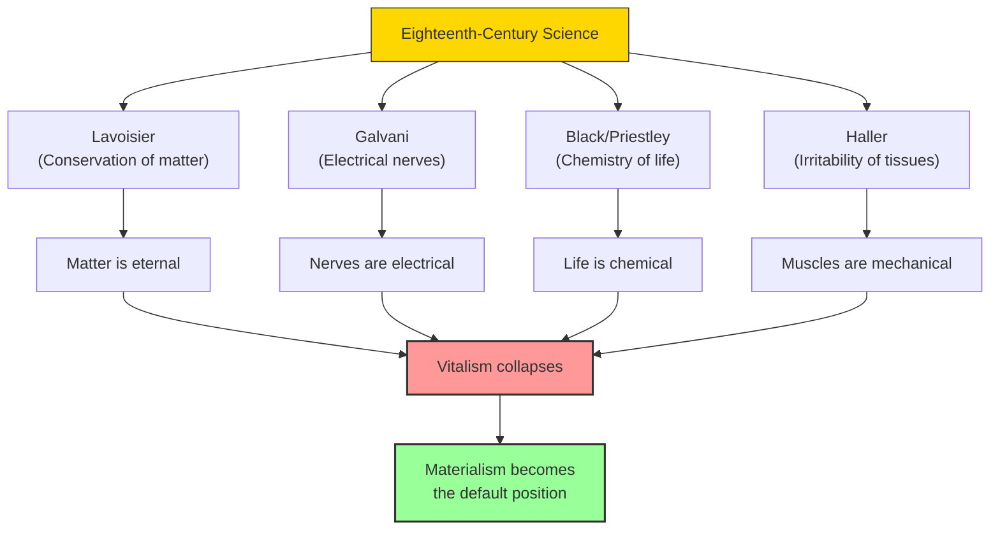

# Module 07 — The Scientific Context and Materialism's Legacy

*Module 7 of 7 — Chapter 9: Materialism: The Enlightened Machine*

---

Psychological materialism did not appear in a vacuum. It was not simply a consequence of the Gassendist rebuke of Cartesianism or the political ambitions of the French Enlightenment. It emerged from a scientific context so rich, so productive, and so self-confident that the idea of reducing mind to matter seemed not just plausible but *inevitable*. The eighteenth century was a century of chemical elements, electrical conduction, conservation of matter, and biological classification. The scientists who produced these discoveries were not philosophers — but their work gave philosophers the courage to make the most audacious claim in the history of ideas: that the mind is nothing but matter obeying the laws of physics.

---

## The Scientific Achievements

The scientific achievements of the eighteenth century were staggering in their breadth and implications:

- **Joseph Black** (1728–1799) discovered carbon dioxide and laid the foundations of quantitative chemistry.
- **Antoine Lavoisier** (1743–1794) demonstrated the conservation of matter and advanced the theory of chemical elements.
- **Luigi Galvani** (1737–1798) discovered the electrical nature of nerve-muscle interaction.
- **Benjamin Franklin** (1706–1790) demonstrated the electrical nature of lightning.
- **Albrecht von Haller** (1708–1777) distinguished between sensitivity and irritability in tissues.
- **Karl Linnaeus** (1707–1778) created the system of biological classification.
- **Joseph Priestley** (1733–1804) discovered oxygen and its role in combustion.

Each of these discoveries reinforced the materialist vision. If matter is conserved (Lavoisier), if nerves carry electrical signals (Galvani), if life processes are chemical (Black, Priestley), then what is left for the soul to do?

> [!TIP]
> **Stop and Think:** Lavoisier demonstrated that matter is neither created nor destroyed. This principle — conservation of matter — had obvious religious implications: if matter cannot be created, then God did not create the world from nothing. Does scientific discovery inevitably undermine religious belief? Or can the two coexist?

> [!TIP]
> **Stop and Think:** If matter is conserved, nerves are electrical, and life is chemical, what is left for the soul to do? The vitalists argued that living things possess a special force. Modern biology has found no such force. Does this settle the question?

## The Collapse of Vitalism

**Vitalism** — the doctrine that living things possess a special "vital force" that distinguishes them from mere matter — was the last refuge of the anti-materialist. Even if rocks and planets obey the laws of physics, surely living things are different? Surely there is something *special* about life — some spark, some élan vital — that cannot be reduced to chemistry and mechanics?

The eighteenth-century scientists systematically dismantled this position. Boerhaave's chemical treatises rejected vitalism and insisted that all life processes were reducible to chemical processes. Haller demonstrated that muscles respond to stimulation with the same mechanical precision as springs. Galvani showed that nerves carry electrical signals — the same kind of signal that powers machines.

*Figure 7.1: The convergence of eighteenth-century science — each discovery narrowed the space for the immaterial, until materialism became the default position.*

## The Unity of Science

One of the most striking features of the scholars of this period is their assumption of the **unity of science**. Locke has been an influential figure in psychology — but so was Newton. The scholars of the seventeenth and eighteenth centuries were not "professionals." They assumed the unity of science to an extent the modern epoch hardly approximates.

Newton was driven to a theory of color vision because he believed that the universal law of gravitation should be as apparent in biological systems as in planetary motion. Borelli studied the physiology of muscles to apply Galileo's mechanics to systems that just happened to be alive. Descartes and Hobbes both sought to base their epistemologies upon the new science of mechanics.

Even Locke and Hume, disinclined to speculate on the biological basis of mind, both agreed that the issue was to be settled by "the anatomists." Hume was explicit: "Any theory of the understanding, or the origin and connection of the passions in man will acquire additional authority, if we find that the same theory is required to explain the same phenomena in all other animals."

> [!TIP]
> **Stop and Think:** The scholars of the seventeenth and eighteenth centuries assumed that one set of laws should explain everything — from planetary motion to human behavior. Modern science has become vastly more specialized. Is this specialization a strength (deeper understanding) or a loss (fragmented knowledge)?

> [!TIP]
> **Stop and Think:** Materialism explains how the mind works but struggles to explain why — to account for purpose, meaning, and value. Is this tension a temporary limitation of science, or a permanent feature of the materialist worldview?

## Materialism's Legacy for Psychology

The materialist tradition bequeathed several lasting features to psychology:

1. **The assumption of continuity between humans and animals.** If both are machines, then animal research can illuminate human psychology. This assumption is the foundation of comparative psychology and behavioral neuroscience.

2. **The reflex arc as the basic unit of behavior.** From Descartes through Whytt to Pavlov, the idea that behavior is a response to stimulation — mediated by the nervous system — has been the organizing principle of physiological psychology.

3. **The rejection of final causes.** Materialism demands efficient causes (how things work) rather than final causes (why things exist). This is the methodological foundation of all modern science, including psychology.

4. **The demand for measurement.** If the mind is material, it can be measured. This demand — from Bentham's "thermometer of intelligence" to modern psychometrics — is the foundation of psychological testing.

5. **The tension between mechanism and meaning.** Materialism explains *how* the mind works but struggles to explain *why* — to account for purpose, meaning, and value. This tension remains at the heart of contemporary psychology.

## The Unresolved Question

Ironically, the French materialists — La Mettrie, Condillac, Cabanis — are closer to a dominant contemporary perspective than were any of their more illustrious contemporaries (Locke, Hume, Leibniz, Kant). What they sensed, and what either eluded or embarrassed the greater philosophers, was the growing possibility of wedding philosophy to anatomy.

They were an eager group, forcing compatibilities where there was no ground other than enthusiasm. They saw into the next century. But they also saw something that remains unresolved: the question of whether the machine metaphor is *complete*. Can everything about the human mind — consciousness, morality, meaning, love — be captured by the language of bodies and motions? Or is there something that escapes the net?

> [!TIP]
> **Stop and Think:** Robinson notes that since 1930, there has not been a major psychological work expressing a need for spiritual terms to comprehend human psychology. Is this a triumph of science? Or is it a loss? Has psychology gained explanatory power by excluding the spiritual, or has it narrowed its vision?

## Speaking of Materialism's Legacy...

- When a psychiatrist prescribes medication for depression, they are applying the materialist principle: mental states are caused by brain chemistry, and changing the chemistry changes the mind.
- The Human Brain Project — an attempt to map every neuron and synapse in the human brain — is the ultimate expression of the materialist vision: if we can map the machine completely, we will understand the mind.
- The persistent human intuition that "there must be more to it than that" — that consciousness, meaning, and morality cannot be reduced to neurons and chemicals — is the voice of the anti-materialist tradition, still speaking after three centuries.

---

The materialist tradition had, by the end of the eighteenth century, established the intellectual foundations for a scientific psychology. But it had also created a profound tension — between the machine metaphor and the human experience of meaning, purpose, and freedom. This tension would shape the course of psychology for the next two centuries, producing some of the discipline's most productive debates and its most enduring questions.

---

## References

- Robinson, D. N. (1995). *An Intellectual History of Psychology* (3rd ed.). University of Wisconsin Press. Chapter 9.
- Hartley, D. (1749/1970). *Observations on Man*. In *Between Hume and Mill* (R. Brown, Ed.). Random House.
- Hume, D. (1748/1965). *An Enquiry Concerning Human Understanding*. In *Essential Works of David Hume* (R. Cohen, Ed.). Bantam Books.

---
*Module 7 of 7 — Chapter 9: Materialism: The Enlightened Machine*
