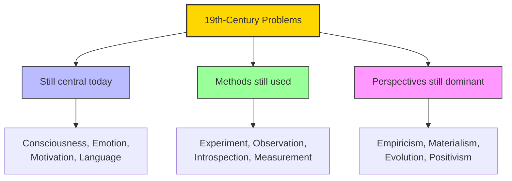

# Module 01 — The Debt to the Nineteenth Century

*Module 1 of 10 — Chapter 10: The Nineteenth Century: The Authority of Science*

---

Contemporary psychology, in its broadest features, remains a nineteenth-century enterprise. This is not to say that modern psychology is "old-fashioned." But it must be noted that the problems that consume the energy of the contemporary psychologist were either set forth explicitly in the nineteenth century or were introduced by those whose educational and cultural backgrounds were provided by the unique perspective of that century. Of those who can lay claim to a significant contribution to the manner in which the contemporary psychologist advances the discipline, only B. F. Skinner (1904–1989) was born in the twentieth century. All the rest — Lashley, Piaget, Freud, Adler, Hull, Pavlov, Tolman, Köhler, Watson, Dewey, and James — are products of the nineteenth century.

---

## Psychology's Unique Position

Modern psychology is not "modern" in the sense that modern physics and modern biology are. Recent discoveries in molecular biology have transformed genetics into a discipline that Mendel scarcely would recognize. The general theory of relativity has required the contemporary physicist to view the Newtonian universe through Einsteinian lenses. In psychology, the situation is quite different. The full range of its theoretical problems — from personality and child development to the neurophysiological basis of emotion or language — can be traced directly to the thoughts and experiments of the psychologists and "natural philosophers" of the nineteenth century.

Physicists no longer test the validity of Ohm's law. They do not commit their lives to repeating experiments that confirm the conservation of energy. Nor do they seek the "aether." Physics still has problems, but it is not nineteenth-century physics that is brought to bear upon these problems now. The same may be said of chemistry and the more developed branches of biology. But in contemporary psychology, not only have the problems of the nineteenth century survived, but so have many of the methods developed in that century.

> [!TIP]
> **Stop and Think:** Is it a strength or a weakness of psychology that its fundamental problems have not changed in over a century? Physics has revolutions; psychology has refinements. Does this mean psychology is less mature as a science, or that its problems are inherently harder?

> [!TIP]
> **Stop and Think:** Psychology persists with 19th-century problems while physics has had multiple revolutions. Does this mean psychology's problems are inherently harder, or that the discipline has been less successful at solving them?

## Why Psychology Lags

The persistence of nineteenth-century problems in psychology is not merely a historical curiosity. It suggests something about the nature of the subject matter. Physics deals with phenomena that can be isolated, measured, and controlled with extraordinary precision. Psychology deals with phenomena — consciousness, emotion, motivation, meaning — that resist isolation and control. The human mind is not a particle accelerator. It cannot be stripped down to its essential components and reassembled at will.

This does not mean psychology is not a science. It means that psychology faces challenges that physics does not. And it means that the nineteenth-century thinkers who first grappled with these challenges were confronting problems of a genuinely different order — problems that, a century and a half later, we are still trying to solve.

*Figure 1.1: The nineteenth century's legacy — problems, methods, and perspectives that still define psychology.*

> [!TIP]
> **Stop and Think:** Only Skinner was a 20th-century psychologist among the major figures. Freud, Watson, Piaget, Pavlov — all were products of the 19th century. How does this affect how we think about psychology as a "modern" science?

## The Nineteenth-Century Thinkers

The intellectual giants who shaped psychology in the nineteenth century include:

- **J.S. Mill** (1806–1873) — who defined the laws of association and the methodology of the human sciences
- **Auguste Comte** (1798–1857) — who established positivism and dismissed introspective psychology
- **Charles Darwin** (1809–1882) — who placed humanity on a biological continuum with all living things
- **Alexander Bain** (1818–1903) — who united psychology and physiology
- **Gustav Fechner** (1801–1876) — who created psychophysics and demonstrated that mental events could be measured
- **Wilhelm Wundt** (1832–1920) — who founded the first experimental psychology laboratory

Each of these thinkers contributed something essential to the discipline. Together, they created the intellectual framework within which all subsequent psychology has operated.

> [!TIP]
> **Stop and Think:** Only Skinner, born in 1904, was a twentieth-century psychologist among the major figures. This means that virtually everything we study in psychology — from Freud's psychoanalysis to Watson's behaviorism to Piaget's developmental theory — was shaped by nineteenth-century minds. How does this affect how we think about psychology as a "modern" science?

> [!TIP]
> **Stop and Think:** When a psychologist designs an experiment using Mill's methods, they are applying principles from 1843. When a neuroscientist maps brain functions, they continue the phrenological tradition. Is psychology building on the past or stuck in it?

## Speaking of the Debt...

- When a psychologist designs an experiment using Mill's methods of induction, they are applying principles formulated in 1843.
- When a neuroscientist maps brain regions associated with specific functions, they are continuing the phrenological tradition that Gall and Spurzheim initiated in the early 1800s.
- When an evolutionary psychologist argues that human emotions are adaptations shaped by natural selection, they are extending Darwin's 1872 argument in *The Expression of the Emotions*.

---

The nineteenth century did not merely contribute to psychology — it *created* psychology as we know it. To understand where psychology came from, we must understand the intellectual revolution that the philosophes of the Enlightenment set in motion.

---

## References

- Robinson, D. N. (1995). *An Intellectual History of Psychology* (3rd ed.). University of Wisconsin Press. Chapter 10.
- Mill, J. S. (1843/1900). *A System of Logic*. Longmans, Green.
- Darwin, C. (1872/1998). *The Expression of the Emotions in Man and Animals*. Oxford University Press.

---
*Module 1 of 10 — Chapter 10: The Nineteenth Century*
