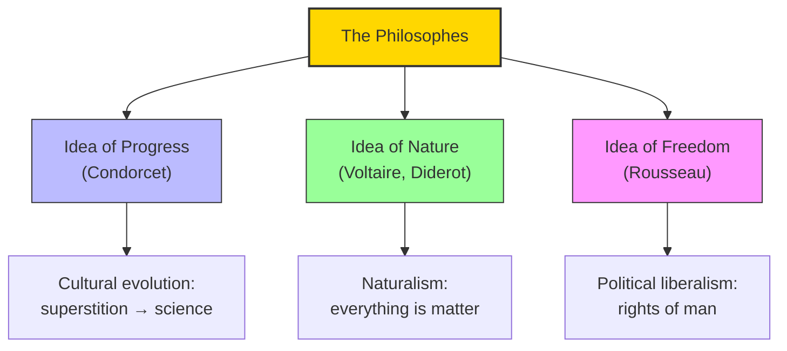

# Module 02 — The Legacy of the Philosophes

*Module 2 of 10 — Chapter 10: The Nineteenth Century: The Authority of Science*

---

The intellectual groundwork for the French Revolution was not accomplished by Descartes, nor by Locke and Newton. It was done by men and women who were literary people, not philosophers or scientists — dramatists, lawyers, and, as they called themselves, dilettantes. The most famous members of the group were Voltaire, Diderot, Rousseau, Condorcet, and D'Alembert. Together, they established a liberated way of thinking with such wit, craft, and penetration that defenders of the status quo inescapably invited ridicule.

---

> [!TIP]
> **Stop and Think:** Voltaire believed in God but was not religious, believed in science but made no contribution to science. Can a literary figure be more influential than a scientist? Consider the relative influence of Shakespeare and Newton on how we understand human nature.

## Voltaire: The Sharpest Sword in Europe

Voltaire's *Letters Concerning the English Nation* (1734) came close to summarizing the entire Enlightenment program. The book was ordered burned by the French parliament. Its letters praised Descartes but dismissed his metaphysics, offered Newton as the master and Bacon as his harbinger, and concluded with a waspish assault on Pascal's *Pensées*.

Voltaire died in 1778. For nearly fifty years, his writings and personality were the hub from which Enlightenment scholarship radiated. He was enormously wealthy, and his influence was increased by a close friendship with Frederick the Great of Prussia. He was no revolutionary, nor a "democrat" in the modern sense. But he insisted that the ultimate validity of any government is rooted in its contributions to the welfare of its citizens — an idea that Rousseau would immortalize.

> [!TIP]
> **Stop and Think:** Voltaire wrote some twenty thousand letters to more than a thousand correspondents. His plays moved the masses; his ideas, the philosophes. He believed in God but was not religious. He believed in science but made no contribution to science. Is it possible to advance a field without practicing it? Can a literary figure be more influential than a scientist?

> [!TIP]
> **Stop and Think:** The ideas of progress, nature, and freedom seem obvious to us now. But they were revolutionary in the 18th century. Which of these ideas do you take for granted? Which might future generations question?

## Three Ideas That Powered the Century

Robinson identifies three ideas that the philosophes bequeathed to the nineteenth century:

**1. The idea of progress.** In Condorcet's *Sketch for a Historical Picture of the Progress of the Human Mind* — written while its author hid from the vengeful zealots of the Revolution — we find the idea that powered the entirety of the nineteenth century: that humanity evolves through stages, from superstition to science, from tyranny to freedom.

**2. The idea of nature.** If the philosophes agreed on anything, it was philosophical naturalism. The world and everything in it are matter. Human reason must aim itself at nature and unearth nature's laws. As Voltaire replied to Pascal's pessimism: "Let us console ourselves for not knowing the possible connections between a spider and the rings of Saturn, and continue to examine what is within our reach."

**3. The idea of personal freedom.** Rousseau's greatest essay begins with the haunting picture of "man, born free and everywhere in chains." Here is the spirit of the Enlightenment, transported to America and translated as The Rights of Man.

*Figure 2.1: Three ideas that powered the nineteenth century — progress, nature, and freedom.*

> [!TIP]
> **Stop and Think:** Helvetius dismissed hereditary differences and placed all emphasis on training and experience. Modern behavioral genetics shows most psychological traits are substantially heritable. Was Helvetius simply wrong? Or did his extreme position serve a valuable function?

## Helvetius and Environmentalism

Helvetius (1715–1771) published *A Treatise on Man, His Intellectual Faculties and His Education*, which comes as close to twentieth-century environmentalism as any work written before 1900. In this treatise, hereditary differences are dismissed as negligible, and the effects of training, reward, punishment, and experience are accorded first place in determining the character and accomplishments of the individual.

This is the extreme empiricist position — the claim that environment is everything and biology is nothing. It would be challenged by every subsequent generation of psychologists, but it would never be fully defeated. The nature-nurture debate that Helvetius framed in the eighteenth century is still the central debate in psychology today.

> [!TIP]
> **Stop and Think:** Helvetius dismissed hereditary differences as negligible and placed all emphasis on training and experience. Modern behavioral genetics shows that most psychological traits are substantially heritable. Was Helvetius simply wrong? Or did his extreme position serve a valuable function — forcing the field to take environment seriously?

## The Politicization of Science

The French materialists were engaged less in science than in politics. The works of La Mettrie, D'Holbach, and others had little influence on science in their own time or thereafter. The same must be said of the "encyclopedists." Neither D'Alembert nor Diderot contributed a method or a set of findings that served as a starting point for any major effort in science or psychology.

But collectively, the philosophes provided the starting point for all subsequent departures from orthodoxy. They established a liberated way of thinking and did this with such wit and penetration that defenders of the status quo inescapably invited ridicule.

> [!TIP]
> **Stop and Think:** The Enlightenment thinkers used science as a weapon against orthodoxy. They did not practice science themselves, but they changed how people thought about science. Is this a legitimate contribution? Or is it a corruption of science — making it serve political ends?

## Speaking of the Philosophes...

- When a politician argues that government policies should be based on "evidence" rather than tradition, they are channeling the Enlightenment philosophes.
- The modern debate about whether science should be "value-free" or "socially engaged" echoes the tension between the philosophes' political ambitions and their scientific aspirations.
- Voltaire's twenty thousand letters are the eighteenth-century equivalent of a social media influencer — reaching thousands through personal correspondence, shaping opinion through wit and persuasion.

---

The philosophes had established the ideas of progress, nature, and freedom. But these ideas needed a philosophical foundation — and that foundation came, paradoxically, from the most unlikely source: Immanuel Kant, whose transcendental philosophy would shape German thought for the next century.

---

## References

- Robinson, D. N. (1995). *An Intellectual History of Psychology* (3rd ed.). University of Wisconsin Press. Chapter 10.
- Voltaire (1733/1956). *Philosophical Letters*. Bobbs-Merrill.
- Condorcet, M.-J.-A. (1795/1955). *Sketch for a Historical Picture of the Progress of the Human Mind* (J. Barraclough, Trans.). Noonday Press.

---
*Module 2 of 10 — Chapter 10: The Nineteenth Century*
