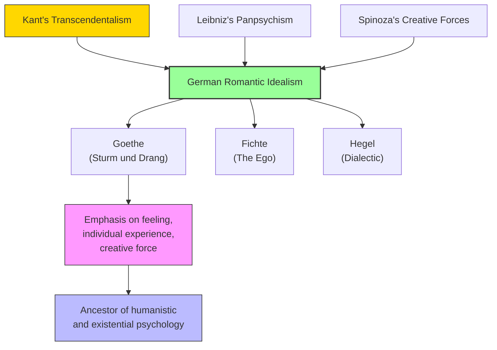

# Module 03 — The Legacy of Kant and Romantic Idealism

*Module 3 of 10 — Chapter 10: The Nineteenth Century: The Authority of Science*

---

Kant died at the beginning of the nineteenth century, but he is far more a member of the Age of Reason than the Age of Materialism. He set the tone of German philosophy for the entirety of the nineteenth century, and as a result, German "naturalism" would ever lack the strong empiricist elements of France and England. German philosophy would accentuate the transcendentalism of Kant — and the combination of naturalism and transcendentalism yielded that uniquely German creation, Romantic Idealism.

---

> [!TIP]
> **Stop and Think:** Goethe's Werther caused an epidemic of copycat suicides — one of the earliest documented examples of media contagion. Is literature responsible for the actions of its readers? Where does artistic freedom end and social responsibility begin?

## Goethe and Sturm und Drang

The principal architect of Romantic Idealism was Johann Wolfgang von Goethe (1749–1832). It was Goethe's poetry that animated the German-speaking world with the spirit of **Sturm und Drang** — "Storm and Stress." His *Sorrows of Young Werther* (1774) resulted in an epidemic of suicides. Naturalism, in Goethe's hands, was the panpsychism of Leibniz and Spinoza's creative forces. Man stands hopelessly alone in an immense universe, torn by the stresses of life, and finding himself only through his own activity.

The goal of life is living it — the activity and personal evolution, the reaching upward and outward. Life is love and passion. Kant's rejection of teleology was all Goethe needed to convince himself that the only end of human life is the activity that defines it. Nature is but a system of opposing forces: life and death, light and dark, love and hate.

> [!TIP]
> **Stop and Think:** Goethe's *Werther* — a novel about a young man who commits suicide over unrequited love — caused an epidemic of copycat suicides across Europe. This is one of the earliest documented examples of what modern psychologists call the "Werther effect" — media contagion of suicidal behavior. Is literature responsible for the actions of its readers?

> [!TIP]
> **Stop and Think:** The Romantics saw nature not as a machine but as a living organism. This vision would influence biology (vitalism), psychology (the unconscious), and aesthetics (the cult of genius). Is the Romantic vision scientifically useful, or is it just poetry?

## The Romantic Vision

Romantic Idealism was not a rejection of science but a *reinterpretation* of it. The Romantics saw nature not as a machine but as a living organism — not as dead matter in motion but as creative force expressing itself through form. This vision would influence biology (vitalism), psychology (the unconscious), and aesthetics (the cult of genius).

The Romantic emphasis on feeling, on individual experience, on the irreducible uniqueness of each person, would profoundly shape the development of psychology. It is the intellectual ancestor of humanistic psychology, of existential psychology, of every tradition that insists the mind cannot be reduced to its material components.

*Figure 3.1: The Romantic tradition — from Kant and Leibniz through Goethe to modern humanistic psychology.*

> [!TIP]
> **Stop and Think:** German philosophy emphasized feeling, individual experience, and creative force. British philosophy emphasized observation, measurement, and law. Modern psychology draws on both. Is it possible to combine them?

## The German Exception

Why did German philosophy develop so differently from British empiricism and French materialism? Robinson suggests that Kant's transcendental philosophy created a framework within which the mind was not merely a passive receiver of sensory data but an active organizer of experience. This framework — the idea that the mind brings its own structure to the world — was profoundly anti-empiricist, and it shaped German thought in ways that persist to this day.

The German emphasis on the *subject* — on the experiencing, feeling, willing individual — would eventually produce Gestalt psychology, phenomenology, and the entire tradition of *Verstehen* (empathic understanding) in the human sciences. These traditions are not empirical in the British sense. They are, in a deep sense, Kantian.

> [!TIP]
> **Stop and Think:** The German intellectual tradition emphasized feeling, individual experience, and creative force. The British tradition emphasized observation, measurement, and law. Modern psychology draws on both. Is it possible to combine them? Or are they fundamentally incompatible ways of understanding the mind?

## Speaking of Romanticism...

- When a therapist encourages a client to "find their authentic self" or "express their true feelings," they are channeling the Romantic tradition — the idea that each person has a unique inner truth that must be discovered and expressed.
- The modern emphasis on "wellness" and "self-care" echoes the Romantic conviction that life's goal is the full expression of one's powers — not the accumulation of external goods.
- Goethe's *Faust* — the story of a man who sells his soul for unlimited knowledge and experience — remains the defining myth of the Western intellectual tradition. Every scientist who sacrifices everything for discovery is, in some sense, a Faust.

---

The Romantic tradition had established that the mind is more than a machine — that it has its own creative, feeling, willing nature. But this insight needed to be translated into a scientific program. The man who did more than anyone to translate Romantic Idealism into empirical psychology was J.S. Mill — a thinker who combined the rigor of British empiricism with a sensitivity to the complexities of human nature that would have delighted Goethe.

---

## References

- Robinson, D. N. (1995). *An Intellectual History of Psychology* (3rd ed.). University of Wisconsin Press. Chapter 10.
- Goethe, J. W. von (1774/1989). *The Sorrows of Young Werther*. Modern Library.
- Fichte, J. G. (1794/1889). *The Science of Knowledge*. In *The Popular Works of Johann Gottlieb Fichte* (W. Smith, Trans.). Trübner.

---
*Module 3 of 10 — Chapter 10: The Nineteenth Century*
