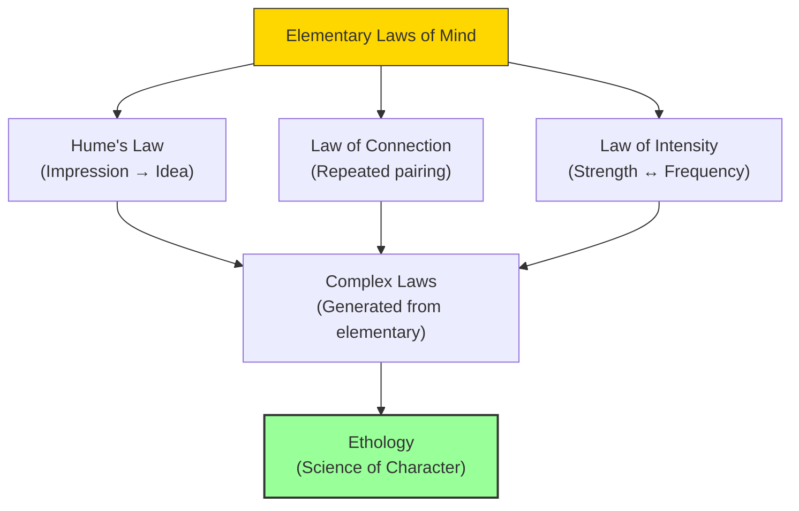

# Module 04 — J.S. Mill and Empirical Psychology

*Module 4 of 10 — Chapter 10: The Nineteenth Century: The Authority of Science*

---

In 1843, John Stuart Mill published a work that would immediately become the handbook of the scientific community. *A System of Logic* went through eight editions in Mill's lifetime and established the principles of induction, the methods of valid inference, and the role of deductive processes in science. Not many scientists in the late nineteenth century read Galileo; all of them read Mill. And it was in Book VI of the *System of Logic* that Mill made his most important contribution to psychology: the argument that human nature is a proper subject of science.

---

> [!TIP]
> **Stop and Think:** Mill argued that psychology can be a science even if it can never achieve the exactness of astronomy. Weather forecasting is a science even though it's probabilistic. Is this a satisfying defense? Or a concession that psychology will always be "second-class"?

## Psychology as Science

Mill's argument for psychology as science is disarmingly simple:

> "It is a common notion... that the thoughts, feelings, and actions of sentient beings are not a subject of science.... This notion seems to involve some confusion of ideas. Any facts are fitted, in themselves, to be a subject of science, which follow one another according to constant laws; although these laws may not have been discovered, nor even be discoverable by our existing resources."

Mill illustrates with meteorology. We cannot specify all the antecedent variables to produce rain, but we all agree that rainfall is the result of laws of nature. Forecasting the weather is probabilistic — it may never be an exact science — but it is a science nonetheless. The science of human nature is of the same description. It falls far short of astronomy's exactness, "but there is no reason that it should not be as much a science as... Astronomy."

> [!TIP]
> **Stop and Think:** Mill argued that psychology can be a science even if it can never achieve the exactness of astronomy. Weather forecasting is a science even though it's probabilistic. Is this a satisfying defense of psychology's scientific status? Or is it a concession that psychology will always be "second-class" science?

> [!TIP]
> **Stop and Think:** Mill's three laws of mind — impression-to-idea, repeated pairing, intensity-versus-frequency — are still the foundation of learning theory. Have we progressed beyond these laws, or merely elaborated them?

## The Laws of Association

Mill summarizes the laws of the mind with three principles:

1. **Hume's law**: Every mental impression has a corresponding idea. Once we have experienced X, we can recall it without its actual presentation.
2. **The law of connection**: Repeated, simultaneous presentation of two stimuli leads us to think of either when the other is later presented.
3. **The law of intensity**: A very intense stimulus has the same effect as a weaker one presented more frequently.

From these simple laws, Mill argued, complex laws of thought and feeling must be generated. The laws of association are "elementary laws of mind" that have been ascertained by ordinary experimental inquiry.

*Figure 4.1: Mill's architecture — from elementary laws of mind to the science of character (ethology).*

> [!TIP]
> **Stop and Think:** Mill distinguished between "tendencies" and "facts." Are there universal laws of human behavior? Or only tendencies that vary across cultures, situations, and individuals? What would it mean for psychology if only tendencies exist?

## Ethology: The Science of Character

Mill gave the name **ethology** to the science deduced from the empirical laws of psychology. Ethology was to be the science of character — the discipline concerned with the effects of environmental conditions on the laws of thought, feeling, and conduct. It was to be "the Exact Science of Human Nature," whose propositions are "hypothetical only, and affirm tendencies, not facts."

This distinction between tendencies and facts is crucial. From the empirical laws of association, we may predict that Henry Jones will form a stronger association between intense stimuli than between weak ones. There may be a race of men about whom this is not true. Yet from this "situational law," we can deduce that *if there is thought at all*, associations will be formed. The law does not predict the exact result of an experiment — it refers to the *tendency* of something to occur, other things being equal.

> [!TIP]
> **Stop and Think:** Mill's distinction between "tendencies" and "facts" anticipates modern debates about whether psychology should aim for universal laws or context-specific predictions. Are there universal laws of human behavior? Or only tendencies that vary across cultures, situations, and individuals?

## Mill's Utilitarianism

Mill's version of utilitarianism modified Bentham's original in important ways. Where Bentham had proposed a purely quantitative calculus of pleasure and pain, Mill argued that pleasures differ in *quality* as well as quantity:

> "Of two pleasures, if there be one to which all or almost all who have experience of both give a decided preference, irrespective of any feeling of moral obligation to prefer it, that is the more desirable pleasure."

This is a significant departure from strict empiricism. Mill is saying that some pleasures are *objectively better* than others — not because they produce more pleasure, but because they are the kind of pleasure that educated, experienced people prefer. The pleasure of reading great literature is, in some sense, higher than the pleasure of eating a good meal — even if the meal produces more immediate sensation.

Against Kant's categorical imperative, which Mill saw as potentially admitting "the most outrageously immoral rules of conduct," Mill adopted the happiness theory: we judge things to be good because they conduce to happiness, and happiness is the ultimate good — accepted without proof.

## Speaking of Mill...

- When a data scientist uses "machine learning" to find patterns in human behavior, they are applying Mill's methods of induction — the same methods he codified in 1843.
- Mill's distinction between "tendencies" and "facts" is the philosophical foundation of modern statistical reasoning in psychology — the recognition that human behavior is probabilistic, not deterministic.
- The modern debate about whether happiness is best measured by pleasure (hedonic well-being) or by meaning (eudaimonic well-being) echoes Mill's distinction between quantitative and qualitative pleasure.

---

Mill had established that psychology can be a science — that human behavior follows laws, even if those laws are probabilistic. But another thinker was about to make an even more radical claim: that psychology is not just a science but the *master* science — the science from which all other sciences derive. Auguste Comte's positivism would attempt to reduce all knowledge to scientific knowledge, and all science to sociology.

---

## References

- Robinson, D. N. (1995). *An Intellectual History of Psychology* (3rd ed.). University of Wisconsin Press. Chapter 10.
- Mill, J. S. (1843/1900). *A System of Logic*. Longmans, Green.
- Mill, J. S. (1863/1961). *Utilitarianism*. In *The Utilitarians*. Dolphin Books.

---
*Module 4 of 10 — Chapter 10: The Nineteenth Century*
