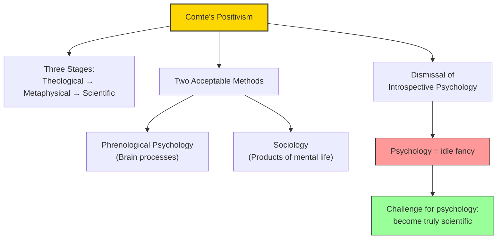

# Module 05 — Comte and Positivism

*Module 5 of 10 — Chapter 10: The Nineteenth Century: The Authority of Science*

---

Auguste Comte (1798–1857) was not a psychologist. He was, by his own account, a sociologist — indeed, he invented the word. But his influence on psychology was enormous, and it was largely negative. Comte dismissed introspective psychology as "an idle fancy, and a dream, when it is not an absurdity." If the mind is to be studied, he argued, only two methods are available: phrenological psychology (research on brain processes) and sociology (the direct observation of the products of mental life). In doing so, Comte set the terms of a debate that would shape psychology for the next two centuries.

---

> [!TIP]
> **Stop and Think:** Comte argued all cultures pass through the same three stages — from superstition to science. Is this true? Or is it a Western-centric narrative that assumes science is the inevitable endpoint of intellectual evolution?

## The Three Stages

Comte's *Cours de philosophie positive* established positivism as a system of philosophy. By his own admission, he was led to his thinking principally by Condorcet's *Sketch*, with its emphasis on cultural evolution and intellectual progress. Comte's position was that cultures pass through three distinct stages:

1. **The theological** — in which superstition and divine explanations dominate
2. **The metaphysical** — in which hidden physical forces or causes replace deities
3. **The scientific** — in which positive knowledge replaces superstition and metaphysics

The three stages must occur and in the specified order. At each transition, the culture finds itself in a "critical period." An old perspective is replaced by one whose virtues are sensed only by the best minds. Once the transition is complete, the culture enters an "organic period" of synthesis, discovery, and growth.

> [!TIP]
> **Stop and Think:** Comte argued that all cultures pass through the same three stages — from superstition to metaphysics to science. Is this true? Or is it a Western-centric narrative that assumes science is the inevitable endpoint of intellectual evolution? Consider: are there forms of knowledge that are not "scientific" but still valuable?

> [!TIP]
> **Stop and Think:** Comte dismissed introspective psychology as "an idle fancy." His challenge forced psychology to become more rigorous. Was this a service to the discipline or a distortion of it?

## The Dismissal of Psychology

Comte's most consequential claim for psychology was his dismissal of the discipline as it existed. Agreeing with Kant that the mind itself is not directly observable, Comte argued that introspective psychology — the attempt to discover the laws of the mind by looking inward — was fundamentally misguided.

If the mind is to be studied, Comte offered two alternatives: **phrenological psychology** (research on the relation between brain processes and mental states) and **sociology** (the direct observation of the products of mental life). Comte believed that if the philosophical psychologists had appreciated the importance of feeling and emotion, they would have looked throughout the animal kingdom and discovered bona fide psychological principles.

*Figure 5.1: Comte's challenge — psychology must become truly scientific or be dismissed as metaphysics.*

> [!TIP]
> **Stop and Think:** Comte argued there are only two kinds of statements: scientific and nonsense. Is this itself a scientific statement? Or is it a metaphysical claim that, by its own criterion, is nonsense?

## Science as Religion

Comte's positivism extended to embrace religion, ethics, and economics. He and his disciples advanced a view of science that placed it on a footing no different from the world's historic religions. Science would solve all problems, answer all questions, remove all doubts. To deny its power was to sink into metaphysical or theological torpor. To avail oneself of its methods was to set the world aright.

Now there were two kinds of statements a person could make. One referred to the objects of sense — and it was a scientific statement. The other was nonsense.

This is the most radical form of scientism — the doctrine that science is the only legitimate form of knowledge. It would be refined by the logical positivists of the Vienna Circle in the twentieth century and would shape the self-understanding of psychology as a discipline.

> [!TIP]
> **Stop and Think:** Comte argued that there are only two kinds of statements: scientific statements (about objects of sense) and nonsense. Is this itself a scientific statement? Or is it a metaphysical claim — a claim about the nature of knowledge that cannot be verified by the senses? If so, is it, by its own criterion, nonsense?

## Comte's Legacy

Comte's positivism was extended and refined by Mill, though Mill disagreed on several counts. Mill wisely rejected phrenology, accepted associationistic laws of the mind, and refused to dogmatize on what science must be. Still, Mill's ethology was intended to complement Comte's sociology; his rules of inference were designed to yield positive knowledge; and his appeal to the senses as the ultimate arbiters of truth was unashamedly Comtean.

The ideas of Mill and Comte culminated in the logical positivism of the Vienna Circle: Wittgenstein, Schlick, Carnap, Reichenbach. According to the logical positivists — radical empiricists — the facts of the world are sensations, and all the laws of science are ultimately reducible to empirical propositions. Once we have exhausted the data of sense, there is nothing else that can be said.

## Speaking of Positivism...

- The modern insistence that psychological claims must be "evidence-based" is a direct descendant of Comtean positivism — the demand that all knowledge claims be grounded in observable data.
- The debate about whether psychology should be a "natural science" (like physics) or a "human science" (like history) echoes Comte's distinction between positive knowledge and metaphysical speculation.
- Comte's dismissal of introspection as unscientific would be challenged by Wundt, who argued that introspection, properly conducted, could be a legitimate scientific method.

---

Comte had challenged psychology to become a genuine science or be dismissed as metaphysics. The response came from an unexpected quarter: biology. Charles Darwin's theory of evolution would provide psychology with its most powerful framework — and its most unsettling implication: that human beings are not special, not unique, not above nature. They are animals, subject to the same laws as every other living thing.

---

## References

- Robinson, D. N. (1995). *An Intellectual History of Psychology* (3rd ed.). University of Wisconsin Press. Chapter 10.
- Comte, A. (1830–1842). *Cours de philosophie positive*. Bachelier.
- Levy-Bruhl, L. (1903). *The Philosophy of Auguste Comte*. Swan Sonnenschein.

---
*Module 5 of 10 — Chapter 10: The Nineteenth Century*
