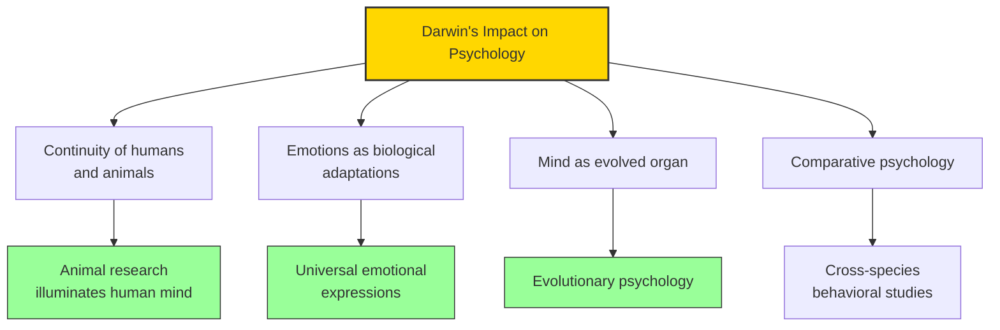

# Module 06 — Darwin and the Idea of Progress

*Module 6 of 10 — Chapter 10: The Nineteenth Century: The Authority of Science*

---

In 1859, Charles Darwin published a book that would change everything. *On the Origin of Species* did not merely propose a new theory of biology. It placed humanity on a continuum with all living things, stripped away the special status that religion and philosophy had conferred on the human mind, and provided the most powerful framework for understanding human behavior that had ever been conceived. Darwin did not "discover" evolution — the concept is as old as Aristotle. What Darwin (and, independently, Alfred Russell Wallace) discovered was that evolution is not only possible but *inevitable* and even, in a very ruthless fashion, mechanical.

---

> [!TIP]
> **Stop and Think:** The "cheerful idea of progress" took on a "gloomier complexion" with Darwin. Progress is but the consequence of annihilation. Is evolution progressive? Or merely change — directionless, purposeless, and blind?

## Malthus and the Struggle for Existence

Darwin and Wallace both read and acknowledged the ideas of Thomas Malthus's *Essay on the Principle of Population*. Malthus demonstrated, with mathematical rigor, that the breeding potential of the human race is staggering — but never realized. It is possible for human beings to increase geometrically, but such increases do not occur. Clearly there must be an opposing force limiting populations.

Malthus described what he called "the struggle for existence" — war, pestilence, and starvation as the forces preventing geometric population growth. Whenever the rate of population increase exceeds the rate of food production, people necessarily die.

Darwin applied Malthusian concepts to all living systems. He presented the forces of nature as blind agents of selection — **natural selection** — which either favor or reduce the probability that a species will survive. Within any species, wide natural variations are apparent. The press of the environment favors certain variants, which become more numerous.

> [!TIP]
> **Stop and Think:** The "cheerful idea of progress" entertained by the Enlightenment philosophes "now took on a gloomier complexion. Progress is but the consequence of annihilation. New life appears and succeeds, while older forms perish." Is evolution progressive? Or is it merely change — directionless, purposeless, and blind?

> [!TIP]
> **Stop and Think:** Darwin argued that emotional expressions are universal, not culturally learned. This was confirmed by Ekman's research a century later. What does it tell us about human nature that a smile means the same thing in every culture?

## Darwin's Psychological Contribution

Darwin's most important psychological work is *The Expression of the Emotions in Man and Animals* (1872), a book that launched comparative psychology. Darwin argued that emotional expressions — smiling, frowning, crying, laughing — are not culturally learned but biologically inherited. They are the same across cultures and across species. A dog's snarl and a human's grimace of anger are expressions of the same evolutionary heritage.

This was a revolutionary claim. It implied that the human mind is not a tabula rasa written on by culture but a biological organ shaped by millions of years of evolution. Emotions, instincts, cognitive capacities — all of these are adaptations, products of natural selection, no less than the shape of the hand or the color of the eye.

*Figure 6.1: Darwin's impact — from comparative psychology to evolutionary psychology.*

> [!TIP]
> **Stop and Think:** Social Darwinism — the idea that competition is "natural" and beneficial — is one of the most dangerous misapplications of scientific theory. What responsibility do scientists have for the political uses of their ideas?

## The Reception of Darwinism

Darwin's theory was received differently by different audiences. To the religious, it was heresy — the earth was older than Scripture indicated, and man was not created separately but evolved from primates. To the middle-class commercialists of Victoria's empire, Darwinism was interpreted as a justifying ethic: the poor were poor "by nature," and only certain "types" were properly adapted to the demands of the environment. This misapplication of Darwin's ideas — **Social Darwinism** — would be used to justify racism, colonialism, and the worst excesses of industrial capitalism.

To Continental scholars under the influence of Comtean positivism, the Darwinian model pulled many diverse strands together. The nervous system has evolved; consciousness has evolved; structure entails function. In Freud's words, "anatomy is destiny." Simultaneously, studies of comparative culture, comparative anatomy, and comparative psychology began to appear. Everything now made sense: the idea of progress, the enlightened machine, utilitarianism, the positive philosophy.

> [!TIP]
> **Stop and Think:** Social Darwinism — the idea that competition between individuals and groups is "natural" and beneficial — is one of the most dangerous misapplications of scientific theory. Darwin never argued that the strong should dominate the weak. But his theory was used to justify exactly that. What responsibility do scientists have for the political uses of their ideas?

## Speaking of Darwin...

- When a psychologist studies fear responses in rats to understand anxiety in humans, they are applying Darwin's principle of evolutionary continuity.
- The modern field of evolutionary psychology — which argues that human cognitive adaptations were shaped by natural selection in ancestral environments — is a direct descendant of Darwin's *Expression of the Emotions*.
- Darwin's insistence that emotional expressions are universal (not culturally learned) was confirmed by Paul Ekman's cross-cultural research in the 1960s — a century after Darwin made the claim.

---

Darwin had placed humanity on a biological continuum with all living things. But this raised a practical question: if the mind is a biological organ, how do we study it? The answer came from two directions: from Alexander Bain, who united psychology and physiology, and from the phrenologists, who attempted to localize mental functions in the brain.

---

## References

- Robinson, D. N. (1995). *An Intellectual History of Psychology* (3rd ed.). University of Wisconsin Press. Chapter 10.
- Darwin, C. (1859/1964). *On the Origin of Species*. Harvard University Press.
- Darwin, C. (1872/1998). *The Expression of the Emotions in Man and Animals*. Oxford University Press.

---
*Module 6 of 10 — Chapter 10: The Nineteenth Century*
