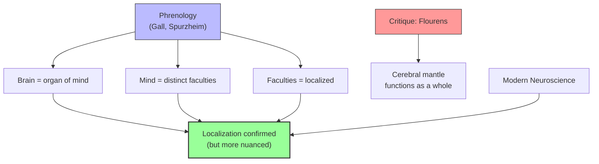

# Module 07 — Nineteenth-Century Materialism: Bain and the Brain

*Module 7 of 10 — Chapter 10: The Nineteenth Century: The Authority of Science*

---

In 1851, Alexander Bain wrote to J.S. Mill describing his progress on a new psychology text: "I have just finished rough drafting the first division... which includes the Sensations, Appetites, and Instincts. All through this portion I keep up a constant reference to the material structure of the parts concerned, it being my purpose to exhaust in this division the physiological basis of mental phenomena." Bain's ambition — "so to unite psychology and physiology that physiologists may be made to appreciate the true ends and drift of their researches into the nervous system" — would define the trajectory of scientific psychology for the next century.

---

> [!TIP]
> **Stop and Think:** Bain's ambition — to unite psychology and physiology — is the program of modern cognitive neuroscience. Has this vision been achieved? Or does the "hard problem of consciousness" still stand in the way?

## Bain's Physiological Psychology

Alexander Bain (1818–1903) was a close and admired associate of J.S. Mill. His *The Senses and the Intellect* (1855) and *The Emotions and the Will* (1859) were the first systematic attempts to ground psychology in physiology. Bain's approach was explicitly materialistic: mental phenomena are to be understood by reference to the brain structures and processes that produce them.

Bain's contribution was not primarily experimental — he was not a laboratory scientist. But he articulated the vision that would drive psychology's transformation from a branch of philosophy into an experimental science. The mind is not a ghost in the machine; it is the machine itself, understood at a different level of description.

> [!TIP]
> **Stop and Think:** Bain's ambition — to unite psychology and physiology — is essentially the program of modern cognitive neuroscience. When a neuroscientist uses fMRI to study the brain basis of decision-making, they are pursuing Bain's vision. Has this vision been achieved? Or does the "hard problem of consciousness" still stand in the way?

> [!TIP]
> **Stop and Think:** Phrenology is dismissed as pseudoscience, yet its core principles — brain is organ of mind, functions are localized — are foundational to modern neuroscience. Can a theory be wrong in specifics but right in fundamentals?

## Phrenology: The First Brain Science

The phrenological movement, founded by Franz Joseph Gall (1758–1828) and popularized by Johann Spurzheim (1776–1832), was the first serious attempt to localize mental functions in specific brain regions. Gall argued that the brain is the organ of the mind, that the mind is composed of distinct faculties, and that these faculties are localized in specific areas of the cerebral cortex.

Gall's specific claims — that character can be read from the bumps on the skull — were largely discredited. But his underlying principles were vindicated by modern neuroscience: the brain *is* the organ of the mind, the mind *is* composed of distinct functions, and these functions *are* localized in specific brain regions.

*Figure 7.1: From phrenology to modern neuroscience — the underlying principles were right, even if the specific claims were wrong.*

## Flourens and the Critique of Phrenology

Pierre Flourens (1794–1867) performed surgery on animals, including removal of the cerebral hemispheres, and carefully noted pathologic changes in the brains of recently deceased patients. It was Flourens who insisted that the cerebral mantle functions as a whole, that the magnitude of a deficit is not simply reducible to the amount of brain involved, and that similar deficits can result from lesions in several brain regions.

Flourens was successful in drawing attention to the scientific deficiencies of phrenological theory. But his alternative — that the brain functions as a whole — was itself an oversimplification. Modern neuroscience has shown that both localization and distributed processing are real: specific functions are indeed localized, but they also depend on widespread neural networks.

> [!TIP]
> **Stop and Think:** Phrenology is often dismissed as pseudoscience. But its core principles — that the brain is the organ of the mind, that mental functions are localized — are foundational to modern neuroscience. Can a theory be wrong in its specifics but right in its fundamentals? What does this tell us about the relationship between error and progress in science?

> [!TIP]
> **Stop and Think:** Spencer argued that "localization of function is the law of all organization whatever." Modern neuroscience confirms this — but also shows that functions depend on distributed networks. Is the mind localized or distributed? Or both?

## Spencer and Evolutionary Psychology

Herbert Spencer (1820–1903), in his widely read *Principles of Psychology*, divorced himself from orthodox phrenology but defended the general principle of localization:

> "Whoever calmly considers the question cannot long resist the conviction that different parts of the cerebrum must, in some way or other, subserve different kinds of mental action. Localization of function is the law of all organization whatever; and it would be marvellous were there here an exception."

Spencer attempted to tie localization to evolution — arguing that the complexities of human neuroanatomical organization are evolved forms of more primitive organization. Unfortunately, he accepted the Lamarckian notion of inheritance of acquired characteristics, which weakened his evolutionary arguments. But his basic insight — that the mind evolved, and that its structure reflects its evolutionary history — was correct.

## Speaking of Bain and the Brain...

- When a neurologist uses brain imaging to diagnose a patient's cognitive deficits, they are applying principles that Gall first articulated and Flourens first tested experimentally.
- The modern debate about "general intelligence" (g) versus "multiple intelligences" echoes the phrenological debate about whether the mind has one faculty or many.
- Bain's vision of uniting psychology and physiology has been largely achieved — but the "hard problem" of how brain processes give rise to conscious experience remains unsolved.

---

Bain and the phrenologists had established that psychology must be grounded in brain science. But how do you *measure* mental events? The answer came from an unlikely source: a Leipzig physicist named Gustav Fechner, who demonstrated that the relationship between mind and body could be expressed mathematically.

---

## References

- Robinson, D. N. (1995). *An Intellectual History of Psychology* (3rd ed.). University of Wisconsin Press. Chapter 10.
- Bain, A. (1855). *The Senses and the Intellect*. Parker.
- Spencer, H. (1855). *The Principles of Psychology*. Longman.

---
*Module 7 of 10 — Chapter 10: The Nineteenth Century*
