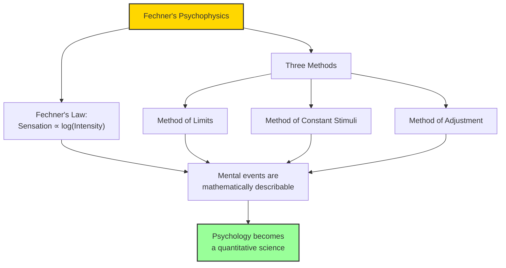

# Module 08 — Fechner and the Birth of Psychophysics

*Module 8 of 10 — Chapter 10: The Nineteenth Century: The Authority of Science*

---

In 1860, a Leipzig physicist named Gustav Fechner (1801–1876) published a book that would change the relationship between psychology and physics forever. *Elemente der Psychophysik* sought to express mathematically the relationship between mental and physical events. Fechner's law — that the strength of sensation is proportional to the logarithmic value of the intensity of stimulation — demonstrated that mental events could be measured with the same precision as physical events. No longer was it necessary to apologize for "introspective" techniques. Comte's critique of psychology seemed to vanish under the weight of Fechner's law.

---

> [!TIP]
> **Stop and Think:** Fechner showed that the relationship between physical stimuli and psychological sensations follows a mathematical law. Is this surprising? Does it change how you think about the mind?

## The Problem Fechner Solved

The problem of measuring mental events had haunted psychology since its inception. How do you measure a feeling? How do you quantify a sensation? The empiricists had argued that all knowledge comes from experience, but they had never shown how to *measure* experience. The materialists had argued that the mind is matter in motion, but they had never shown how to *quantify* the motion of thought.

Fechner solved this problem with elegant simplicity. He demonstrated that if you present a subject with a series of stimuli of increasing intensity and ask them to report when they notice a difference, the relationship between the physical stimulus and the psychological sensation follows a logarithmic function. A small increase in a weak stimulus is noticeable; the same increase in a strong stimulus is not. The relationship is predictable, measurable, and universal.

> [!TIP]
> **Stop and Think:** Fechner showed that the relationship between physical stimuli and psychological sensations follows a mathematical law. This means that mental events are not random or chaotic — they are lawful. Is this surprising? Does it change how you think about the mind?

> [!TIP]
> **Stop and Think:** Modern signal detection theory — which measures the ability to detect faint signals against background noise — is a direct descendant of Fechner's methods. Every time you use a hearing test or a quality control inspection, you are applying Fechner.

## Fechner's Methods

Fechner developed three psychophysical methods that are still used today:

1. **The method of limits**: The subject is presented with stimuli of increasing or decreasing intensity and reports when they can or cannot detect a difference.
2. **The method of constant stimuli**: The subject is presented with a series of stimuli of fixed intensity and reports whether each is above or below a threshold.
3. **The method of adjustment**: The subject adjusts a stimulus until it matches a standard.

These methods demonstrated that the properly instructed laboratory subject, paced through a series of repeated measurements, would yield reliable data reducible to lawful description. Psychology had its measurement tools.

*Figure 8.1: Fechner's contribution — the mathematical relationship between mind and body, and the methods to measure it.*

> [!TIP]
> **Stop and Think:** Fechner's law — sensation is proportional to the logarithm of stimulus intensity — is one of the most robust findings in all of psychology. It applies to vision, hearing, touch, taste, and smell. What does it mean that a mathematical law governs our most intimate experiences?

## The Significance of Psychophysics

Fechner's achievement was not merely technical — it was philosophical. By demonstrating that mental events follow mathematical laws, Fechner showed that the mind is not beyond the reach of science. The Kantian claim that psychology can never be a true science because the mind cannot be observed directly was refuted: the mind *can* be observed, through its measurable effects on behavior.

Wundt, seldom lavish in his praise, acknowledged Fechner's contribution: "It is Fechner's service to have found and followed the true way; to have shown us how a 'mathematical psychology' may, within certain limits, be realized in practice."

> [!TIP]
> **Stop and Think:** Fechner's law — sensation is proportional to the logarithm of stimulus intensity — is one of the most robust findings in all of psychology. It applies to vision, hearing, touch, taste, and smell. What does it mean that a mathematical law governs our most intimate experiences?

## Speaking of Fechner...

- When a sound engineer adjusts volume levels using decibels (a logarithmic scale), they are applying Fechner's law — the recognition that perceived loudness is proportional to the log of physical intensity.
- Modern signal detection theory — which measures the ability to detect faint signals against background noise — is a direct descendant of Fechner's psychophysical methods.
- Fechner's demonstration that mental events can be measured is the foundation of all psychological testing — from IQ tests to personality inventories to clinical assessments.

---

Fechner had shown that mental events can be measured. But who would build the laboratory, design the experiments, and create the discipline of experimental psychology? The answer was Wilhelm Wundt, who in 1879 opened the first experimental psychology laboratory at the University of Leipzig — and founded a science.

---

## References

- Robinson, D. N. (1995). *An Intellectual History of Psychology* (3rd ed.). University of Wisconsin Press. Chapter 10.
- Fechner, G. T. (1860/1966). *Elements of Psychophysics* (H. E. Adler, Trans.). Holt, Rinehart and Winston.
- Wundt, W. (1874/1904). *Principles of Physiological Psychology* (E. B. Titchener, Trans.). Macmillan.

---
*Module 8 of 10 — Chapter 10: The Nineteenth Century*
