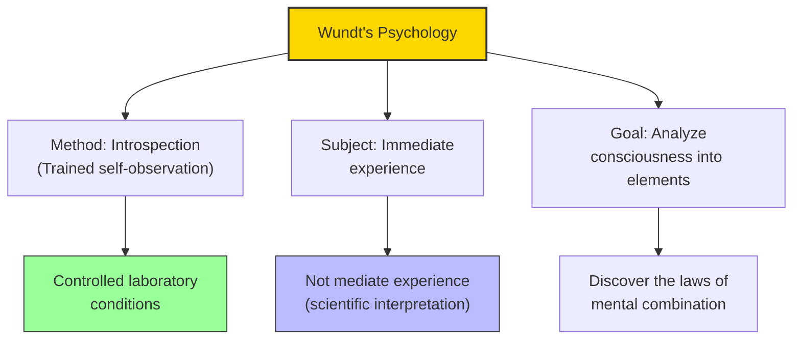

# Module 09 — Wundt and the Founding of Experimental Psychology

*Module 9 of 10 — Chapter 10: The Nineteenth Century: The Authority of Science*

---

In 1879, Wilhelm Wundt (1832–1920) opened a laboratory at the University of Leipzig that would become the birthplace of experimental psychology. It was not the first laboratory devoted to psychological research — Fechner had been conducting psychophysical experiments for two decades. But it was the first laboratory *explicitly designated* as a psychology laboratory — the first institution dedicated to the proposition that the mind can be studied by the methods of experimental science. Psychology, at last, had a home.

---

> [!TIP]
> **Stop and Think:** What does it mean to "found" a science? Is it the person who opens the first laboratory? Who writes the first textbook? Who defines the subject matter? Or is it a collective achievement that no single person can claim?

## Wundt's Vision

Wundt's *Principles of Physiological Psychology* (1874) was the most self-consciously programmatic work of its era. With Bain and Spencer, Wundt saw the need to join the sciences of psychology and physiology. Unlike either Bain or Spencer, Wundt was a working scientist — and as a result, he was far more concerned with the development of proper methods and measures.

For these methods, Wundt looked to Fechner's psychophysical demonstrations. But for Wundt, neither the rational-mathematical deductive psychology of Herbart nor the dualism of Fechner could serve as the foundation of psychological science. Wundt sought something new: a psychology that was simultaneously experimental and philosophical, empirical and theoretical.

> [!TIP]
> **Stop and Think:** Wundt is often credited with "founding" psychology as a science. But what does it mean to "found" a science? Is it the person who opens the first laboratory? Who writes the first textbook? Who defines the subject matter? Or is it a collective achievement that no single person can claim?

> [!TIP]
> **Stop and Think:** Wundt's introspection has been largely abandoned. But when researchers ask participants to "think aloud" or report subjective ratings, they use a descendant of his method. Has introspection been refined rather than rejected?

## Introspection as Method

Wundt's method was **introspection** — the systematic self-observation of one's own mental states. This was not the casual, untrained self-reflection that Comte had dismissed. It was a rigorous, controlled procedure in which trained observers were presented with carefully designed stimuli and asked to report their immediate conscious experiences.

Wundt insisted that his psychology was nonmetaphysical, nondeductive, and concerned only with the facts and internal organization of consciousness. He distinguished between **mediate** and **immediate** experience: mediate experience is experience as interpreted by science (e.g., the physics of light); immediate experience is experience as directly lived (e.g., the sensation of red). Psychology's subject matter is immediate experience — the contents of consciousness as they are directly apprehended.

*Figure 9.1: Wundt's program — introspection as a rigorous laboratory method for studying immediate experience.*

> [!TIP]
> **Stop and Think:** Wundt distinguished between experimental psychology (simple processes) and cultural psychology (complex ones). This division anticipated the modern split between cognitive psychology and cultural psychology. Can one method study both?

## The Limits of Introspection

Wundt was aware of the limitations of his method. He recognized that introspection could not address all psychological questions. Higher mental processes — reasoning, judgment, language — were not amenable to the same kind of laboratory investigation as simple sensations. For these, Wundt turned to *Völkerpsychologie* (cultural psychology) — the study of how mental life is shaped by language, myth, and custom.

This distinction between experimental psychology (for simple processes) and cultural psychology (for complex ones) anticipated the modern division between cognitive psychology and cultural psychology. It also revealed the fundamental tension in Wundt's program: the mind is both a laboratory object and a cultural product — and these two aspects require different methods.

> [!TIP]
> **Stop and Think:** Wundt's introspection method has been largely abandoned in modern psychology. But is it truly dead? When a researcher asks participants to "think aloud" while solving a problem, or reports their subjective ratings of emotional states, they are using a descendant of Wundt's method. Has introspection been refined rather than rejected?

## The Legacy of the Leipzig Laboratory

Wundt's laboratory attracted students from across the world. Many of them — Edward Titchener, G. Stanley Hall, James McKeen Cattell — would return to their home countries and establish psychology laboratories of their own. Within a decade of its founding, the Leipzig model had been replicated in universities across Europe and America.

But the students often disagreed with their master. Titchener, who brought experimental psychology to America, transformed Wundt's introspection into a more rigid, elementistic method. Hall founded the first American psychology laboratory at Johns Hopkins and pioneered the study of child development. Cattell developed mental testing and individual differences research. The discipline that Wundt had created was already fragmenting into specialties.

## Speaking of Wundt...

- The modern psychology department — with its laboratories, its experimental methods, its distinction between basic and applied research — is Wundt's institutional legacy.
- Wundt's insistence that psychology must be both experimental and philosophical anticipates the modern debate about whether psychology is a natural science, a social science, or something else entirely.
- The fact that Wundt's students disagreed with each other almost as much as they disagreed with their master suggests that the fragmentation of psychology was built into its founding.

---

Wundt had created experimental psychology as a laboratory science. But while Wundt was building his laboratory in Leipzig, other thinkers were pursuing very different visions of the human mind. In Berlin, Hegel's dialectic was shaping the course of political philosophy. In London, Marx was developing a materialist theory of history. And in Turin, Nietzsche was dismantling every certainty that Western philosophy had ever claimed.

---

## References

- Robinson, D. N. (1995). *An Intellectual History of Psychology* (3rd ed.). University of Wisconsin Press. Chapter 10.
- Wundt, W. (1874/1904). *Principles of Physiological Psychology* (E. B. Titchener, Trans.). Macmillan.
- Danziger, K. (1979). The origins of the psychological experiment as a social institution. *American Psychologist, 34*(4), 343–353.

---
*Module 9 of 10 — Chapter 10: The Nineteenth Century*
