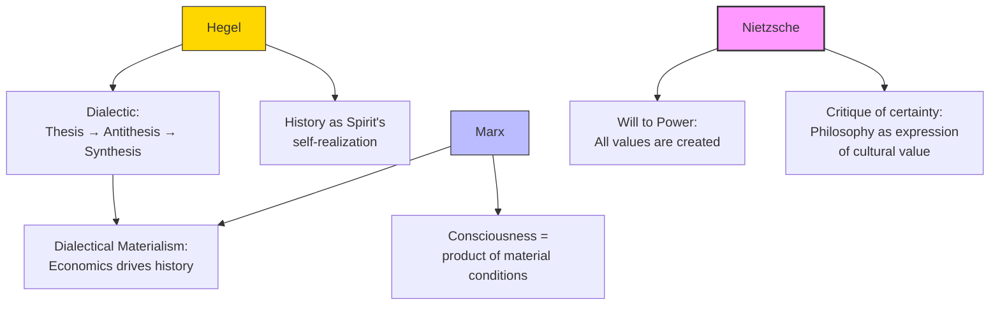

# Module 10 — Hegel, Marx, and Nietzsche: Philosophy Beyond the Lab

*Module 10 of 10 — Chapter 10: The Nineteenth Century: The Authority of Science*

---

While Wundt was building his laboratory in Leipzig and Fechner was measuring sensations, three of the most influential thinkers of the nineteenth century were pursuing visions of the human mind that had nothing to do with laboratories or measurements. Georg Wilhelm Friedrich Hegel (1770–1831) proposed a dialectical philosophy of history and consciousness. Karl Marx (1818–1883) developed a materialist theory of society and economics. Friedrich Nietzsche (1844–1900) dismantled every certainty that Western philosophy had ever claimed. None of them were psychologists. All of them profoundly influenced psychology.

---

> [!TIP]
> **Stop and Think:** Hegel's dialectic — thesis, antithesis, synthesis — is really a claim about how understanding develops: through conflict, not accumulation. Do your best ideas come from confirming what you know, or from confronting what challenges it?

## Hegel's Dialectic

Hegel proclaimed that "nothing great in the world has been accomplished without passion" and argued that the essential nature of humanity — not one at a time but as a collective of consciousness — is freedom, the irrepressible freedom of spirit. Renewing the ageless dichotomy, he dismissed matter as the passive victim of natural laws and asserted spirit as the only free force in the universe.

Hegel's dialectical method — **thesis, antithesis, synthesis** — proposed that truth emerges through the clash of opposing ideas. Every proposition (thesis) generates its opposite (antithesis), and from their conflict emerges a higher truth (synthesis) that incorporates both. This dialectical logic would influence Marx's theory of historical change, Freud's model of the psyche (id, ego, superego), and every subsequent theory that understands the mind as a system of opposing forces.

> [!TIP]
> **Stop and Think:** Hegel's dialectic — thesis, antithesis, synthesis — is often presented as a formula. But it is really a claim about how understanding develops: through conflict, not through accumulation. Is this how you learn? Do your best ideas come from confirming what you already know, or from confronting what challenges it?

> [!TIP]
> **Stop and Think:** Marx argued that consciousness is determined by material conditions. Kant argued that the mind brings its own structure to experience. Is consciousness shaped by economics (Marx) or by innate categories (Kant)? Or both?

## Marx's Materialism

Marx's contribution to psychology was marginal — not because his ideas were unimportant, but because his approach was historiographical rather than experimental. The nineteenth-century developments in psychology were largely experimental, and Marx's approach was precisely the kind of thinking that the founders of experimental psychology were rejecting.

Moreover, while Marx accorded "consciousness" a central role in his theory, it was a role indistinguishable from Hegelianism — and therefore not new enough to attract the attention of psychologists seeking original frameworks. Marx did not have a great effect either on contemporaries who figured centrally in psychology or on later psychologists who shared his materialistic orientation.

*Figure 10.1: The three philosophical rebels — Hegel, Marx, and Nietzsche each challenged the foundations of Western thought in ways that would echo through psychology.*

> [!TIP]
> **Stop and Think:** Nietzsche argued that all philosophical systems are expressions of human needs, not discoveries about reality. Is this true of psychology? When a psychologist proposes a theory, are they discovering something about the mind or expressing their own cultural values?

## Nietzsche's Critique

Nietzsche found Kant charmed by the discovery of the pure categories and the possibility of synthetic knowledge a priori. As Nietzsche understood Kant, all this is possible owing to a "faculty" of reason: "So then we are able to do this because we have something that enables us to do this — the old virtus dormitiva of Molière again."

Nietzsche's conclusion was not that we lack such fixed features of thought and judgment, but that *having them does not establish their validity, only their utility*. We think and reason as we do in the furtherance of desires that are "all too human." The discoveries of philosophy are but inventions — not the illumination of what is in the natural world, but the crafting of things expressive of cultural or personal value.

This is a devastating critique. It implies that *all* philosophical systems — empiricist, rationalist, materialist — are not discoveries about the mind but expressions of the mind. They are not objective descriptions of reality but subjective projections of human needs, desires, and values.

> [!TIP]
> **Stop and Think:** Nietzsche argued that all philosophical systems are expressions of human needs, not discoveries about reality. Is this true of psychology as well? When a psychologist proposes a theory of motivation or personality, are they discovering something about the mind or expressing their own cultural values?

## Speaking of Hegel, Marx, and Nietzsche...

- Freud's model of the psyche — id (thesis), superego (antithesis), ego (synthesis) — is explicitly Hegelian in structure.
- The debate about whether consciousness is determined by material conditions (Marx) or by innate structures (Kant) is still the central debate in the philosophy of mind.
- Nietzsche's claim that "truth" is a human invention anticipates the social constructionist movement in psychology — the argument that psychological categories are cultural products, not natural kinds.

---

The nineteenth century had created psychology as we know it — its problems, its methods, its institutional structure, and its philosophical foundations. But it had also created a tension that would define the next century: the tension between psychology as a *natural science* (objective, experimental, materialist) and psychology as a *human science* (subjective, interpretive, meaning-seeking). This tension is not a flaw in psychology. It is the reflection of a genuine and irreducible feature of the human mind: we are both objects and subjects, both machines and meaning-makers.

---

## References

- Robinson, D. N. (1995). *An Intellectual History of Psychology* (3rd ed.). University of Wisconsin Press. Chapter 10.
- Hegel, G. W. F. (1807/1977). *Phenomenology of Spirit* (A. V. Miller, Trans.). Oxford University Press.
- Marx, K. (1867/1990). *Capital* (Vol. 1). Penguin.
- Nietzsche, F. (1886/1966). *Beyond Good and Evil*. Vintage.

---
*Module 10 of 10 — Chapter 10: The Nineteenth Century*
