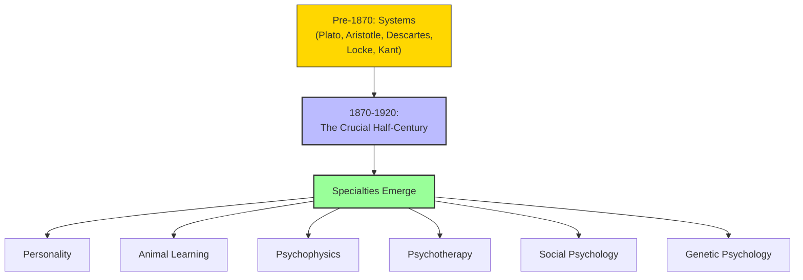

# Module 01 — From Systems to Specialties: Why Psychology Fragmented

*Module 1 of 8 — Chapter 11: From Systems to Specialties*

---

If we thumb through the preceding chapters, one characteristic stands out and divides all of the past from what is now taken to be the proper study of psychology. The psychologies of Plato, Aristotle, Aquinas, Hobbes, Descartes, Locke, and the rest share a uniform commitment to develop a *system* of psychology able to embrace the fullest range of psychological phenomena: thought, emotion, memory, conduct, morality, government, aesthetics. When we compare this commitment with the activities that most clearly identify contemporary psychology, we find a striking difference. Modern psychology is dominated by a relatively small number of highly specialized fields, and each develops independently of the others.

---

> [!TIP]
> **Stop and Think:** A psychophysicist studying auditory thresholds and a psychotherapist treating depression work in the same field but share almost nothing. Is this a sign of maturity (specialization) or dysfunction (fragmentation)?

## The Great Fragmentation

Today's psychology includes (a) the psychology of personality, (b) animal learning and memory, (c) human psychophysics, (d) psychotherapy, (e) social psychology, and (f) genetic psychology. The social psychologist can undertake programs without ever consulting psychophysics. The psychophysicist need not explore psychotherapy. The psychotherapist proceeds without help from comparative psychology.

This fact is neither "good" nor "bad." But it is a fact of history, and one to be understood in historical terms. Every one of the old isms contributed to it: empiricism, rationalism, idealism, materialism, and nativism. So too did advances in the physical and biological sciences, and especially the general divorce between science and philosophy decreed toward the middle of the nineteenth century.

> [!TIP]
> **Stop and Think:** Modern psychology is fragmented into specialties that rarely talk to each other. Is this a strength (depth of expertise) or a weakness (loss of the big picture)? Consider: does a psychophysicist studying auditory thresholds need to know about Freud? Should a psychotherapist understand neural coding?

> [!TIP]
> **Stop and Think:** Physics keeps trying to find a unified theory despite centuries of failure. Psychology gave up on systems and settled for specialties. What does this difference tell you about the two disciplines?

## Why Not the Old Way?

Why did psychology abandon the "systems" approach? The most obvious explanations are uninforming:

- "Earlier attempts failed, so psychologists became more modest." But in physics, failed attempts at a unified theory haven't stopped physicists from trying.
- "Modern psychology is more scientific." But it's far from clear that psychology is "more scientific" than earlier contributions. It is more *experimental*, but that's a different matter.
- "Today's psychologists are simply not as bright as the geniuses of old." This is offensive without being documented.

The real explanation lies in the creation of *specialized methods and problems* that, by their very nature, became collections of specialties. The bridge-builders — the scientists and scholars of the half-century from 1870 to 1920 — combined the various isms and scientific advances within the context of the great divorce between science and philosophy and created special fields of psychological inquiry and practice.

*Figure 1.1: The great fragmentation — from unified systems to independent specialties in the half-century from 1870 to 1920.*

> [!TIP]
> **Stop and Think:** The period 1870–1920 created virtually every specialty in modern psychology in just fifty years. What conditions made this possible? The advance of science? The decline of philosophy? The rise of universities?

## The Bridge-Builders

The individuals who created modern psychology's specialties include:

- **George Romanes** and **C. Lloyd Morgan** — who founded comparative psychology
- **Henry Maudsley** — who established the medical model of mental illness
- **Wilhelm Wundt** — who created experimental psychology as a laboratory science
- **William James** — who defined psychology for the American tradition
- **Sigmund Freud** — who invented psychoanalysis
- **Pierre Janet** — who pioneered the psychological study of hysteria
- **Alfred Binet** — who created intelligence testing

Each of these thinkers contributed something essential. Together, they created the intellectual framework within which all subsequent psychology has operated.

> [!TIP]
> **Stop and Think:** The period from 1870 to 1920 — just fifty years — created virtually every specialty in modern psychology. This is an astonishingly short time for such a profound transformation. What conditions made this possible? Was it the advance of science? The decline of philosophy? The rise of universities?

## Speaking of Fragmentation...

- When a university department has separate divisions for clinical, cognitive, developmental, and social psychology, it is institutionalizing the fragmentation that began in the 1870s.
- The modern debate about whether psychology is "one science or many" echoes the nineteenth-century tension between the systems approach and the specialties approach.
- The fact that a psychotherapist and a psychophysicist can work in the same department without ever speaking to each other is a direct consequence of the historical process this chapter describes.

---

The first specialty to emerge was comparative psychology — the study of animal minds. And its founding question was deceptively simple: do animals think?

---

## References

- Robinson, D. N. (1995). *An Intellectual History of Psychology* (3rd ed.). University of Wisconsin Press. Chapter 11.
- Morgan, C. L. (1894). *An Introduction to Comparative Psychology*. Walter Scott.
- Romanes, G. J. (1882). *Animal Intelligence*. Kegan Paul, Trench.

---
*Module 1 of 8 — Chapter 11: From Systems to Specialties*
