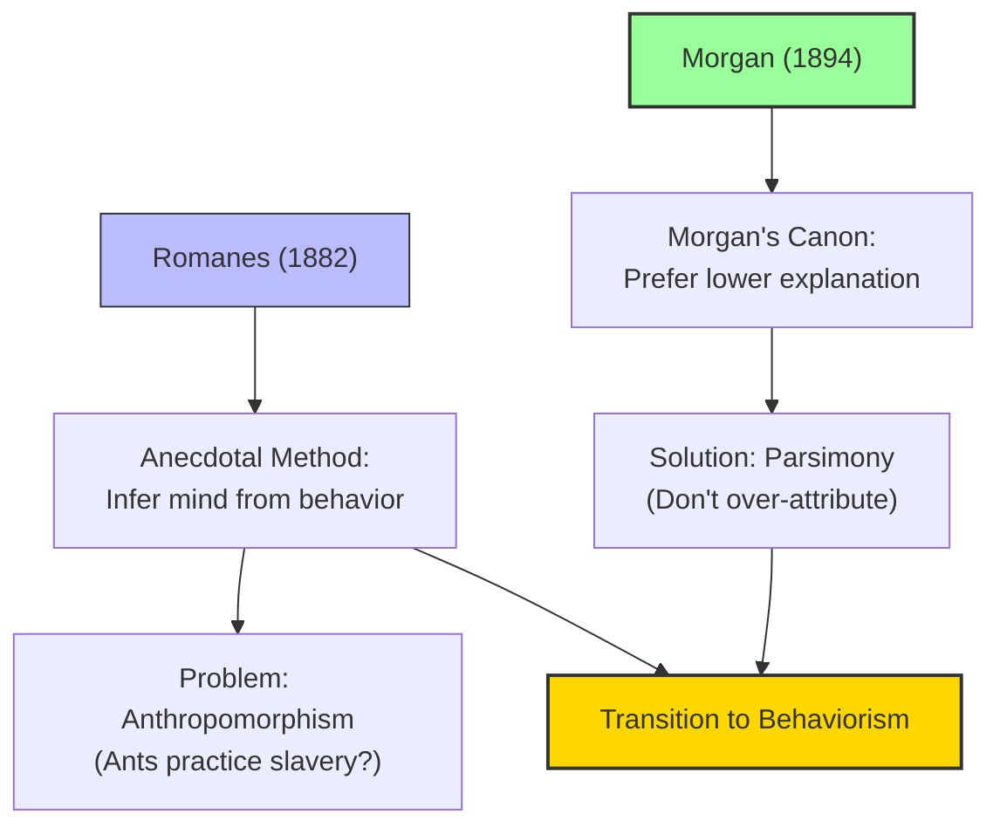

# Module 02 — Comparative Psychology: From Anthropomorphism to Behaviorism

*Module 2 of 8 — Chapter 11: From Systems to Specialties*

---

In 1882, George Romanes published *Animal Intelligence*, a work that launched comparative psychology by asking a simple question: do animals have minds? Romanes argued that they do — and that the evidence for animal minds is the same kind of evidence we use to infer minds in other humans. We observe behavior. We note that the animal does the sorts of things we do when we are thinking, feeling, or remembering. And we infer that the animal, like us, has mental states. This method — the "anecdotal method" — would be both the making and the undoing of comparative psychology.

---

> [!TIP]
> **Stop and Think:** You assume your dog is happy when it wags its tail. Is this inference justified? Or is it anthropomorphism — projecting human qualities onto non-human creatures?

## Romanes and the Anecdotal Method

Romanes insisted that all attributions of mind are inferential: "We can be sure only of our own minds and not those of others." The basis upon which we infer that Smith has fear is that Smith is doing the sorts of things we do when we are fearful. The same is the case when we attribute consciousness, motivation, and memory to animals.

But Romanes took this logic to extremes. He concluded that ants practice slavery, that the termite queen summons an audience, and that the trap-door spider learns how to prevent illegal entries. What is behavioristic in this approach is the commitment to accept only observable behavior as evidence. What is mentalistic is the commitment to translate this evidence into the language of consciousness.

> [!TIP]
> **Stop and Think:** Romanes argued that we infer minds in others — human or animal — based on behavior. You do the same thing every day: you assume your dog is happy when it wags its tail, your friend is sad when they cry. Is this inference justified? Or is it anthropomorphism — projecting human qualities onto non-human creatures?

> [!TIP]
> **Stop and Think:** Morgan's canon says: prefer the simpler explanation. If a dog's behavior can be explained by association, don't attribute reasoning. Is this always good advice? Could it cause us to underestimate animal minds?

## Morgan's Canon

The antidote for Romanes's anthropomorphism was provided by C. Lloyd Morgan in his *Introduction to Comparative Psychology* (1894). Morgan developed his famous canon:

> "In no case may we interpret an action as the outcome of the exercise of a higher psychic faculty, if it can be interpreted as the outcome of the exercise of one which stands lower in the psychological scale."

This is the principle of parsimony applied to animal behavior. If a dog's behavior can be explained by simple association, do not attribute reasoning to it. If a rat's maze-learning can be explained by trial-and-error, do not attribute planning to it.

But Morgan was not a behaviorist. He took for granted that "it is with states of consciousness that psychology has to deal." His canon was not a denial of animal consciousness but a methodological caution: do not attribute more consciousness than the evidence warrants.

*Figure 2.1: From Romanes to Morgan to behaviorism — the progressive tightening of what counts as acceptable inference about animal minds.*

> [!TIP]
> **Stop and Think:** Morgan — who founded comparative psychology — argued that artistic genius cannot be explained by natural selection. Wallace — who co-discovered evolution — agreed. Is this a failure of imagination, or does it suggest some capacities transcend biology?

## The Conservative Darwinists

Not all Darwinists were willing to extend evolutionary continuity to the highest human capacities. Morgan himself argued that "commanding intellect, mathematical or scientific ability, artistic genius or lofty moral ideas" are *not* attributable solely to natural selection. Alfred Russell Wallace, co-founder of evolutionary theory, agreed: he could find no connection between musical faculty and survival in the struggle for existence.

Only radical evolutionists like Haeckel submerged all such reservations in the triumph of monistic materialism. Haeckel urged those who would exempt art or ethics from evolutionary theory to "surrender their superstitions."

> [!TIP]
> **Stop and Think:** Morgan — the man who founded comparative psychology — argued that artistic genius and mathematical ability cannot be explained by natural selection. Wallace — who co-discovered evolution — agreed. Is this a failure of imagination? Or does it suggest that some human capacities transcend biological explanation?

## The Road to Behaviorism

The transition from comparative psychology to behaviorism was gradual. James Rowland Angell, William James's student and John B. Watson's teacher, captured the mood: "Our whole tendency now-a-days is to recognize and frankly admit that, inasmuch as we must infer the psychic operations of animals wholly in terms of their behavior, we are under peculiar obligation to interpret their activities in the most conservative possible way."

Even in this brief passage, we can see the old mentalism receding and the new objective behaviorism on the horizon. If we must infer mental states from behavior, and if we must be conservative in our inferences, then perhaps we should confine ourselves to behavior alone — and abandon the language of consciousness altogether.

## Speaking of Comparative Psychology...

- When a dog owner says "my dog feels guilty" after it has chewed a shoe, they are making a Romanesian inference. Morgan's canon would ask: can the dog's lowered head and averted gaze be explained by simpler learning processes?
- Modern animal cognition research — which carefully designs experiments to test what animals *actually* know, rather than what we project onto them — is the sophisticated descendant of Morgan's canon.
- The debate about whether animals have "theory of mind" (the ability to attribute mental states to others) is a modern version of the Romanes-Morgan dispute.

---

Comparative psychology had established that animal behavior can be studied scientifically. But this raised a deeper question: what is psychology *about*? Is it about consciousness (the mentalistic view) or about behavior (the materialistic view)? The debate between these two positions would define psychology for the next century.

---

## References

- Robinson, D. N. (1995). *An Intellectual History of Psychology* (3rd ed.). University of Wisconsin Press. Chapter 11.
- Romanes, G. J. (1882). *Animal Intelligence*. Kegan Paul, Trench.
- Morgan, C. L. (1894). *An Introduction to Comparative Psychology*. Walter Scott.

---
*Module 2 of 8 — Chapter 11: From Systems to Specialties*
