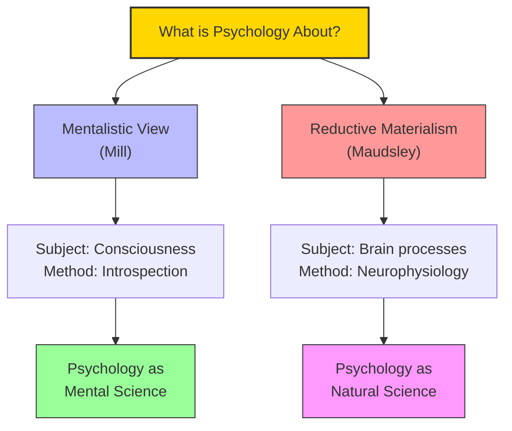

# Module 03 — Defining Psychology: Natural Science or Mental Science?

*Module 3 of 8 — Chapter 11: From Systems to Specialties*

---

Throughout the nineteenth century, eminent spokesmen argued for two fundamentally different visions of psychology. On one account — the "mentalistic" account — the subject matter of psychology is consciousness, and the best method for studying it is introspection. On the other — "reductive materialism" — all mental states originate in the brain, and a true science of the mind requires understanding neural function. The debate between these two positions was not merely academic. It determined what psychology would study, how it would study it, and whether it would be recognized as a legitimate science.

---

> [!TIP]
> **Stop and Think:** Mill argued that psychology should study consciousness through its own methods, not reduce it to brain science. Modern cognitive psychology does exactly this. Was Mill right?

## Mill's "Psychological Method"

John Stuart Mill defended what he called the "psychological method" — the study of mental phenomena through self-examination and the laws of association. Mill had become disaffected with Comtean positivism because he concluded that the positivist approach to the mind was "naive and constricted."

Mill's defense was in keeping with his general views on inductive science: psychology should study the facts of consciousness, discover their laws through careful observation, and resist the temptation to reduce mental phenomena to neural mechanisms. The tension between Mill and Comte was not about experimental science — on this they agreed completely. It arose from differing views on the *nature of explanation*.

> [!TIP]
> **Stop and Think:** Mill argued that psychology should study consciousness through its own methods, not reduce it to brain science. Modern cognitive psychology does exactly this: it studies mental processes (attention, memory, reasoning) without requiring that these be explained at the neural level. Was Mill right that psychology needs its own methods?

## Maudsley and the Physiological Method

Henry Maudsley's *Physiology and Pathology of the Mind* (1867) mounted a direct challenge to Mill's position:

> "Mr. J. S. Mill has made a powerful defence of the so-called Psychological Method.... The admirers of Mr. Mill cannot but experience regret to see him serving with so much zeal on what seems so desperately forlorn a hope."

Maudsley argued that mental states originate in brain states, and that a true science of the mind requires understanding the laws governing the brain. When a man becomes deranged from grief, Maudsley insisted, we must understand the "conspiracy of conditions, internal and external" by which a mental shock produces insanity in one person but not another.

*Figure 3.1: The defining question — is psychology a mental science (Mill) or a natural science (Maudsley)?

> [!TIP]
> **Stop and Think:** The insanity defense assumes brain states can override free will. If brain damage makes someone not responsible, is anyone fully responsible? Where does the line fall?

## The Insanity Defense

The debate between mentalism and materialism was not purely philosophical. It had practical consequences — literally life-and-death consequences — in the courtroom. In the landmark British case of Hadfield (1800), the "wild beast" standard of insanity (dating from Roman law) was successfully challenged. Counsel argued that Hadfield, charged with attempting to kill George III, was laboring under a delusion caused by brain injuries sustained in war.

Hadfield's acquittal illustrates the growing willingness to accept neurological opinions as grounds for exoneration. By 1800, the "brain theory" of mind was sufficiently compelling to be decisive in a celebrated legal case. The concept of free will was not abandoned but was "somewhat casually absorbed into the larger naturalistic framework."

> [!TIP]
> **Stop and Think:** The insanity defense assumes that brain states can override free will — that a person with brain damage is not fully responsible for their actions. This is the materialist position applied to law. Is it consistent? If brain states determine behavior, is *anyone* fully responsible for their actions?

> [!TIP]
> **Stop and Think:** Wundt distinguished between a "cause" (which necessarily produces its effect) and a "motive" (which does not). Is this distinction valid? Or is it a way of preserving free will by renaming it?

## Wundt's Voluntarism

Wundt sought a middle path. He insisted on two distinct sciences: one addressed to the individual mind (its "manifold of consciousness"), relying on psychophysical methods; the other addressed to social aggregates, relying on historical and anthropological analysis.

But Wundt was not merely splitting the difference. He was making a philosophical claim: "If we could see every wheel in the physical mechanism whose working the mental processes are accompanying, we should still find no more than a chain of movements showing no trace whatsoever of their significance for mind." Even exhaustive knowledge of the brain would not explain consciousness.

Wundt's concept of *volition* was central. A motive, for Wundt, is a *reason* for acting — not a cause. "A cause necessarily produces its effect: not so a motive." Character — the complex creation of biology, culture, heredity, and personal experience — is the "sole immediate cause of voluntary actions."

## Speaking of the Debate...

- The modern debate about whether psychology should be a "brain science" or a "science of the mind" is the same debate that Mill and Maudsley had in the 1860s.
- When a therapist focuses on a client's subjective experience rather than their brain chemistry, they are implicitly siding with Mill's "psychological method."
- When a psychiatrist prescribes medication based on neurotransmitter levels, they are implicitly siding with Maudsley's physiological method.

---

The debate between mentalism and materialism was not resolved in the nineteenth century — and it has not been resolved in the twenty-first. But two thinkers — Wilhelm Wundt and William James — would each offer a vision of psychology that attempted to transcend the debate, and in doing so, would define the discipline for the next century.

---

## References

- Robinson, D. N. (1995). *An Intellectual History of Psychology* (3rd ed.). University of Wisconsin Press. Chapter 11.
- Maudsley, H. (1867). *The Physiology and Pathology of the Mind*. Macmillan.
- Mill, J. S. (1865). Auguste Comte and positivism. *Westminster Review*.

---
*Module 3 of 8 — Chapter 11: From Systems to Specialties*
