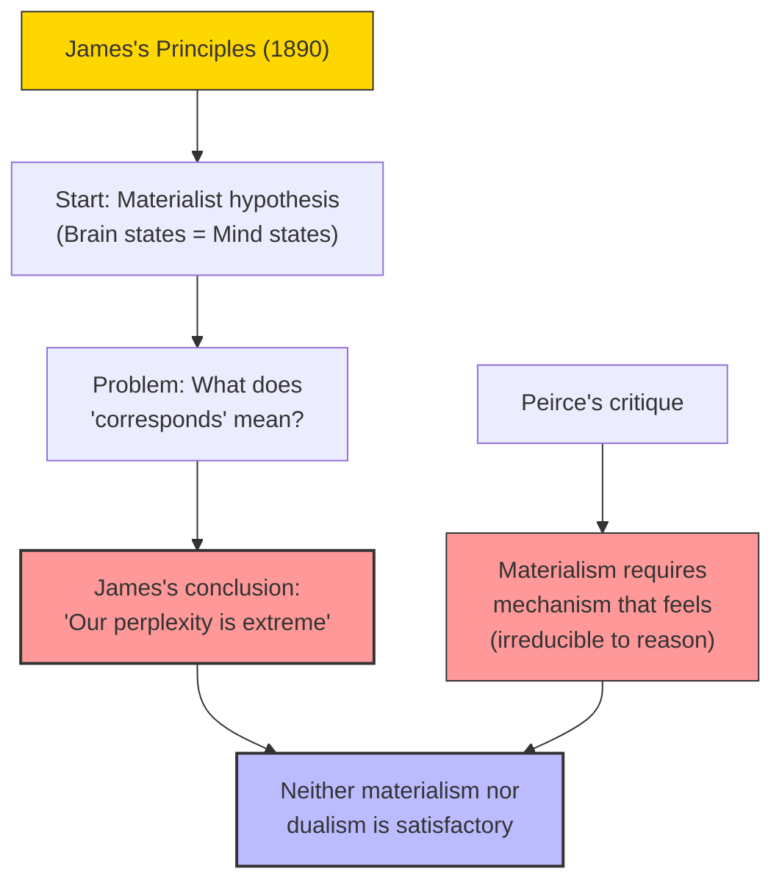

# Module 04 — Wundt, James, and the Facts of Consciousness

*Module 4 of 8 — Chapter 11: From Systems to Specialties*

---

William James's *Principles of Psychology* (1890) begins with a materialist hypothesis: "The immediate condition of a state of consciousness is an activity of some sort in the cerebral hemispheres." James takes this to be soundly supported and assumes "without scruple... that the uniform correlation of brain-states with mind-states is a law of nature." But when discussion turns to consciousness itself, James's loyalty to the hypothesis sustains "first embarrassment and then abandonment." The problem of how brain states *correspond* to mind states proves, in James's words, "dark in the extreme."

---

> [!TIP]
> **Stop and Think:** James could not state the mind-body problem in elementary terms. The "entire brain" is an abstraction; the "entire thought" is equally abstract. Has anyone since James done better?

## James's Dilemma

James's dilemma is worth quoting at length, because it captures a problem that has never been solved:

> "When psychology is treated as a natural science... 'states of mind' are taken for granted, as data immediately given in experience; and the working hypothesis... is the mere empirical law that to the entire state of the brain at any moment one unique state of mind always 'corresponds.' This does very well till we begin to be metaphysical and ask ourselves just what we mean by such a word as 'corresponds.'"

The difficulty is not merely technical. James cannot even *state* the problem in elementary terms. The "entire brain" is not a physical fact at all — it is an abstraction. And the "entire thought" is equally abstract. The real in physics seems to correspond to the unreal in psychology, and vice versa. "Our perplexity is extreme."

> [!TIP]
> **Stop and Think:** James — one of the greatest psychologists who ever lived — could not solve the problem of how brain states correspond to mind states. This is the "hard problem of consciousness" that David Chalmers would name a century later. Is it a problem that science can solve? Or is it a philosophical puzzle that lies beyond the reach of experiment?

> [!TIP]
> **Stop and Think:** Peirce argued that saying "a mechanism will feel" is not an explanation but an admission of ignorance. Is he right? Or is it possible that consciousness *emerges* from complexity?

## Peirce's Materialism Critique

James's friend, the philosopher C. S. Peirce, put the case against materialism directly:

> "The materialistic doctrine seems to me quite as repugnant to scientific logic as to common sense; since it requires us to suppose that a certain kind of mechanism will feel, which would be a hypothesis absolutely irreducible to reason."

To say that a mechanism will *feel* — that matter, arranged in a certain way, will produce conscious experience — is not an explanation. It is an admission that we cannot explain. It is, in Peirce's words, "an ultimate, inexplicable regularity."

*Figure 4.1: James and Peirce both found materialism inadequate — but neither could offer a satisfactory alternative.*

> [!TIP]
> **Stop and Think:** Wundt and James — the two founders of experimental psychology — both rejected radical materialism. Does modern psychology agree with them? Or has it silently adopted the materialism they rejected?

## Wundt's Defense of Consciousness

Wundt shared James's impatience with overly confident materialism. His commitment was to the psychology of consciousness — a science of mind as mind. When he insisted that "all that is valuable in our mental life still falls to the psychical side" even after we have studied brain mechanisms exhaustively, he was stating his essential defense of the psychological method.

What Wundt rejected was not the thesis of radical materialism itself but the correlated claim that the methods of the radical materialist are germane to a scientific psychology. He had genuine respect for the neural sciences. But he would not be led to the "all too complacent belief that the problems of psychology would be (or could be) solved by them."

> [!TIP]
> **Stop and Think:** Wundt and James — the two founders of experimental psychology — both rejected radical materialism. They agreed that consciousness is real, that it cannot be reduced to brain processes, and that psychology needs its own methods. Does modern psychology agree with them? Or has it silently adopted the materialism they rejected?

## Speaking of Consciousness...

- The modern debate about whether artificial intelligence can be conscious is a version of James's dilemma: how do we know whether a system that *processes* information also *experiences* it?
- The "hard problem of consciousness" — explaining why physical processes give rise to subjective experience — is exactly the problem James identified in 1890. It remains unsolved.
- Wundt's insistence that psychology must study consciousness on its own terms, not reduce it to neuroscience, anticipates the modern field of phenomenology — the systematic study of subjective experience.

---

While Wundt and James were debating the nature of consciousness, another thinker was developing a radically different approach to the mind. Sigmund Freud, a Viennese neurologist, would argue that the most important mental processes are *unconscious* — hidden from awareness, accessible only through their effects on behavior, dreams, and slips of the tongue.

---

## References

- Robinson, D. N. (1995). *An Intellectual History of Psychology* (3rd ed.). University of Wisconsin Press. Chapter 11.
- James, W. (1890). *The Principles of Psychology*. Henry Holt.
- Peirce, C. S. (1891). The architecture of theories. *The Monist, 1*(2), 161–176.

---
*Module 4 of 8 — Chapter 11: From Systems to Specialties*
