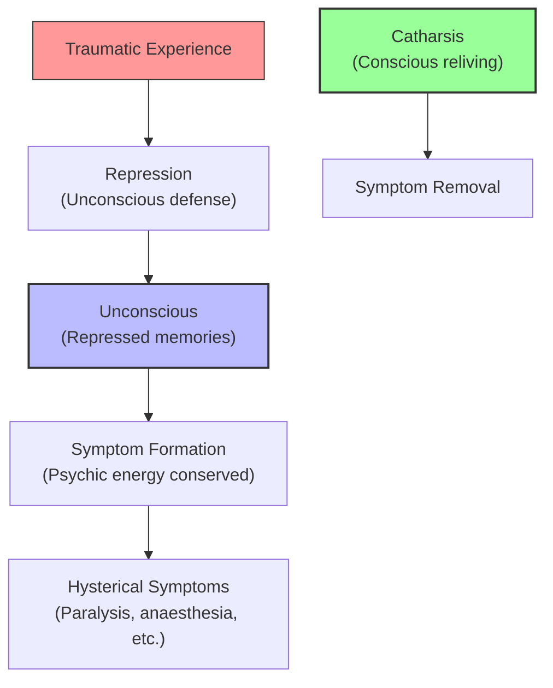

# Module 05 — Freud and the Unconscious

*Module 5 of 8 — Chapter 11: From Systems to Specialties*

---

In 1880, a Viennese physician named Joseph Breuer began treating a young woman suffering from hysteria — a condition in which sensory and motor deficits appeared without any detectable neurological cause. Under hypnosis, the patient's symptoms could be relieved by bringing traumatic memories to consciousness. Breuer called this the "talking cure." His younger colleague, Sigmund Freud, would transform this clinical observation into a theory of the mind that would dominate the twentieth century. The key insight was revolutionary: the most important mental processes are *unconscious* — hidden from the patient's awareness, accessible only through their effects on behavior, dreams, and slips of the tongue.

---

> [!TIP]
> **Stop and Think:** Hysterical symptoms could be moved around the body through hypnosis — a paralyzed arm could be "cured," but the paralysis would appear in the leg. What does this tell you about the mind-body relationship?

## The Birth of Psychoanalysis

Freud's mentor in neurophysiology was Professor Ernst Brücke, a student of Müller's and one of Helmholtz's closest associates. Brücke trained Freud to be an "uncompromising physicalist." When Freud and Breuer observed that hypnotic suggestion could relieve hysterical symptoms, they reasoned within this physicalist framework: "a certain amount of the organism's energy goes into intracerebral excitation and there is a tendency in the organism to hold this excitation at a constant level."

Under hypnosis, a hysterically paralyzed hand could be made to move — but at the cost of immobilizing the leg. Sight could be restored — but deafness would follow. Since the patient showed no understanding of the causes and since hypnosis could relieve the symptoms, Freud and Breuer concluded that the mechanism of symptom-formation was **unconscious**.

> [!TIP]
> **Stop and Think:** Freud and Breuer discovered that hysterical symptoms could be moved around the body through hypnosis — a paralyzed arm could be "cured," but the paralysis would appear in the leg. What does this tell you about the relationship between mind and body? Is the symptom "real" or "imaginary"?

> [!TIP]
> **Stop and Think:** Freud claimed that painful memories are repressed into the unconscious, where they produce symptoms. Modern research on trauma confirms that traumatic memories can be "forgotten" and later recovered. Is this the same as Freudian repression?

## Hysterical Patients Suffer from Reminiscences

Freud's most concise statement of his early theory: "Hysterical patients suffer from reminiscences. Their symptoms are the remnants and the memory symbols of certain (traumatic) experiences."

Painful thoughts are repressed. They come to reside in the unconscious. The symptoms are the work done by the repressed elements — psychic energy is conserved through symptom-formation. Only through a conscious reliving of the former trauma — an exhumation from the unconscious — can the symptoms finally be removed. Short of this, they can only be moved about, disguised, accepted.

*Figure 5.1: Freud's early model — traumatic experiences are repressed into the unconscious, where they produce symptoms. Catharsis (conscious reliving) removes the symptoms.*

> [!TIP]
> **Stop and Think:** The "Freudian slip" — saying one thing when you mean another — is, for Freud, never accidental. Have you ever said something you "didn't mean" and wondered where it came from?

## From Hypnosis to Free Association

Freud's quick renunciation of hypnosis reflected both his Helmholtzian bias (he described hypnosis as "fanciful" and "mystical") and his inability to bring all patients "under." He abandoned it completely in favor of the cathartic method and its emerging technique: **free association**.

Reasoning that neurotic symptoms result from incomplete or unsuccessful repression, Freud sought to discover the traumatic episode through subterfuge. This involved analysis of slips of the tongue (parapraxes), automatic or free associations, and — most saliently — dreams. For Freud the determinist, there was no more reason to consider dreams and parapraxes as uncaused than to consider normal speech uncaused.

> [!TIP]
> **Stop and Think:** The "Freudian slip" — saying one thing when you mean another — is, for Freud, never accidental. It is a window into the unconscious. Have you ever said something you "didn't mean" and wondered where it came from? Freud would say it came from a repressed thought trying to surface.

## The Interpretation of Dreams

In 1900, Freud published *The Interpretation of Dreams*, and in the following year, *The Psychopathology of Everyday Life*. Thus, as the twentieth century began, he had a following. By 1920, there was a movement. By 1930, he was — and has since remained — the preeminent figure in modern theoretical psychology.

Dreams, for Freud, are "the royal road to the unconscious." They are disguised fulfillments of repressed wishes — primarily sexual wishes. The dream's *manifest content* (what you remember) conceals its *latent content* (the repressed wish). The work of dream interpretation is the work of uncovering the latent content beneath its disguise.

## Speaking of the Unconscious...

- Modern neuroscience has confirmed that much of mental processing is indeed unconscious — we are not aware of the vast majority of our brain's operations. But Freud's *dynamic* unconscious — where repressed thoughts actively produce symptoms — is a much stronger claim.
- The "talking cure" — the idea that simply talking about problems can relieve them — is the foundation of all modern psychotherapy. Every therapist who listens to a client's story is, in some sense, practicing Freud's method.
- The concept of repression — that traumatic memories can be pushed out of awareness — remains controversial. Some researchers argue that "false memories" can be created by suggestion, complicating Freud's original claims.

---

Freud had established that the unconscious exists and that it shapes behavior. But he was about to develop a much more elaborate theory — a system of personality that would explain not just neurosis but the entire structure of the human mind.

---

## References

- Robinson, D. N. (1995). *An Intellectual History of Psychology* (3rd ed.). University of Wisconsin Press. Chapter 11.
- Freud, S. (1900/1953). *The Interpretation of Dreams*. In *The Standard Edition of the Complete Psychological Works of Sigmund Freud* (Vols. 4–5). Hogarth Press.
- Freud, S. (1910). The origins and development of psychoanalysis. *American Journal of Psychology, 21*(2), 181–218.

---
*Module 5 of 8 — Chapter 11: From Systems to Specialties*
