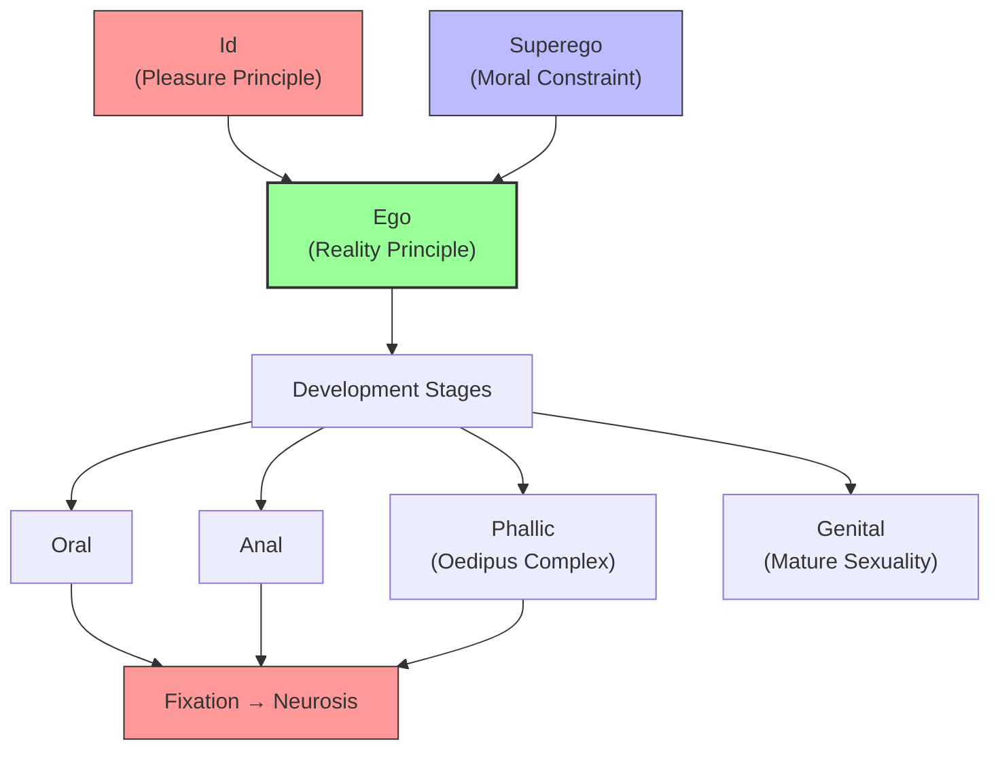

# Module 06 — Freud's System: Id, Ego, Superego

*Module 6 of 8 — Chapter 11: From Systems to Specialties*

---

Central to Freud's system is the concept of **unconscious motivation**. Herbart and Fechner had both speculated about unconscious processes, but Freud's use of the concept was among the first to be genuinely scientific — in the sense that it generated a "covering law" from which one could deduce consequences. The unconscious is not merely a repository of forgotten memories. It is an active force — a dynamic system that shapes behavior, produces symptoms, and drives the course of human development.

---

> [!TIP]
> **Stop and Think:** Freud's id-ego-superego model is explicitly Hegelian (thesis-antithesis-synthesis). Is this a strength (connecting psychology to philosophy) or a weakness (importing metaphysics into science)?

## The Structure of the Psyche

Freud's mature theory divided the mind into three structures:

**The id** is the most primitive element — the seat of instinctual drives, operating on the **pleasure principle**. It demands immediate gratification and has no concern for reality, morality, or the needs of others.

**The superego** is the internalized voice of society — the conscience. It develops through the child's identification with parental and cultural values. It stands in antithetical regard to the id, demanding restraint and moral behavior.

**The ego** emerges from the reconciliation of these counterpoised forces. It operates on the **reality principle** — finding socially acceptable ways to satisfy the id's demands while respecting the superego's constraints.

The Hegelian structure is unmistakable: id (thesis), superego (antithesis), ego (synthesis). Freud's system is, at its deepest level, a dialectical psychology.

> [!TIP]
> **Stop and Think:** Freud's id-ego-superego model is explicitly Hegelian in structure. Is this a strength (connecting psychology to a powerful philosophical tradition) or a weakness (importing metaphysical assumptions into a scientific theory)?

> [!TIP]
> **Stop and Think:** Freud claimed that childhood experiences shape adult personality. Every developmental psychologist — even those who reject Freud's specific claims — accepts this basic premise. What does this tell you about Freud's lasting influence?

## Psychosexual Development

Freud's theory of development is utterly consonant with Darwinism. The human personality evolves. Its origins are animalistic, survivalistic. Bentham's pleasure principle has been raised to the level of a medical or neurological reality. The engine of psychological growth is **libido** — sexual energy that drives the individual through a series of developmental stages:

1. **Oral** — pleasure centered on the mouth (feeding, sucking)
2. **Anal** — pleasure centered on elimination
3. **Phallic** — pleasure centered on genital awareness (Oedipus complex)
4. **Genital** — mature sexual motivation (heterosexual procreation)

Pathological conditions result from failure to resolve the tensions at any stage. The Oedipal stage is particularly critical: the boy's natural proclivity for his mother creates a conflict with the father, resolved only by identifying with the father or redirecting desire to another object.

*Figure 6.1: Freud's structural model — the ego mediates between the id's demands and the superego's constraints through a series of developmental stages.*

> [!TIP]
> **Stop and Think:** Freud drove away followers who disagreed with him. Jung emphasized the collective unconscious; Adler emphasized the will to power. Are these genuinely different theories, or different emphases within the same framework?

## Jung, Adler, and the Departures from Orthodoxy

Freud's insistence on strict orthodoxy drove away many of his most talented followers:

**Carl Gustav Jung** (1875–1961) was more self-consciously Darwinian, arguing that the unconscious contains not only repressed personal experiences but also the **collective unconscious** — archetypal elements characteristic of the entire race. Every male has an unconscious female archetype (anima); every female, a male archetype (animus).

**Alfred Adler** (1870–1937) departed from Freudian determinism, centering his theory on the **will to power** and the dynamic interaction between an evolving self and shifting social fortunes. Adler's psychology was less biological, more social.

Both Jung and Adler founded their own "analytical" schools, but the departures were largely matters of emphasis rather than fundamental disagreements over the central terms of the theory.

> [!TIP]
> **Stop and Think:** Freud drove away followers who disagreed with him. Jung emphasized the collective unconscious; Adler emphasized the will to power. Are these genuinely different theories, or different emphases within the same basic framework? What does Freud's intolerance of dissent tell you about the relationship between personality and theory?

## Speaking of Freud's System...

- The concept of "defense mechanisms" — repression, projection, denial, sublimation — is Freud's most enduring clinical contribution. Every therapist recognizes these patterns in their clients.
- Freud's insistence that childhood experiences shape adult personality is the foundation of all developmental psychology — even developmental psychologists who reject Freud's specific claims.
- The modern debate about whether personality is primarily biological (Freud's drives) or primarily social (Adler's will to power) echoes the nature-nurture tension that runs through all of psychology.

---

Freud's psychoanalysis was the most ambitious psychological system since Aristotle. But it was not the only clinical approach being developed in the late nineteenth century. In France, Pierre Janet was pioneering a very different approach to the same phenomena — an approach that was, in many ways, more scientific than Freud's.

---

## References

- Robinson, D. N. (1995). *An Intellectual History of Psychology* (3rd ed.). University of Wisconsin Press. Chapter 11.
- Freud, S. (1923/1961). *The Ego and the Id*. In *Standard Edition* (Vol. 19). Hogarth Press.
- Jung, C. G. (1912/1956). *Symbols of Transformation*. In *Collected Works* (Vol. 5). Routledge.

---
*Module 6 of 8 — Chapter 11: From Systems to Specialties*
