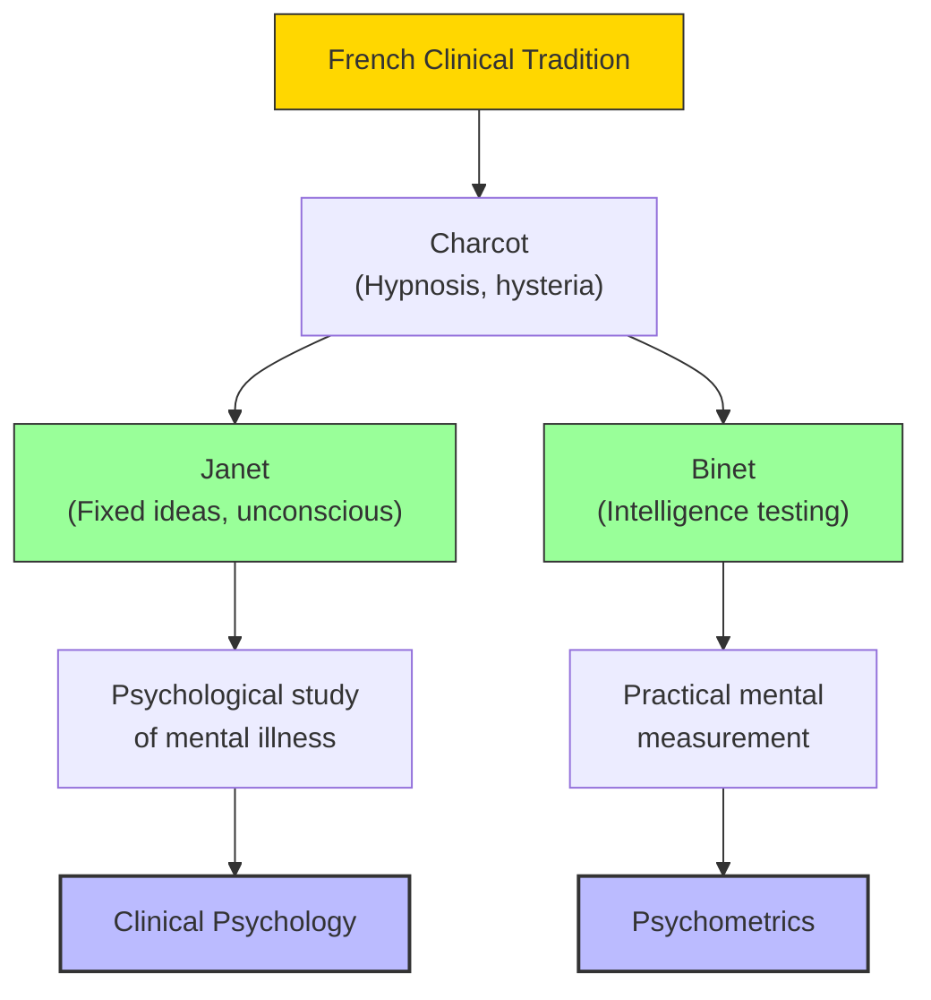

# Module 07 — Janet, Binet, and Clinical Psychology

*Module 7 of 8 — Chapter 11: From Systems to Specialties*

---

While Freud was developing psychoanalysis in Vienna, Pierre Janet (1859–1947) was pursuing a parallel but distinct approach to the same phenomena in Paris. Janet received his doctorate under Charcot, whom he succeeded as head of the Psychological Laboratory at the Salpêtrière in 1890. His international repute was already great by 1906, when he was invited to lecture at Harvard. Janet's approach to hysteria was, in many ways, more cautious and more empirical than Freud's — and his criticisms of Freudian theory remain relevant today.

---

> [!TIP]
> **Stop and Think:** Hysterical symptoms don't behave like neurological symptoms — the paralysis moves, the reflexes remain. Is the symptom "real" or "imaginary"? Or is this a false dichotomy?

## Janet's Approach to Hysteria

Janet's chief interest was the diverse phenomena of hysteria — from sleep-walking and morbid fear to "automatic writing" and profound losses of sensitivity and locomotion. Until Charcot documented cases of "virile hysteria," the medical consensus held that only women were afflicted.

Janet demonstrated that genuinely hysterical patients displayed no signs of neuropathology. Hysterical anaesthesia is illustrative: when anaesthesia results from neurological disease, all associated reflexes are eliminated. But in hysterical anaesthesia, the sensitivity is gone while the reflexes remain. Moreover, hysterical anaesthesias are highly mobile — the patient may have no sensitivity in the upper extremities on Thursday and none in the lower extremities on Friday.

> [!TIP]
> **Stop and Think:** Janet showed that hysterical symptoms don't behave like neurological symptoms. The paralysis moves around the body; the reflexes remain intact. What does this tell you about the relationship between mind and body? Is the symptom "real"? Or is it a product of the mind that nevertheless produces genuine physical effects?

## Janet's Critique of Wundt

Janet was intimately familiar with Wundt's research at Leipzig and was convinced that their methods were unsuitable for clinical problems. The Leipzig group's "purist" stance on the nature of science caused them to suffer, in Janet's view, a "self-imposed naivete."

Janet's critique was pointed: the words "I, me" — the sense of self — "are terms enormously complex. This is the idea of personality; that is to say, the reunion of presentations, the remembrance of all past impressions, the imagination of future phenomena." Wundt's introspection, focused on elementary sensations, missed the *person* entirely.

> [!TIP]
> **Stop and Think:** Janet criticized Freud for over-generalizing and underestimating therapy's complexity. Janet was more cautious, more empirical. Why did Freud become famous while Janet was forgotten?

## Janet vs. Freud

When Janet turned to Freud and Breuer's publication on hysteria, he found several deficiencies. His complaint: they attempted to account for all hysterias with explanations that actually apply only to certain cases, and they underestimated the complexities of therapy.

On the erotic element in hysteria, Janet was skeptical: "This erotic disposition exists, we think, in hysteria just as all possible fixed ideas do.... Amorous passions, sexual desires, must exist with these persons, most of them young, as they do with others." Janet's tentativeness and common-sensical tone contrasted sharply with Freud's confident theorizing.

> [!TIP]
> **Stop and Think:** Janet criticized Freud for over-generalizing from limited cases and underestimating therapy's complexity. Janet's approach was more cautious, more empirical, more respectful of individual differences. Why did Freud become famous while Janet was largely forgotten? Is fame in science determined by the quality of ideas or by the force of personality?

> [!TIP]
> **Stop and Think:** Binet designed his test to identify children who needed help — not to rank or label them. The misuse of IQ tests for classification would have horrified Binet. What responsibility do test creators have for how their tests are used?

## Binet and Intelligence Testing

Alfred Binet (1857–1911) co-founded France's most prestigious psychological journal (*L'Année Psychologique*), wrote authoritative texts on hypnotism and multiple personality, and inaugurated the methods of intelligence testing that would define the field of mental tests.

Binet's approach was quintessentially French — practical, clinical, action-oriented. He opposed the introspectionists' search for structural elements: "We oppose [the] counterpart, that which gives action as the end of thought and which seeks the very essence of thought in a system of actions."

The Binet-Simon test (1905) was designed to identify children who needed special educational support. It was not intended to measure "intelligence" as a fixed, innate quantity — Binet explicitly rejected the idea that his test measured innate capacity. It was a practical tool for a practical problem.

*Figure 7.1: The French clinical tradition — from Charcot through Janet and Binet to modern clinical psychology and psychometrics.*

## Speaking of Janet and Binet...

- Janet's concept of "fixed ideas" — unconscious mental contents that control behavior — is remarkably similar to Freud's concept of repression. The two men were working on the same problem from different angles.
- Binet's intelligence test was designed to identify children who needed help — not to rank or label them. The misuse of IQ tests for purposes of classification and selection would have horrified Binet.
- The French emphasis on practical, clinical observation over laboratory introspection anticipated the modern scientist-practitioner model of clinical psychology.

---

The half-century from 1870 to 1920 created modern psychology. Comparative psychology, experimental psychology, clinical psychology, psychometrics, psychoanalysis — all of these emerged in this brief, extraordinary period. But what did it all add up to? What was the nineteenth century's invention?

---

## References

- Robinson, D. N. (1995). *An Intellectual History of Psychology* (3rd ed.). University of Wisconsin Press. Chapter 11.
- Janet, P. (1901). *The Mental State of Hystericals* (C. Corson, Trans.). Putnam.
- Binet, A., & Simon, T. (1905/1916). *The Development of Intelligence in Children*. Williams & Wilkins.

---
*Module 7 of 8 — Chapter 11: From Systems to Specialties*
