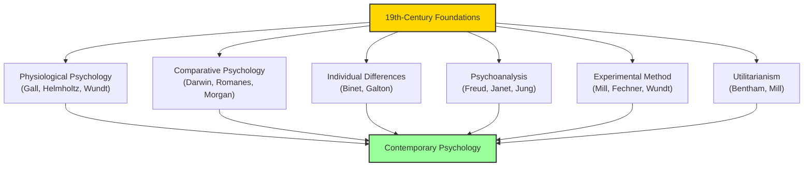

# Module 08 — The Nineteenth Century's Invention: Psychology as a Science

*Module 8 of 8 — Chapter 11: From Systems to Specialties*

---

It was Alfred North Whitehead who credited the nineteenth century with having "invented the method of invention." It was the first period in history in which nearly every important philosophical figure recognized the essential function of experimentation in the search for truth. It was also the first century in which the vast majority of serious works in science were completely devoid of theological colorations. The record of the century is particularly commendable in regard to psychology.

---

> [!TIP]
> **Stop and Think:** Robinson argues that "contemporary psychology is largely a footnote to the nineteenth century." Has psychology truly failed to transcend its origins? Or did the 19th century simply ask the right questions?

## What the Nineteenth Century Created

When we examine the topics now filling the literature in professional psychology, we are hard pressed to find one that was not put forth — often in a form still to be improved upon — by the scholars of this period:

- **Physiological psychology** became a science in the hands of Flourens, Gall, Bell, Magendie, Helmholtz, and Wundt.
- **Comparative psychology** was invented by Spencer, Darwin, Romanes, and Morgan.
- **The psychology of individual differences** is the creation of Binet and Francis Galton.
- **Cognitive and Gestalt psychologies** are so tied to phenomenology that only a purist could deny Hegel and the neo-Hegelians the title of "founders."
- **Freud, Janet, Jung, and the unconscious** are near-synonyms.
- **Our sense of experimental science** is taken over from J.S. Mill.
- **Our general attitude toward science** remains largely the one advocated by Auguste Comte.
- **Our fascination with reward and punishment** is linearly traceable to Jeremy Bentham and utilitarianism.
- **Even our "humanistic" psychologies** have never improved upon the German Romantics' formulations of self-actualization and personal freedom.

> [!TIP]
> **Stop and Think:** Robinson argues that "contemporary psychology is largely a footnote to the nineteenth century." Is this a fair characterization? Has psychology truly failed to transcend its origins? Or is it simply that the nineteenth century asked the right questions — questions that remain unanswered?

> [!TIP]
> **Stop and Think:** The modern debate about whether psychology is a "natural science" or a "social science" shows that the 19th century's defining question has not been resolved. Is resolution possible? Or is psychology inherently divided?

## The Bridge to the Present

The bridge-builders of 1870–1920 allowed psychology to go from the promise of a "scientific psychology" to the realities of contemporary psychology. Between 1870 and 1920, the distinct fields of personality, clinical psychology, comparative psychology, physiological psychology, and developmental psychology were all established. So too was the sociological point of view that would soon become formalized as social psychology.

What is missing from the record is that further distillation that imparts the very special flavor of today's psychology. In the final chapter, we will examine three representative — dominant — orientations in modern psychology: behavioristic, Gestalt, and physiological.

*Figure 8.1: The nineteenth century's invention — every major field in contemporary psychology traces its origins to this extraordinary period.*

> [!TIP]
> **Stop and Think:** The 19th century's central contradiction — between naturalism (we are products of nature) and libertarianism (we are free agents) — is still psychology's central contradiction. Can these be reconciled?

## The Nineteenth Century's Contradictions

The nineteenth century was caught in one of those titanic contradictions for which the Victorian age is ungenerously remembered. On one hand, there was evolutionary naturalism concerned with the history and destiny of the species as a whole. On the other, there was the libertarian ethic striving to secure the freedom and defend the dignity of every individual.

The ways invented by that century to eliminate the contradiction were elaborate, confused, and are very much with us now. Wundt's solution was two distinct sciences: one for the individual mind, one for social aggregates. James's solution was to abandon materialism and embrace the facts of consciousness as irreducible. Freud's solution was to ground the individual psyche in universal biological drives.

> [!TIP]
> **Stop and Think:** The nineteenth century's central contradiction — between naturalism (we are products of nature) and libertarianism (we are free agents) — is still psychology's central contradiction. Every time a psychologist explains behavior in terms of brain chemistry or evolutionary adaptation, they are a naturalist. Every time they speak of choice, responsibility, and personal growth, they are a libertarian. Can these be reconciled?

## Speaking of the Invention...

- The modern psychology department — with its separate divisions for clinical, cognitive, developmental, social, and neuroscience psychology — is the institutional expression of the nineteenth century's invention.
- The fact that psychology still debates whether it is a "natural science" or a "social science" shows that the nineteenth century's defining question has not been resolved.
- The nineteenth century's emphasis on experimentation, measurement, and the rejection of metaphysics remains the methodological foundation of all scientific psychology.

---

The nineteenth century created psychology as we know it. But it also created a tension that would define the next century: the tension between psychology as a natural science and psychology as a human science. In the final chapter, we will examine how three dominant orientations — behaviorism, Gestalt psychology, and physiological psychology — attempted to resolve this tension, and what their attempts tell us about the nature of the human mind.

---

## References

- Robinson, D. N. (1995). *An Intellectual History of Psychology* (3rd ed.). University of Wisconsin Press. Chapter 11.
- Whitehead, A. N. (1925). *Science and the Modern World*. Macmillan.
- Boring, E. G. (1950). *A History of Experimental Psychology* (2nd ed.). Appleton-Century-Crofts.

---
*Module 8 of 8 — Chapter 11: From Systems to Specialties*
