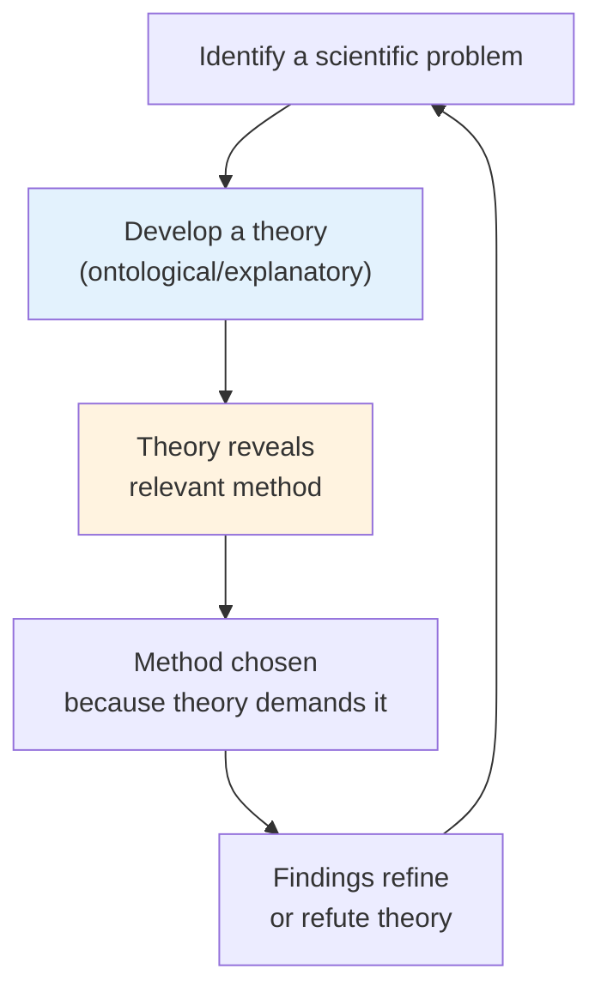

# Chapter 12 · Module 1
# Method as Metaphysic
## Psychology · Unit 2 · History of Psychology

---

In 1895, a Leipzig-trained psychologist named Theodor Ziehen opened his textbook with a declaration: "The psychology which I shall present to you is not that old psychology which sought to investigate psychical phenomena in a more or less speculative way. That psychology has long been abandoned by those whose method of thought is that of the natural sciences, and empirical psychology has justly taken its place." Two years later, another Leipzig Ph.D., E. W. Scripture, writing from Yale, echoed the sentiment: "The development of a science consists in the development of its means of extending and improving its method of observation."

You might read these statements and think: fair enough. Science advances by improving its methods. What could be wrong with that?

But notice what Ziehen and Scripture are actually saying. They are not claiming to have discovered new truths about the mind. They are claiming that psychology's identity is defined by its method — that to be a psychologist is to use a particular set of procedures. The subject matter is secondary. The method is primary. If your method cannot reach a phenomenon, that phenomenon is no longer psychology's concern.

This is a remarkable move. It means that when Titchener and James — the two most influential psychologists in America at the turn of the century — both abandoned their own programs, it was not because consciousness had vanished from the world. Consciousness was still right there, as obvious as ever. What vanished was a method that could not handle it.

## Psychology's Perpetual Youth

Daniel Robinson opens his final chapter with an accusation that cuts deep: contemporary psychology is not a young science discovering new territory. It is nineteenth-century psychology wearing a modern costume. The accusation rests on a distinction between two kinds of intellectual continuity.

The first is **scholastica successionis civitatium** — a Latin phrase Robinson borrows from jurisprudence. It names the error of assuming that when an idea reappears in a later century, it must have been borrowed from the earlier one. A contemporary psychologist studying the effects of food-reward on behavior is not necessarily a disciple of Jeremy Bentham, even if Bentham said similar things two centuries ago. The ideas may simply converge because they address the same problems.

But Robinson's point is subtler. He is not claiming that modern psychologists borrowed from the nineteenth century. He is claiming that modern psychology *is* nineteenth-century psychology — that nothing has happened since then to compel a fundamental change in direction. Physicists abandoned phlogiston because they proved it did not exist. Geneticists abandoned the inheritance of acquired characteristics because molecular biology showed it was impossible. Psychologists have abandoned introspection, not because they proved consciousness does not exist, but because their method could not reach it.

> [!TIP] **Stop and Think**
> Titchener wrote, "Psychology is a very old science; we have a complete treatise from the hand of Aristotle. But the experimental method has only recently been adopted by psychologists." Robinson counters that experiments in most sciences did not take precedence over pure speculation until the eighteenth century. If psychology is not unusually young, why do psychologists keep claiming it is?

### There Is No Single Scientific Method

Robinson's most provocative claim is that there is no such thing as "the scientific method." Archimedes used geometric reasoning. Newton used mathematical deduction from first principles. Darwin used decades of careful observation followed by bold theorizing. Einstein used thought experiments. Their methods have almost nothing in common at the descriptive level.

What they share is something deeper: a systematic relationship between the identification of a problem and the choice of method. The method is chosen because it is transparently relevant to the problem. And what establishes this relevance is a theory — a theory rich enough in ontological or explanatory possibilities to make certain methods look promising.

When Newton identified the problem of planetary motion, his gravitational theory made mathematical deduction the obvious method. When Darwin identified the problem of species diversity, his theory of natural selection made comparative observation the obvious method. The theory comes first. The method follows.

Now ask yourself: what overarching theory in psychology makes a particular method transparently relevant? Robinson's answer is devastating — there is no such theory. Psychology adopted the experimental method not because a theory demanded it, but because physics used it and physics was the prestige science. The method was borrowed, not earned.

*Figure: How method and theory relate in mature sciences — theory determines method, not the other way around.*

> [!TIP] **Stop and Think**
> In physics, Newton's gravitational theory made mathematical deduction the obvious method. In biology, Darwin's theory of natural selection made comparative observation the obvious method. What theory in psychology makes the experimental method the obvious choice? If there is no such theory, why did psychologists adopt experimentation?

### The Victorian Battleground

To understand why psychology chose method over substance, Robinson takes you back to Victorian England — a culture torn between two irresistible forces.

On one side stood the romantics: Wordsworth, Coleridge, Byron, Tennyson. They sensed the weakening of traditional values and the creeping relativism of empiricism. Wordsworth called out for Milton — "thou should'st be living at this hour; England hath need of thee; she is a fen of stagnant waters." Coleridge's *Ancient Mariner* found redemption in returning to the kirk with a goodly company. These poets demanded a return to natural feelings — duty, morality, love of God — accessible only to what Byron called the "Eternal Spirit of the chainless Mind."

On the other side stood the scientists and engineers: Bell dissecting spinal nerves, Gall and Spurzheim trying to transform morality into neurology, coal miners choking for pennies a day while Constable painted landscapes one could nearly walk through. Industry, measurement, material progress.

The Darwinian revolution was, in Robinson's reading, the melding of these tensions — man evolving from the slime of nature, rising through instinctual duty to temporary mastery. Even Darwin, whose works would become an authority against romantic idealism, was not spared the influence of the Lake poets. He closes *The Expression of the Emotions* by quoting Shakespeare's *Hamlet* on the power of emotion to transform the body.

The essayists of the period — Matthew Arnold, J. S. Mill, John Ruskin — tried to bridge the divide. Arnold's *Culture and Anarchy* sought to commit an industrial system to "sweetness and light." Mill's *On Liberty* proclaimed the intellectual freedom of every individual. Ruskin made architecture a lesson in morality. But the bridge never held. The character of contemporary psychology, Robinson argues, is to be found in the failure of these two forces to find a means of reconciliation.

> [!TIP] **Stop and Think**
> Victorian England was torn between romanticism and science — between Wordsworth's "trailing clouds of glory" and the coal mines of industrial Manchester. Psychology inherited this tension. Does psychology still carry it today? When a therapist listens to a client's story, is that romanticism or science?

### The Divorce

It was Helmholtz — the great German physicist and physiologist — who summarized the situation most candidly. He described how natural philosophy had separated itself from the sciences under the influence of Hegel's philosophy. Hegel had started with the bold hypothesis that nature itself was the result of an act of thought — that the world was mind. The philosophers accused the scientists of narrowness. The scientists retorted that the philosophers were crazy.

The result was a divorce. Scientists banished philosophy from their work. But in doing so, they also banished the rightful claims of philosophy — the criticism of the sources of cognition, the definition of the functions of the intellect. Psychology was caught in the crossfire. In Europe, where idealism ran deepest, the psychologist could become a Wundtian, a neo-Hegelian, or a physiologist in psychologist's clothing. In England and America, the options were starker: one was either a philosopher or an experimentalist. To fail to be the latter was to fail to be a psychologist.

Note, Robinson insists, that this was a historical development, not a scientific one. No logical proof demonstrated that rationalistic psychology would fail. No experimental finding showed that we lack a moral sense or a link with God or a love of beauty. No surgical procedure established that psychological life reduces to neural mechanisms. The decision was metaphysical: psychology would be defined by its method, and its subject matter would contain only those entries amenable to that method.

> [!TIP] **Stop and Think**
> Robinson argues that psychology's adoption of the experimental method was a metaphysical decision, not a scientific discovery. If he is right, what does this mean for the authority of psychological research? Can a discipline that has made a metaphysical commitment to its method still claim to be value-neutral?

### A Method in Search of a Subject

The irony is sharp. Titchener's rules for introspection — "be impartial, be attentive, be comfortable, be perfectly fresh" — were supposed to yield a natural science of the mind. His special rules included gems like "work only on dry days" when measuring sensitivity to the smell of beeswax, because beeswax smells stronger in wet weather. This was the cutting edge of experimental psychology at the turn of the century.

It did not last. The most that structuralism could accomplish was, as Robinson puts it, "the rediscovery of what every man, woman, and child know to be true during every waking hour of daily life." The data from Wundtian laboratories did not behave the way scientific data are supposed to. Subjects could not introspect identically on separate occasions. There was no covering law, no theory worth the name, no independent validation of the psychophysical methods.

Yet the experimental method remained at the core of psychology. It still does. Robinson's verdict is unsettling: "In a way, it is a method in search of a subject." The method was chosen not because a theory demanded it, but because the culture of science demanded it. Psychology chose to be defined by what it could measure, not by what it needed to understand.

> [!TIP] **Stop and Think**
> Titchener's introspection rules included "work only on dry days" when measuring sensitivity to beeswax. Robinson calls this the cutting edge of experimental psychology at the turn of the century. What does this tell you about the gap between what psychology wanted to study and what its methods could reach?

> [!IMPORTANT]
> Psychology's adoption of the experimental method was not compelled by any theory or discovery. It was a metaphysical decision — a choice to define the discipline by its method rather than its subject matter. This decision, made in the context of the Victorian struggle between romanticism and science, between Hegelianism and empiricism, has shaped every subsequent development in the discipline. When psychologists abandon a topic — introspection, consciousness, free will — they do so because their method cannot reach it, not because the topic has ceased to exist. The method does not follow the problem. The problem is redefined to fit the method.

## Speaking of Methods and Metaphysics...

- A medical student in Mumbai is taught that evidence-based medicine means randomized controlled trials. She accepts this until she encounters a patient whose chronic pain responds to acupuncture but not to pharmaceuticals. The method says acupuncture is unproven. The patient says it works. Whose authority wins?

- A teacher in Lagos designs a lesson plan based on "learning objectives" measurable by standardized tests. But the most important thing his students learn that year — how to think critically about political claims — cannot be measured by any test. The method misses what matters most.

- A software engineer in São Paulo reads that "agile methodology" is the one true way to build products. She follows the rituals — standups, sprints, retrospectives — and ships a product that works perfectly but that nobody wants. The method was followed. The problem was ignored.

---

The psychologists who entered the twentieth century chose method over substance. But the substance did not disappear. It simply went underground — waiting for a generation of researchers who would find new ways to reach it. One such researcher was Edward Thorndike, who watched cats learn in puzzle boxes and asked a question that would reshape the discipline: what determines behavior?

*[Module 1 of 10.]*

---

## References

1. Robinson, D. N. (1995). *An Intellectual History of Psychology* (3rd ed.). Madison: University of Wisconsin Press.
2. Titchener, E. B. (1914). *A Primer of Psychology*. New York: Macmillan.
3. Helmholtz, H. von. Quoted in W. C. Dampier, *A History of Science*. Cambridge: Cambridge University Press, 1966.
