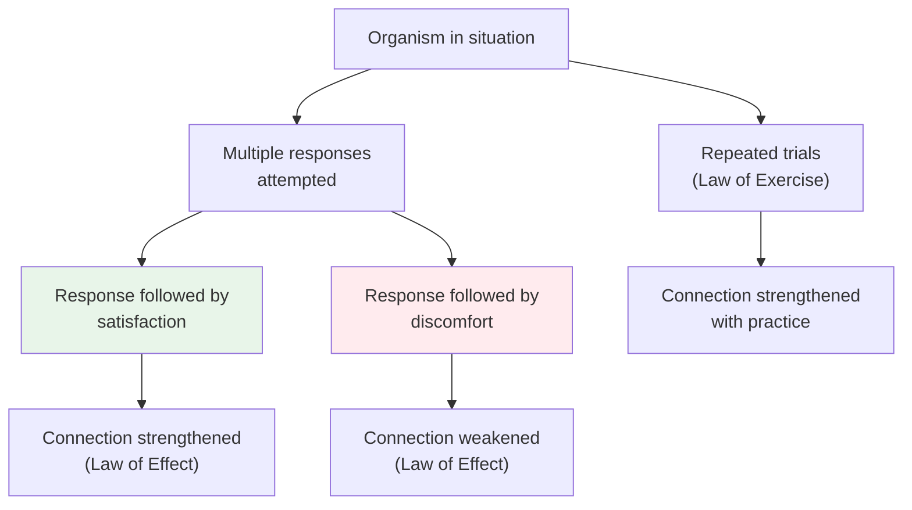

# Chapter 12 · Module 2
# Thorndike and the Roots of Behaviorism
## Psychology · Unit 2 · History of Psychology

---

In 1898, a young Harvard graduate named Edward Lee Thorndike built a series of small wooden boxes. Each had a different latch — a loop of string, a lever, a button — that an animal could manipulate to open the door and escape. Thorndike placed hungry cats inside these boxes and timed how long it took them to find the mechanism. The first trial was always a spectacle of panic: scratching, biting, clawing at every surface. But over repeated trials, something systematic happened. The time to escape dropped sharply. The random movements disappeared. The cat went straight for the latch.

Thorndike plotted these times on graphs and produced what he called **learning curves** — smooth, declining functions showing improvement with practice. It was not the dramatic insight that Köhler would later report in chimpanzees. It was something quieter and, in its way, more revolutionary: a mathematical description of how organisms learn through trial and error. The data were clean. The method was objective. And the implications were enormous — because Thorndike was about to offer the first real laws of learning.

## The Laws That Were Almost Obvious

Thorndike presented two "provisional" laws that he believed stood out "clearly in every series of experiments on animal learning and in the entire history of the management of human affairs."

The **Law of Effect** stated that of several responses made to the same situation, those accompanied or closely followed by satisfaction to the animal will, other things being equal, be more firmly connected with the situation. Those accompanied by discomfort will have their connections weakened. The greater the satisfaction or discomfort, the greater the strengthening or weakening.

The **Law of Exercise** stated that any response to a situation will, other things being equal, be more strongly connected with the situation in proportion to the number of times it has been connected with that situation and to the average vigor and duration of the connections.

Robinson observes, with dry precision, that there is little in either law that could not be gleaned from Locke, Hume, Bentham, or even Aristotle. Practice makes perfect. We tend to do things we find satisfying. The difference is that Thorndike had experimental data — cats in boxes, plotted on graphs — to back these claims up.

*Figure: Thorndike's two laws — the Law of Effect (satisfaction strengthens, discomfort weakens) and the Law of Exercise (practice strengthens).*

> [!TIP] **Stop and Think**
> Thorndike's Law of Effect says behavior followed by satisfaction is strengthened. Robinson notes this could have been gleaned from Aristotle. Is it a scientific law or just a restatement of common sense? What does the experimental data add that common sense does not?

### The Problem of Mentalism

Thorndike's laws were, in their stated form, richly **mentalistic**. The Law of Effect used terms like "satisfaction" and "discomfort" — psychological terms that fit easily into the introspective tradition. Under the Law of Effect, Thorndike employed "the same situation" and "satisfaction"; under the Law of Exercise, "a situation." These are psychological terms. Whether Thorndike intended it or not, his laws allowed a construction in which psychology remained the science of mind.

This was precisely what troubled John B. Watson. Watson had watched Thorndike's work with admiration for its objectivity but distaste for its mentalism. "Most of the psychologists believe habit formation is implanted by kind fairies," Watson complained. "For example, Thorndike speaks of pleasure stamping in the successful movement and displeasure stamping out the unsuccessful movements."

Watson wanted something cleaner. He wanted to strip learning of all mentalistic residue — no satisfaction, no discomfort, no pleasure stamping anything in. He found his model in the work of Ivan Pavlov, a Russian physiologist who had discovered that a neutral stimulus could acquire the power to elicit a reflex response through repeated pairing with an unconditioned stimulus.

Pavlov was not a behaviorist. He was a physiologist by training and commitment. His ambition was to articulate the laws of central nervous system function that accounted for the psychological dimensions of life. His Nobel Prize speech in 1909 introduced the conditioned reflex to the general scientific community. "It has long been known," Pavlov noted, "that the sight of tasty food makes the mouth of a hungry man water." The conditioned reflex was not revolutionary in itself. What was revolutionary was the theory built on top of it — that all psychic functions are reducible to reflex mechanisms within the brain.

> [!TIP] **Stop and Think**
> Thorndike said "pleasure stamps in" a successful movement. Watson objected: too mentalistic. Pavlov said a neutral stimulus becomes "conditioned" through pairing with an unconditioned stimulus. Is the second description really less mentalistic, or does it just use different words for the same thing?

### From Cats to Reflexes

Watson did not applaud Thorndike's choice of terms, but he did applaud the objective methods of measurement and the general demystification of the discipline. Thorndike had shown that learning could be studied without introspection — without asking the animal what it was thinking or feeling. You just timed the escape.

But Thorndike's framework still left room for mentalistic interpretation. "Satisfaction" could be read as a subjective state. "The same situation" implied a cognitive comparison. Watson wanted to close these loopholes entirely. He turned to Pavlov's reflex physiology as his foundation.

The conditioned reflex became Watson's unit of behavior. All more complex forms of behavior were compounded of these units. Through conditioning, anything could come to elicit a given response provided it had been presented in conjunction with an unconditioned stimulus. By association, the previously neutral stimulus becomes the substitute for the unconditioned stimulus. Language itself — that most vaunted human vanity — was, for Watson, nothing more than a product of conditioned reflexes involving the laryngeal musculature.

Watson was careful about one thing. He resisted the temptation to set tiny servants to work in the brain. "Most of the psychologists talk quite volubly about the formation of new pathways in the brain," he observed, "as though there were a group of tiny servants of Vulcan there who run through the nervous system with hammer and chisel digging new trenches and deepening old ones." His explanation of psychological processes was to remain descriptive — relatively neutral on physiological detail, relatively hostile on mental referents.

> [!TIP] **Stop and Think**
> Watson claimed that language is nothing more than conditioned reflexes of the laryngeal muscles. When you read this sentence and understand it, is that just a chain of reflexes? What would a child who has just learned to say "Why?" say about that?

> [!TIP] **Stop and Think**
> Robinson notes that Thorndike's laws are "classical associationism with the addition of Darwinian and Benthamist principles." If a scientific law is just an old philosophical idea with data attached, does the data transform the idea into something new? Or does it just dress the old idea in a lab coat?

### Why Behaviorism Caught On

The rise of behaviorism in America was not purely a scientific achievement. Robinson draws your attention to the cultural atmosphere that made it possible.

Kurt Koffka, presenting his Gestalt psychology in 1935, observed that Americans possessed "a very high regard for science, 'accurate and earthbound' science," which produced in them "an aversion, sometimes bordering on contempt, for metaphysics that tries to escape from the welter of mere facts into a loftier realm of ideas and ideals." This was, Koffka noted, a specifically American phenomenon. America was the country of William James and John Dewey — but it was also the country of pragmatism, and pragmatism's insistence on restricting scientific terms to observables supported Watson's growing dissatisfaction with traditional formulations.

The philosophical pragmatism of Charles Sanders Peirce had a central tenet: the meaning of any concept, as applied to any thing in the natural world, can be no more than the behavior of that thing in a variety of clearly specified conditions. James brought these ideas to the attention of American philosophers and psychologists. Without belaboring the line of succession, Robinson simply notes the strong pragmatistic flavor of Watson's definitions and criteria of scientific discourse.

Behaviorism also had timing on its side. By 1930, the signs were unmistakable. Psychologists had divided into two camps. In one were the self-appointed scientists — students of animal behavior, conditioned reflexes, brain-behavior relations. In the other was everyone else. Introspection was fading. Freud's influence was growing, but psychoanalysis was too mentalistic to threaten the new science. The stage was set for a revolution.

> [!TIP] **Stop and Think**
> Robinson argues that behaviorism's rise was as much cultural as scientific — American pragmatism, anti-Hegelianism, and devotion to "earthbound science" all played roles. If a scientific movement's success depends on cultural factors, does that undermine its scientific authority? Or is science always shaped by its culture?

> [!IMPORTANT]
> Thorndike's cats in puzzle boxes and Pavlov's salivating dogs provided the raw materials for behaviorism. But the movement's success depended on something more than data — it depended on a philosophical climate that valued measurement over meaning, prediction over understanding, and practical results over theoretical depth. Thorndike's laws were classical associationism dressed in experimental clothing. Watson stripped away the mentalistic language and replaced it with reflex physiology. What survived was not a new discovery about learning, but a new way of talking about it — one that defined psychology by what it could measure rather than what it needed to explain.

## Speaking of Laws and Learning...

- A parent in Seoul teaches her toddler to say "thank you" by offering praise after each attempt. Within weeks, the child says "thank you" automatically — not because she feels gratitude, but because the behavior has been reinforced. Is this the Law of Effect in action? Or is something missing from that description?

- A factory worker in Istanbul performs the same assembly task eight hours a day. His speed improves with practice — exactly as Thorndike's Law of Exercise predicts. But he also develops a deep resentment toward the work. His performance improves. His well-being deteriorates. Can a law of learning ignore what the learner feels?

- A student in London reads Thorndike's laws and thinks: "This is just common sense dressed up as science." But then she reads about the learning curves — the smooth, predictable decline in escape time across trials. The data show something that common sense alone would not have predicted: the regularity of improvement. What does the data add that intuition does not?

---

Thorndike provided the laws. Pavlov provided the mechanism. Watson provided the manifesto. But behaviorism in its Watsonian form was too crude to survive. It needed a more sophisticated architect — someone who could build a complete system of behavior on the foundation of the conditioned reflex. That architect was Burrhus Frederick Skinner, who in 1938 published a book that would change American psychology forever.

*[Module 2 of 10.]*

---

## References

1. Thorndike, E. L. (1898/1970). *Animal Intelligence: Experimental Studies*. New York: Hafner Publishing.
2. Pavlov, I. P. (1927). *Conditioned Reflexes: An Investigation of the Physiological Activity of the Cerebral Cortex*. (G. V. Anrep, Trans.). London: Oxford University Press.
3. Watson, J. B. (1913). Psychology as the behaviorist views it. *Psychological Review, 20*(2), 158–177.
4. Koffka, K. (1935). *Principles of Gestalt Psychology*. New York: Harcourt Brace.
