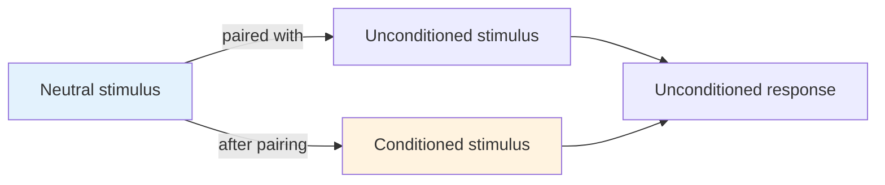

# Chapter 12 · Module 3
# Watson's Behaviorism
## Psychology · Unit 2 · History of Psychology

---

In February 1913, John Broadus Watson stood before the American Psychological Association at Columbia University and delivered an address that would later be called the "behaviorist manifesto." Watson was thirty-five years old, a professor at Johns Hopkins, and possessed of a certainty that bordered on arrogance. He had no patience for the debates between structuralists and functionalists — debates that had occupied American psychology for two decades. He wanted to burn the whole thing down and start over.

"Psychology as the behaviorist views it," Watson declared, "is a purely experimental branch of natural science. Its theoretical goal is the prediction and control of behavior. Introspection forms no essential part of its methods, nor is the scientific value of its data dependent upon the readiness with which they lend themselves to interpretation in terms of consciousness. The behaviorist, in his efforts to get a unitary scheme of animal response, recognizes no dividing line between man and brute."

You can almost hear the audience shifting in their seats. This was not a proposal for reform. It was a declaration of independence — from philosophy, from introspection, from the entire tradition of psychology as the science of mind.

## What Watson Rejected

Watson's manifesto was directed at two targets, and he hit both with equal force.

The first was **structuralism** — Titchener's program of analyzing consciousness into its elements through controlled introspection. Watson found it indefinite and self-serving in its methods, hopelessly out of control in its data, and committed to a mission that could never succeed because it could never end. There is no limit to the number of "experiences" one may have, especially since each may be attended by anywhere from "three to nine states of clearness of attention." Watson had searched and never found a physician, lawyer, or businessman who had even once found a use for the methods or findings of the structuralists.

The second target was **functionalism** — the school identified with James and Dewey. Watson frankly admitted that he had never been able to understand what functionalism was supposed to be, in contrast to Titchener's psychology. James had complained that empirical associationism described a river in terms of "pailsful, spoonsful, quartpotsful, barrelsful, and other moulded forms of water." He argued that the stream of consciousness cannot be fragmented to suit the experimental psychologist. Dewey attacked the reflex arc concept, arguing that it failed to appreciate the coordinated nature of functional behavior.

But neither Titchener nor Wundt was naive on these points. What disturbed Watson was not that the functionalists found something lacking in structuralism — it was that they had not recommended a plausible method of correcting it.

> [!TIP] **Stop and Think**
> Watson rejected both structuralism and functionalism. Structuralism introspected too much. Functionalism theorized without offering a clear method. Was Watson right that a science of psychology needed to choose — either study consciousness with introspection or study behavior with objective methods? Or was there a third path he missed?

### The Conditioned Reflex as Unit

Watson disposed of his predecessors with revolutionary rhetoric. But rhetoric alone does not build a science. Watson needed a foundation — a unit of behavior from which all complex actions could be constructed. He found it in the conditioned reflex.

Through conditioning (and in thoroughly Humean fashion), anything can come to elicit a given response provided it has been presented in conjunction with an unconditioned stimulus. By association, the previously neutral stimulus becomes the substitute for the unconditioned stimulus. "The importance of stimulus substitution or stimulus conditioning cannot be overrated," Watson wrote. "So far as we know now... we can take any stimulus calling out a standard reaction and substitute another stimulus for it."

This was powerful in its simplicity. If any desired behavior could be secured through conditioning, then Watson could reject even the concept of instincts. We have been credited with a large number of instincts, he noted, but no recitation of the list tells us very much. He offered the analogy of a boomerang that returns to the place from which it was thrown — its behavior is the result of its composition, not some mysterious inner purpose. Organisms also are composed of biological systems structured to respond in stereotypical fashion to particular environmental features.

Watson, studying infants devoid of a conditioning history, was persuaded that their only native psychological apparatus consisted of the primitive emotions of rage, fear, and love. Everything else — every habit, every skill, every preference — was built through conditioning. Language itself was nothing more than conditioned reflexes involving the laryngeal musculature. The most vaunted human vanity reduced to a chain of stimulus-response connections.

*Figure: Watson's building block — the conditioned reflex. A neutral stimulus, through pairing with an unconditioned stimulus, becomes a conditioned stimulus capable of eliciting the response on its own.*

> [!TIP] **Stop and Think**
> Watson claimed that language is nothing more than conditioned reflexes of the laryngeal muscles. Children learn to speak the way Pavlov's dogs learned to salivate — through stimulus substitution. When you compose a sentence you have never written before, is that a chain of reflexes? What would Watson say? What would you say?

### The Watsonian Program

Watson's behaviorism was more than a theory of learning. It was a complete program for psychology.

The subject matter: observable behavior, nothing else. No consciousness, no mental states, no introspection, no unconscious processes, no "ghosts."

The goal: prediction and control of behavior. Not understanding, not insight, not wisdom — prediction and control.

The method: objective observation, experimentation, and the conditioned reflex as the unit of analysis.

The implications were radical. Watson's system left out a topic that even the "scientists" of psychology were not willing to part with: perception. His data, in the context of his ambitious system, were strikingly sparse and his proposed methods were daringly ambiguous. Promising to create "dentists" by Pavlovian conditioning left a good part of the psychological community incredulous, another part perplexed, and still another part in stitches.

Yet by 1930, the signs were unmistakable. Psychologists had divided into two camps. In one were the self-appointed scientists of the profession — students of animal behavior, conditioned reflexes, brain-behavior relations. In the other was everyone else. Introspection was a fading method. Freud's influence was becoming international, but psychoanalysis was still too mentalistic, too terminologically obtuse, to threaten the new science.

Watson reflected on his achievement in the Introduction to the 1930 edition of *Behaviorism*: "Without behaviorism being overtly accented, its influence has been profound during the eighteen years of its existence. Today, no university can escape the teaching of behaviorism... the younger generation of students demands at least some orientation in behaviorism."

> [!TIP] **Stop and Think**
> Watson's behaviorism promised prediction and control of behavior. Not understanding, not wisdom — prediction and control. Is prediction enough for a science of human behavior? Can you predict behavior without understanding it? Can you understand it without predicting it?

### The Cultural Reception

Robinson draws your attention to something that purely scientific accounts of behaviorism's rise tend to miss: the cultural atmosphere that made it possible.

Kurt Koffka, presenting his Gestalt psychology in 1935, observed that Americans possessed "a very high regard for science, 'accurate and earthbound' science," which produced in them "an aversion, sometimes bordering on contempt, for metaphysics that tries to escape from the welter of mere facts into a loftier realm of ideas and ideals." This was not merely an observation about academic preferences. It was a diagnosis of a culture.

America in the early twentieth century was the country of pragmatism. Charles Sanders Peirce had argued that the meaning of any concept can be no more than the behavior of that thing in clearly specified conditions. James brought these ideas to the attention of large numbers of philosophers and psychologists. Dewey's instrumentalism reinforced the message: thought is for action, not contemplation.

Watson's behaviorism fit this cultural moment perfectly. It was anti-Hegelian without ever mentioning Hegel. It was practical, objective, earthbound. It rejected the philosophical tradition that had given psychology its subject matter — consciousness, the soul, the mind — and replaced it with something you could see, measure, and control.

The philosophical pragmatism of James and Peirce, the experimental methods of Thorndike and Pavlov, the cultural demand for practical results — these converged in Watson's manifesto. Behaviorism was not just a scientific theory. It was a product of its time.

> [!TIP] **Stop and Think**
> Robinson argues that behaviorism's success was partly cultural — American pragmatism, anti-Hegelianism, and devotion to "earthbound science" all played roles. If a scientific theory succeeds partly because it fits the culture, does that make it less scientific? Or is science always shaped by the values of its time?

> [!TIP] **Stop and Think**
> Watson's behaviorism reduced all of psychology to stimulus-response connections. But consider this: when you recognize a friend's face in a crowd, are you responding to a stimulus? Or are you doing something that the S-R framework cannot capture? What would Watson say you are doing?

> [!IMPORTANT]
> Watson's behaviorism was a declaration of independence from the philosophical tradition that had created psychology. It rejected consciousness as a subject, introspection as a method, and the mind as an explanatory concept. In their place, it offered the conditioned reflex as the unit of behavior and prediction-and-control as the goal of science. The manifesto succeeded not because it solved any deep problem about the mind, but because it offered a clear method in a discipline that had been defined by its method from the start. If psychology was going to be a science — and the culture demanded that it be a science — then Watson showed it how. The cost was everything that made psychology interesting.

## Speaking of Manifestos and Methods...

- A manager in Berlin introduces "evidence-based management" to her company. Every decision must be supported by data. Employee satisfaction surveys replace conversations. Productivity metrics replace intuition about team dynamics. The method is clean. But the best employees start leaving. What did the data miss?

- A school district in Nigeria adopts a "behavioral management" system for students. Rewards for good behavior, consequences for bad. The system works — test scores rise, discipline incidents fall. But a counselor notices that the students who comply most perfectly are also the most anxious. The method measures behavior. It does not measure what the behavior costs.

- A psychologist in Tokyo studies decision-making by presenting subjects with binary choices in a laboratory. The results are clean, publishable, and precise. But a philosopher asks: "When was the last time you made a binary choice in real life?" The method simplifies. The simplification may distort.

---

Watson built the foundation. But behaviorism in its Watsonian form was too crude to survive — too dependent on the conditioned reflex, too vague about its mechanisms, too sweeping in its claims. It needed a more sophisticated architect. In 1938, a Harvard psychologist named Burrhus Frederick Skinner published *The Behavior of Organisms* and offered behaviorism a new foundation — one that would carry the movement for the next half century.

*[Module 3 of 10.]*

---

## References

1. Watson, J. B. (1913). Psychology as the behaviorist views it. *Psychological Review, 20*(2), 158–177.
2. Watson, J. B. (1930). *Behaviorism* (Rev. ed.). Chicago: University of Chicago Press.
3. Koffka, K. (1935). *Principles of Gestalt Psychology*. New York: Harcourt Brace.
4. Peirce, C. S. (1900). How to make our ideas clear. *Popular Science Monthly, 12*, 286–302.
