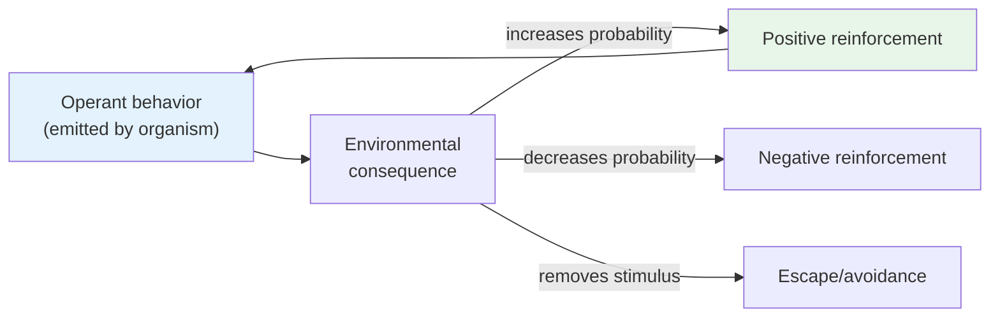

# Chapter 12 · Module 4
# Skinner's Operant Revolution
## Psychology · Unit 2 · History of Psychology

---

In 1938, a Harvard psychologist named Burrhus Frederick Skinner published a slim volume titled *The Behavior of Organisms*. It was not the first book on behaviorism — Watson had published several. It was not the most dramatic — Watson's prose crackled with revolutionary zeal. But Skinner's book did something Watson's never could: it gave behaviorism a precise, operational foundation that could generate testable predictions. Within two decades, *The Behavior of Organisms* would influence American experimental psychology as much as any single work in the history of the discipline.

Skinner had watched Watson's behaviorism struggle with its own contradictions. Watson's system was built on the conditioned reflex — Pavlovian conditioning applied to everything from language to dentistry. But the conditioned reflex was a passive affair: the organism waits for a stimulus and responds. Real behavior does not work that way. A rat in a cage does not wait for a stimulus. It moves, explores, presses levers, sniffs corners. It operates on its environment. Skinner saw this and built his entire system around a different unit: the **operant** — a behavior that operates on the environment to produce consequences.

## Beyond the Reflex

Watson's behaviorism was built on Pavlovian reflexes — stimulus in, response out. But Pavlovian reflexes tend to involve subsystems of the organism: salivation, eye blinks, knee jerks. They are intimately associated with the organism's adaptive capacities but do not directly result in those adjustments of the environment that more complex behavior produces.

Skinner drew a sharp line between two kinds of behavior. **Respondent behavior** — elicited by known stimuli — was the domain of Pavlovian conditioning. **Operant behavior** — emitted by the organism to operate on the environment — was something else entirely. A rat pressing a lever is not responding to a stimulus. It is emitting a behavior that changes the environment. The consequences of that behavior determine whether it will occur again.

This was a fundamental shift. In Pavlovian conditioning, the stimulus comes first and the response follows. In operant conditioning, the behavior comes first and the consequences follow. The environment does not trigger the behavior — it shapes it.

Skinner stripped the Law of Effect of its mentalistic language. Thorndike had spoken of "satisfaction" and "discomfort." Skinner replaced these with purely operational terms: that which increases the probability of the behavior that precedes it is, by operational definition, a **positive reinforcer**. That which reduces the probability is a **negative reinforcer**. No satisfaction. No discomfort. Just probabilities.

*Figure: Skinner's operant cycle — behavior operates on the environment, and the consequences determine whether the behavior will recur.*

> [!TIP] **Stop and Think**
> Skinner replaced Thorndike's "satisfaction" with "positive reinforcer" — defined purely as something that increases the probability of the behavior that precedes it. Is this really less mentalistic? Or does it just avoid mentalistic words while still describing the same process?

> [!TIP] **Stop and Think**
> Skinner drew a sharp line between respondent behavior (elicited by stimuli) and operant behavior (emitted to produce consequences). Think about your own morning routine — brushing teeth, making breakfast, commuting. How much of it is respondent? How much is operant? Does the distinction hold up in real life?

### Schedules of Reinforcement

One of Skinner's most important findings concerned not what reinforces behavior but *when* behavior is reinforced. In most of life, you do not get rewarded every time you do something right. Sometimes you find a parking spot immediately; sometimes you circle for ten minutes. Sometimes your joke gets a laugh; sometimes it falls flat. Skinner called these patterns **schedules of reinforcement**, and he discovered that they have profound effects on behavior.

The most striking finding: behavior that has been reinforced on a random or variable schedule — sometimes rewarded, sometimes not — is extraordinarily resistant to extinction. A pigeon that has been pecking a key on a variable-ratio schedule (rewarded after an unpredictable number of pecks) will continue pecking long after the rewards stop. This is one of the most robust demonstrations in all of psychology.

Think about what this means for human behavior. Gambling is reinforced on a variable schedule — you never know when the next win will come. The result is behavior that persists despite consistent losses. The slot machine does not reward you every time. It rewards you just often enough to keep you pulling the lever.

But here is Robinson's sharp observation: there is no formulation of the law of effect that permits one to predict such an effect. The finding is not logically deducible from the law that is asserted as covering it. Skinner discovered something important about reinforcement, but his own theoretical framework could not have predicted it. The law of effect, stripped of mentalism, becomes so broad that it loses its explanatory power.

> [!TIP] **Stop and Think**
> Skinner found that variable reinforcement schedules produce behavior that is extraordinarily resistant to extinction. This explains why gambling is so addictive. But Robinson points out that the law of effect cannot predict this finding — it can only describe it after the fact. If a law cannot predict, is it really a law?

### A Descriptive Science

Skinner and his disciples declared themselves against grandiose theories, satisfying explanations, uniting psychology with all other sciences, unearthing "mechanisms," and penetrating the "mind." In place of these historic and resoundingly failing missions, the behaviorists proposed to provide a descriptive science of behavior permitting the prediction and control of the actions of organisms.

This was a deliberate retreat from the ambitions of both Watson and the neobehaviorists. Clark Hull had tried to build a mathematical system of behavior as rigorous as Newton's *Principia*. Tolman had postulated cognitive maps and intervening variables. Skinner rejected both approaches. He did not want to explain behavior — he wanted to describe it. He did not want theories — he wanted data. He did not want to know what happens inside the organism — he wanted to know what happens between the organism and its environment.

The maxim that directs behavioristic inquiry is the law of effect, and this law is as close as Skinner came to a generalization. But stripped of all mentalistic features, the law declares only that certain stimuli ("reinforcers") alter the probability of the response that produces them. This is very nearly tautological: a reinforcer is defined as something that reinforces. The law of effect, in its Skinnerian form, describes a regularity but does not explain it.

Robinson's verdict is measured. Behaviorism in Skinner's hands liberated itself from the goals and methods of nineteenth-century science more successfully than any other branch of the discipline. But liberation from theory came at a cost: the system could describe behavior but never explain it.

> [!TIP] **Stop and Think**
> Skinner rejected theories and explanations in favor of pure description. He wanted psychology to be a science of behavior, not a science of mind. But can a science exist without theories? Is a description of regularities — "this stimulus alters the probability of that response" — enough to count as science?

> [!TIP] **Stop and Think**
> The slot machine is reinforced on a variable schedule — you never know when the next win will come. The result is behavior that persists despite consistent losses. Robinson points out that the law of effect cannot predict this — it can only describe it after the fact. If you were designing a gambling addiction prevention program, would Skinner's principles help? Or would you need something more?

> [!IMPORTANT]
> Skinner's operant revolution replaced the conditioned reflex with the operant as the unit of behavior, and replaced mentalistic language with operational definitions. His schedules of reinforcement produced some of the most robust findings in psychology. But the system's strength was also its weakness: stripped of mentalistic language, the law of effect became nearly tautological. It described regularities without explaining them. Skinner showed what behaviorism could do when it stopped trying to explain the mind. He also showed what it could not do.

## Speaking of Reinforcement and Control...

- A teacher in Mexico City uses a token economy in her classroom — students earn points for good behavior, redeemable for privileges. The system works: disruptive behavior drops sharply. But when the tokens are removed, the disruptive behavior returns — sometimes worse than before. What did the tokens actually teach?

- A fitness app in London rewards users with badges and streaks for daily exercise. Users who were already motivated find the badges annoying. Users who were not motivated exercise just long enough to earn the badge, then quit. The reinforcer works on some behavior, for some people, some of the time. Is that enough for a science?

- A parent in São Paulo notices that her toddler throws food on the floor whenever she wants attention. The parent learns to ignore the food-throwing and attend to the child only when she is calm. Within a week, the food-throwing stops. The parent has just done operant conditioning — without reading Skinner, without a laboratory, without a theory. Is the parent doing science?

---

Skinner built a system of remarkable precision and practical power. But his rejection of internal states — his insistence that consciousness, will, and intention are "verbal operants" invented by society — would provoke a backlash that shook behaviorism to its foundations. The attack came not from the romantics or the philosophers, but from the behaviorists' own allies — and it asked a question Skinner could not answer: what about autonomous man?

*[Module 4 of 10.]*

---

## References

1. Skinner, B. F. (1938). *The Behavior of Organisms*. New York: Appleton-Century-Crofts.
2. Skinner, B. F. (1953). *Science and Human Behavior*. New York: Macmillan.
3. Thorndike, E. L. (1898/1970). *Animal Intelligence: Experimental Studies*. New York: Hafner Publishing.
