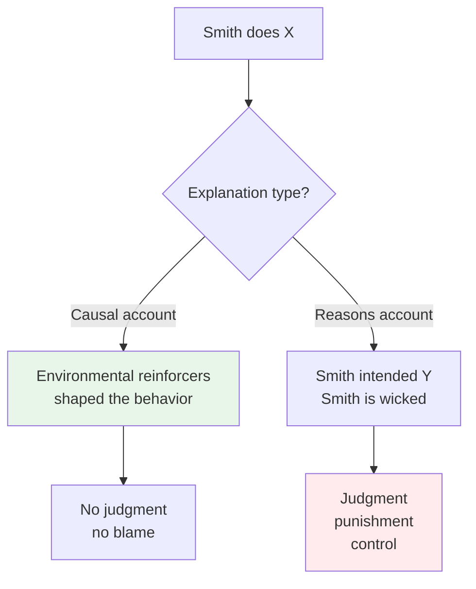

# Chapter 12 · Module 5
# The Skinnerian Worldview
## Psychology · Unit 2 · History of Psychology

---

In 1971, B. F. Skinner published a book that ignited one of the fiercest intellectual controversies of the twentieth century. *Beyond Freedom and Dignity* argued that the concepts of human freedom and personal dignity were not merely outdated — they were obstacles to a scientific understanding of behavior. The book made Skinner a household name. It also made him a target.

Humanists condemned his psychology as dehumanizing. Theologians called it godless. Ethicists found it amoral. Political theorists in the Kantian tradition judged it fascistic. Philosophers in the Hegelian tradition found it absurd. Not even Freud attracted such a diverse array of critics. But far from chastening Skinner, the attention and condemnation called forth bold resolve. He had a thesis to defend, and he would defend it to the end.

The thesis was simple in structure but radical in implication: what we call "autonomous man" — the self-directed, free-choosing, morally responsible agent — is a fiction. Not a useful fiction, not a noble fiction, but a scientific fiction that prevents us from understanding why people behave as they do.

## The Attack on Autonomous Man

Skinner's argument against autonomous man rested on a distinction between two kinds of explanation: **reasons** and **causes**.

When we attribute someone's walking, talking, and working to the effects of reinforcing stimuli, we remove the behavior from a judgmental domain and locate it in the domain of natural phenomena. We offer a causal account. But when we impute reasons to a person — when we say Smith did X *because* he intended Y — we earn the right to judge Smith's intentions as something above and beyond the mere actions and their consequences. We can say that Smith intended to kill Jones even though the bullet missed. We can say Smith is wicked, worthy of punishment.

The behaviorist rejoinder is sharp: what is added to a description of the publicly observable relations between responses and reinforcers when the concept of "motivation" is supplied? What can the term "motive" mean beyond the efficacy of a stimulus to control the behavior that obtains or avoids it?

Skinner goes further. He argues that our insistence on reasons rather than causes serves a social function — it gives us control over others. When we can say Smith acted from "bad reasons," we earn the right to punish him. When we can say we acted from "good reasons," we elevate ourselves. The search for reasons is itself a behavior shaped by reinforcement: we are reinforced for claiming to see "deeper" into others' motivations, and we gain status from the appearance of insight.

*Figure: Skinner's distinction between causal and reasons explanations — causal accounts remove judgment, reasons accounts enable it.*

> [!TIP] **Stop and Think**
> Skinner argues that our insistence on "reasons" for behavior serves a social function — it gives us power to judge and control others. When you explain your own behavior by saying "I chose to do X because of Y," are you describing a real process? Or are you performing a verbal behavior that has been reinforced by your culture?

### Freedom and Dignity as Verbal Operants

Skinner's most provocative move was to treat the concepts of freedom and dignity not as achievements of human civilization but as obstacles to scientific progress.

Reasons, being private and therefore "one's own," put the actor in control — whereas causes put nature in control. Industrial societies place a great premium on competition. Secondary reinforcers — titles, distinctions, status — are distributed in such a way as to increase the behavior of the laboring community. Modern citizens are controlled in such a way as to emit behaviors that seem to remove them from the direct control of others. It becomes increasingly important for them to refer to their "freedom" and "dignity," since such imputations carry special status.

Such persons are not merely animals working for food — they are self-motivated, self-actualizing, rational creatures. All this is proved, Skinner notes with evident irony, by our asserting reasons for actions over and against natural causes. Those who criticize causal accounts by inserting "reasons" into Smith's mind are merely putting certain words into Smith's vocabulary, and these words get into his vocabulary in precisely the same way that bar-presses enter the behavioral vocabulary of the laboratory rat.

The purely descriptive, causal account allows a specification of the environmental sources of behavior control. This specification is, in principle, complete, predictively powerful, and pragmatically successful. It is not improved by the inclusion of inner selves, motives, reasons, spirits, wants, beliefs, or even neurons.

> [!TIP] **Stop and Think**
> Skinner argues that "freedom" and "dignity" are verbal operants — words that have been reinforced by society because they serve social functions. If he is right, then your sense of being a free agent who makes choices is itself a product of reinforcement. Is this a coherent claim? Can the argument undermine itself — is Skinner's own theory also a verbal operant?

### The Behaviorist Utopia

Skinner did not stop at analysis. He offered a prescription. An experimental analysis shifts the determination of behavior from autonomous man to the environment — an environment responsible both for the evolution of the species and for the repertoire acquired by each member.

"Is man then 'abolished'?" Skinner asked. "Certainly not as a species or as an individual achiever. It is autonomous inner man who is abolished, and that is a step forward."

The practical applications were extensive. Techniques of behavior modification were introduced into classrooms, psychiatric clinics, vocational schools, industrial training programs, counseling chambers, and even playgrounds. They were as at home in penal institutions as in the animal laboratory, or wherever there is a captive audience. Their application was recommended with the same confidence whether the "organism" was a white rat, a convicted felon, an autistic child, a performing seal, a schizophrenic patient, or a difficult student.

Robinson notes that the groundwork for Skinnerian psychology had been laid years — even centuries — earlier. More proximately, it began with Hume and reached its first great plateau in the functional biology of Darwin, the utilitarianism of Mill, and the pragmatism of James. For James, knowledge is utility. Skinner's system was the ultimate expression of this tradition: a psychology that would be judged by what it could do, not by what it said about the mind.

> [!TIP] **Stop and Think**
> Skinner claimed that abolishing "autonomous inner man" is "a step forward." He meant that replacing the fiction of free will with a science of environmental control would allow us to solve social problems more effectively. But who controls the controllers? If behavior is shaped by the environment, who designs the environment — and by what values?

### The Critics

The most persistent complaint against behaviorism is that it fails to recognize the rational, volitional, and intentional elements of human behavior. In its devotion to unearthing the environmental causes of behavior, it ignores the private reasons and motives of the behaving person. The accounts of behavior it offers are limited to the "whens" and "wheres" while remaining stunningly silent on the matter of "why."

Robinson examines the behaviorist thesis for the first time and finds it invulnerable on the surface — but suspects the invulnerability may result from its failure to say anything. The system's only law — the law of effect — is either too rich in mentalistic terms (Thorndike's version) or too empty of content (Skinner's version). Even Skinner's own important finding about schedules of reinforcement is not logically deducible from the law that is asserted as covering it.

The system also has a peculiar relationship with Darwinian theory. Behaviorism shares with all systematic psychologies since Wundt the conviction that human psychological processes have evolved and are present in lower forms of life. But Robinson points out that evolutionary theory is itself far from an adequate scientific theory. The term "environment" — which psychologists use as if it were a voltage or a weight — stands for a continuously changing and extraordinarily large assortment of conditions, inevitably described in terms borrowed from the observing culture. For the organism capable of locomotion, the "environment" is never permanent. For the organism with memory, it is never really gone.

> [!TIP] **Stop and Think**
> Robinson suggests that Skinner's system may be invulnerable precisely because it says nothing. The law of effect, stripped of mentalism, describes a regularity but does not explain it. A reinforcer reinforces — that is the entire theory. Is a theory that cannot be refuted still a theory?

> [!TIP] **Stop and Think**
> Skinner's behavior modification techniques have been used successfully with autistic children, prisoners, and students. If the techniques work — if they change behavior in predictable, beneficial ways — does it matter whether the theory behind them is correct? Can practical success validate a theory?

> [!IMPORTANT]
> Skinner's behaviorism was the most thoroughgoing rejection of the philosophical tradition in the history of psychology. It abolished autonomous man, replaced reasons with causes, and treated freedom and dignity as verbal operants. The system was powerful in its practical applications — behavior modification works — but Robinson identifies a fatal weakness: the system's invulnerability comes from its emptiness. The law of effect, stripped of mentalistic content, is either a tautology or a description. It cannot explain why behavior occurs — it can only describe the conditions under which it does. Skinner showed what psychology could become when it abandoned the mind entirely. He also showed what it could not become.

## Speaking of Freedom and Control...

- A parent in Delhi uses a reward chart for her children — stars for good behavior, deductions for bad. The system works brilliantly for two weeks. Then the children start negotiating: "How many stars do I get for this?" The reinforcer has become the point. The behavior it was supposed to encourage has become a bargaining chip. What happened?

- A prison in Johannesburg implements a token economy — inmates earn privileges for good behavior. The program reduces incidents of violence. But a sociologist visiting the prison asks: "Are the inmates learning to behave well, or are they learning to perform well?" The difference matters — but can the token economy distinguish between them?

- A manager in Tokyo introduces performance bonuses for his team. Productivity rises sharply in the first quarter. By the third quarter, it has plateaued. By the fourth, the best performers are burned out and the worst performers have found ways to game the metrics. The reinforcer worked. Then it stopped working. Then it made things worse. What does the law of effect say about that?

---

Skinner rejected the mind. But the mind refused to stay rejected. In Europe, a group of psychologists — Wertheimer, Koffka, Köhler — had been building an alternative to behaviorism that took perception, cognition, and mental organization as its central concerns. Their approach was called Gestalt psychology, and it would prove to be one of the most important intellectual movements of the twentieth century.

*[Module 5 of 10.]*

---

## References

1. Skinner, B. F. (1971). *Beyond Freedom and Dignity*. New York: Knopf.
2. Skinner, B. F. (1938). *The Behavior of Organisms*. New York: Appleton-Century-Crofts.
3. Skinner, B. F. (1948). *Walden Two*. New York: Macmillan.
