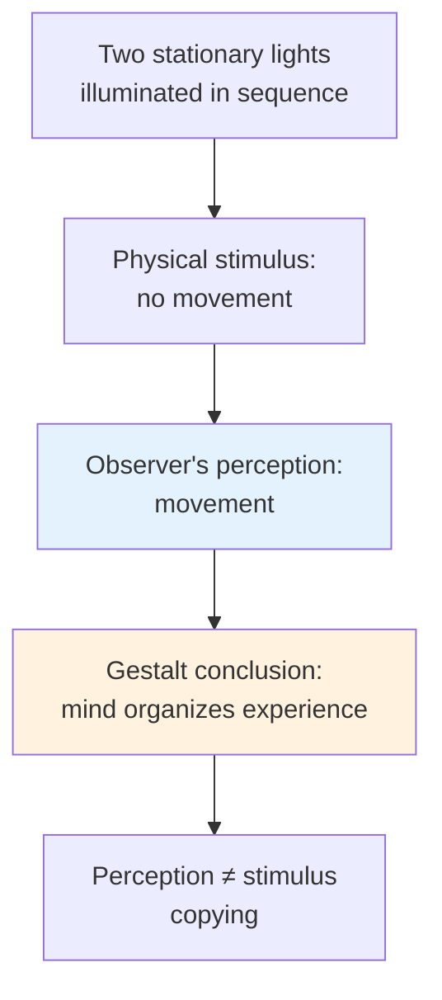

# Chapter 12 · Module 6
# Gestalt Psychology — The Continental Reply
## Psychology · Unit 2 · History of Psychology

---

In 1910, a young psychologist named Max Wertheimer was sitting on a train traveling through Germany when he had an idea. He had been thinking about a toy he had seen in a shop — a stroboscope, a device that creates the illusion of movement by presenting slightly different images in rapid succession. The earliest motion pictures had been filmed some twenty years before, and stroboscopes were available as children's toys by 1910. What interested Wertheimer was not the device itself but the phenomenon it revealed: apparent movement. When two illuminated stripes are presented in quick succession, the observer sees not two stripes but one stripe moving from left to right.

Wertheimer got off the train, checked into a hotel, and began writing. Within weeks, he had designed experiments with his colleagues Kurt Koffka and Wolfgang Köhler at the Psychological Institute of Frankfurt. What they discovered — or rather, what they demonstrated — would become the foundation of one of the most important movements in the history of psychology.

The phenomenon was called **phi**. It was not the first time someone had noticed apparent movement. But Wertheimer, Koffka, and Köhler saw something in it that others had missed: the movement was not in the stimulus. The physical arrangement contained nothing that would predict motion. The motion was created by the observer's mind.

## The Phi Phenomenon

The setting for demonstrating phi is a dark room in which one can present two illuminated stripes placed several inches apart. An interval can be found between the illumination of one stripe and that of its neighbor such that the observer reports not two stripes but the movement of one stripe from left to right, or right to left, depending on the order of illumination.

The important point is this: nothing in the experimental arrangement, except the phenomenon itself, would lead to the prediction of apparent movement. A purely stimulus-bound description of the laboratory setting is devoid of any allusion to motion. The motion is cheated by the observer — it is one's perception of motion, not one's response to motion, that is the object of study.

This was a direct challenge to behaviorism. Watson had argued that psychology should study observable behavior — stimulus in, response out. But the phi phenomenon showed that the stimulus does not determine the perception. The observer's mind does. Two stationary lights produce the perception of movement. The movement is not in the lights. It is in the mind.

*Figure: The phi phenomenon — two stationary lights produce the perception of movement, demonstrating that perception is an active construction, not a passive recording.*

> [!TIP] **Stop and Think**
> In the phi phenomenon, two stationary lights produce the perception of movement. Nothing in the physical stimulus predicts motion. The observer's mind creates it. If perception is not a copy of the stimulus, what is it? And what does this mean for a psychology that studies only stimuli and responses?

### Isomorphism and Brain Dynamics

Gestalt psychology was not, despite Pavlov's accusations, an "idealistic" psychology. None of the major Gestalt treatises contains an acknowledgment of Hegel's or Berkeley's influence. No Gestalt psychologist denied the existence of matter or suggested that the fundamental stuff of the universe is mental. But the Gestaltists were united by a conviction that perception is governed by mental laws — laws of organization that the mind imposes on raw sensory data.

Köhler insisted that the relationship between perception and neurophysiology was **isomorphic** — meaning that the structural features of the percept are matched by the structural features of the brain's functional organization. "We are inclined to assume," Köhler wrote, "that when the self feels in one way or another referred to an object there actually is a field of force in the brain, which extends from the processes corresponding to the self to those corresponding to the object."

This was not the old associationism. The brain was not a telephone switchboard, connecting stimulus inputs to response outputs through learned associations. It was a dynamic system, organized by principles that could not be reduced to simple connections. The Gestalt critique of behaviorism was uncompromising: the behavioristic reliance on physiological reflexes was not only simplistic but at variance with even the physiological facts.

The philosophical roots of Gestalt psychology lie in Kant and Hegel — not in their specific doctrines but in their shared conviction that the mind actively organizes experience. Just as Thorndike borrowed the philosophical principles of association and created an experimental environment in which they could be demonstrated, the Gestaltists accepted the Kantian-Hegelian principle of the pure categories of the understanding and brought them to bear on studies of visual perception.

> [!TIP] **Stop and Think**
> Köhler argued that the brain is not a telephone switchboard but a dynamic system organized by principles that cannot be reduced to simple connections. A century later, neuroscience has largely confirmed this. Does this vindicate the Gestaltists? Or does it just show that they were right about the brain but wrong about the mind?

> [!TIP] **Stop and Think**
> The Gestaltists showed that you perceive a melody as the same melody when played in different keys — even though every note has changed. This is transposition: you perceive relationships, not absolute values. Does this challenge the behaviorist idea that learning is about forming specific stimulus-response associations? What would Watson say about transposition?

### The Gestalt Critique of Behaviorism

The Gestalt critique of behaviorism attacked on multiple fronts.

First, behaviorism's reliance on physiological reflexes was too simplistic. Even Pavlov's careful studies showed only that simple associations could be formed — a tone paired with food produces salivation. But human perception is vastly more complex than a chain of reflexes. The phi phenomenon alone shows that what we perceive is not what the stimulus contains.

Second, behaviorism claimed to model itself after physics but failed to take from physics its most celebrated discoveries — those that allow comprehension of dynamic processes. The brain, like any complex physical system, operates according to principles of organization that cannot be predicted from the properties of individual neurons.

Third, behaviorism's associationistic principles could not account for the abilities of animals in settings that had not been trivialized by the demands of the experimental paradigm. Kohler's chimpanzees — stacking boxes, joining sticks, demonstrating insight — showed that organisms do not merely stumble through environments collecting reinforced responses. They perceive, organize, and understand.

Robinson notes that the Gestalt critique was as opposed to introspective psychology as any behaviorist. The Gestaltists did not want to return to Titchener's introspection. They wanted to study perception objectively — but they insisted that the object of study is the percept, not the stimulus. The difference matters enormously.

> [!TIP] **Stop and Think**
> The Gestaltists rejected both introspection and behaviorism. They did not want to study private experience (introspection) or mere stimulus-response connections (behaviorism). They wanted to study how the mind organizes perception. Is this a third path? Or does it lean toward one side more than the other?

> [!TIP] **Stop and Think**
> Robinson notes that the Gestaltists were "as opposed to introspective psychology as any behaviorist." They wanted to study perception objectively — but the object of study was the percept, not the stimulus. If the percept is not the same as the stimulus, what is it? And can you study it without some form of introspection?

> [!IMPORTANT]
> Gestalt psychology was the Continental reply to both introspection and behaviorism. The phi phenomenon demonstrated that perception is not a copy of the stimulus — it is an active construction by the mind. Isomorphism linked perceptual organization to brain dynamics, not to learned associations. The Gestalt critique showed that behaviorism's stimulus-response framework was too simple to account for perception, insight, or the dynamic organization of the nervous system. But Gestalt psychology also faced its own challenges: its principles of perceptual organization were difficult to formalize, and its relationship to the German idealist tradition made it suspect in the eyes of those who equated science with empiricism.

## Speaking of Perception and Organization...

- A graphic designer in Istanbul arranges elements on a page. She knows that nearby elements will be perceived as grouped — a principle the Gestaltists called proximity. She also knows that similar elements will be perceived as related. She is using Gestalt principles every day, whether or not she has ever heard of Wertheimer.

- A musician in Lagos plays a melody in a different key. Every note has changed — the frequencies are completely different. But you recognize the melody instantly. This is **transposition** — you perceive the relationships between notes, not the notes themselves. The Gestaltists would say you are perceiving the Gestalt, not the elements.

- A traffic engineer in Seoul designs an intersection. He knows that drivers will perceive the road as continuous even when it is interrupted by a crosswalk — a principle related to the Gestalt law of **continuity**. The drivers are not responding to stimuli. They are organizing their perception according to principles the Gestaltists identified a century ago.

---

Gestalt psychology showed that perception is active, not passive — that the mind organizes experience according to principles that cannot be reduced to stimulus-response connections. But the movement's greatest contribution may have come from a researcher who was not formally a Gestalt psychologist at all: Edward Tolman, whose rats built cognitive maps and learned without reward. Tolman's work, combined with Köhler's chimpanzees, would plant the seeds of the cognitive revolution that transformed psychology in the second half of the twentieth century.

*[Module 6 of 10.]*

---

## References

1. Wertheimer, M. (1912). Experimentelle Studien über das Sehen von Bewegung. *Zeitschrift für Psychologie, 61*, 161–265.
2. Köhler, W. (1947). *Gestalt Psychology*. New York: Liveright.
3. Koffka, K. (1935). *Principles of Gestalt Psychology*. New York: Harcourt Brace.
