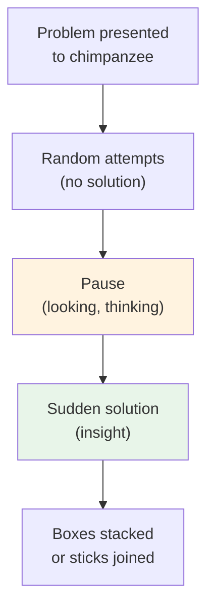

# Chapter 12 · Module 7
# Kohler's Apes and Tolman's Rats
## Psychology · Unit 2 · History of Psychology

---

In 1913, Wolfgang Köhler arrived at the Anthropoid Station on the island of Tenerife, off the coast of West Africa, to study the intelligence of chimpanzees. He would remain there for four years, conducting experiments that would fundamentally challenge the behaviorist account of learning. The station was modest — a few cages, some fruit, and a handful of chimpanzees. But what Köhler demonstrated there was anything but modest.

The most famous experiment involved a chimpanzee named Sultan. Sultan was confronted with a problem: food was hung too high above him to reach. Boxes were strewn about the cage. After some random activity and a good deal of looking at the situation, Sultan suddenly stacked the boxes on top of each other and climbed on them to reach the food. In another experiment, Sultan was given two sticks, neither long enough to reach food placed beyond the cage. After trying each stick separately, Sultan paused, looked at the sticks, and then suddenly joined them together to create a single stick of twice the length. He used it to haul in his reward.

Köhler called this **insight** — the sudden perception of the relationships between elements in a problem situation. It was not trial and error. It was not conditioned reflexes accumulating through reinforcement. It was a reorganization of the perceptual field — a Gestalt.

## Insight Versus Trial and Error

The contrast with Thorndike's cats was stark. Thorndike's cats learned through gradual improvement — random movements slowly eliminated until only the effective response remained. The learning curves were smooth and declining. There was no sudden moment of comprehension.

Köhler's chimpanzees behaved differently. They would try various approaches, fail, pause — and then suddenly solve the problem in a single, fluid action. The solution appeared all at once, as if the animal had suddenly seen the relationships between the elements of the situation. The stacking of boxes, the joining of sticks, the use of a branch as a tool — these were not responses that could be shaped by incremental reinforcement. They were acts of understanding.

Robinson emphasizes the methodological point: all one will learn of the abilities of an animal is what the testing situation permits the animal to perform. Thorndike's puzzle boxes were designed to study trial-and-error learning — and trial-and-error learning is exactly what they found. Köhler's experiments were designed to allow insight — and insight is what he found. The experimental paradigm does not merely measure the animal's abilities. It determines them.

*Figure: Köhler's insight experiments — after random attempts and a pause, the chimpanzee suddenly perceives the solution, suggesting a reorganization of the perceptual field rather than gradual learning.*

> [!TIP] **Stop and Think**
> Thorndike's cats learned through gradual improvement — trial and error. Köhler's chimpanzees solved problems through sudden insight. Is insight just fast trial-and-error? Or is it a fundamentally different process? What does the difference tell you about the relationship between the experimental setup and the kind of learning it reveals?

### Tolman's Cognitive Maps

Across the Atlantic, at the University of California, Berkeley, another researcher was producing findings that challenged the behaviorist orthodoxy from a different angle. Edward Tolman did not study chimpanzees — he studied rats. But his rats did things that the law of effect could not explain.

In a famous series of experiments, Tolman allowed rats to run freely in a maze every day with no food reward at the end. Control groups received food from the start. After ten days of unrewarded exploration, Tolman introduced food into the maze. The rats that had been exploring without reward immediately ran the correct path — faster than rats who had never explored the maze before.

This was **latent learning** — learning that occurs without reinforcement and is not demonstrated until a motive is introduced. The rats had been building a **cognitive map** of the maze during their unrewarded exploration — an internal representation of the spatial layout that they could use when they finally had a reason to use it.

Tolman distinguished between **performance** — which is under the control of rewards and punishments — and **learning** — which occurs whenever a complex organism has perceptual commerce with the immediate environment. Rats permitted to run freely in a maze come to solve the maze more quickly on subsequent occasions when food-reward is introduced. Learning had occurred. The performance simply was not visible until the right motivation appeared.

> [!TIP] **Stop and Think**
> Tolman's rats learned the maze without any reward. They built cognitive maps — internal representations of the spatial layout. When food was finally introduced, they used these maps immediately. What does this tell you about the relationship between reinforcement and learning? Can you learn something without being rewarded for it?

### Transposition: Learning Relations, Not Stimuli

Tolman also demonstrated a phenomenon called **transposition**. In one experiment, an animal was trained to respond to a circle five inches in diameter and not rewarded for responses to a circle two-and-a-half inches in diameter. When subsequently given the choice between five inches and ten inches, the animal chose ten inches — not the five-inch circle with which all previous rewards had been associated.

This was deeply problematic for behaviorism. If the animal had learned a specific stimulus-response connection — "five inches equals food" — it should have chosen the five-inch circle. Instead, it chose the larger of the two options. What was learned was not a specific stimulus but a **relationship** — "the larger one is correct." The animal had abstracted the relational property from the specific stimulus elements.

A more common instance of transposition occurs in music. You recognize a melody played in different keys despite the fact that, from key to key, the actual notes are of completely different frequencies. You are not responding to specific stimuli — you are perceiving a pattern, a relationship, a Gestalt.

> [!TIP] **Stop and Think**
> After learning to choose a five-inch circle over a two-and-a-half-inch circle, Tolman's rats chose a ten-inch circle over a five-inch circle — the opposite of what stimulus-response theory predicts. The rats learned a relationship, not a specific stimulus. If animals learn relationships rather than specific responses, what does this mean for the behaviorist program of reducing all learning to stimulus-response connections?

### Fatal Flaws in the Behaviorist Perspective

From the Gestalt point of view, latent learning and transpositional learning introduce fatal flaws into the traditional behavioristic perspective. Latent learning is judged to be telling evidence against the law of effect — which requires reinforcement if learning is to occur. Transposition is judged to be evidence against associationism — which requires that specific stimuli become associated with specific responses.

Robinson presents the Gestalt critique with precision. It is one thing to assert that the Wundtian-Titchenerian psychology is "subjective," but quite another to deny the relevant immediate experience to the study of man — and all other complex organisms. It is one thing to assert that the conditioned reflex comes about by virtue of the formation of reflex associations among cortical neurons, but quite another to suggest that the brain is capable of only such "connections." It is one thing to demonstrate how practice and reward affect performance, but a very different matter to submit that practice and reward are the only determinants of learning.

The Gestaltists were not returning to introspection. They were not abandoning objectivity. They were insisting that the object of psychological study must include the percept — the organized experience — and not merely the physical stimulus and the behavioral response. The difference is not a matter of method. It is a matter of what counts as a psychological fact.

> [!TIP] **Stop and Think**
> Robinson argues that latent learning and transposition are "fatal flaws" in the behaviorist perspective. But behaviorists responded that these phenomena could be explained by more complex stimulus-response models. Who do you find more convincing — the Gestaltists who saw these as proof of cognition, or the behaviorists who tried to accommodate them within their framework?

> [!TIP] **Stop and Think**
> Tolman distinguished between performance (what you do) and learning (what you know). His rats knew the maze before they had any reason to show it. Think about your own life — what do you know how to do that you have never had reason to demonstrate? What does the distinction between performance and learning mean for how we measure intelligence?

> [!IMPORTANT]
> Köhler's chimpanzees demonstrated insight — the sudden perception of relationships in a problem situation. Tolman's rats demonstrated latent learning — learning without reinforcement — and transposition — learning relationships rather than specific stimuli. Together, these findings showed that organisms do not merely accumulate reinforced responses. They perceive, organize, and represent their environments. The Gestaltists and Tolman did not reject behaviorism's commitment to objectivity. They rejected its commitment to a framework too narrow to accommodate the phenomena they observed. The mind, they insisted, is not a reflex arc. It is a dynamic system that transforms experience into understanding.

## Speaking of Insight and Maps...

- An engineer in Istanbul has been stuck on a design problem for weeks. She has tried every approach she can think of. One morning, while making tea, she suddenly sees the solution — not through a new piece of data, but through a new way of connecting the pieces she already had. This is insight. Köhler's chimpanzees did the same thing with sticks and boxes.

- A taxi driver in London navigates a city of millions using a mental map so detailed that he can reroute instantly when a road is closed. He did not learn these routes through reinforcement — he learned them through years of exploration. His cognitive map, like Tolman's rats', was built without explicit reward.

- A child in Lagos learns to play a song on a keyboard. She learns it in the key of C. When her teacher asks her to play it in the key of G, she transposes instantly — every note changes, but the melody is the same. She has learned the relationships between the notes, not the notes themselves. Tolman's rats did the same thing with circles.

---

Köhler and Tolman showed that organisms perceive, organize, and represent their environments. But their work also raised a question that neither could fully answer: how does the brain accomplish this? The answer would come from an unexpected direction — from physiological psychology, and from two researchers whose names are synonymous with the science of brain and behavior: Ivan Pavlov and Karl Lashley.

*[Module 7 of 10.]*

---

## References

1. Köhler, W. (1925/1959). *The Mentality of Apes*. (E. Winter, Trans.). New York: Vintage Books.
2. Tolman, E. C. (1948). Cognitive maps in rats and men. *Psychological Review, 55*(4), 189–208.
3. Tolman, E. C., & Honzik, C. H. (1930). Introduction and removal of reward, and maze performance in rats. *University of California Publications in Psychology, 4*, 257–275.
