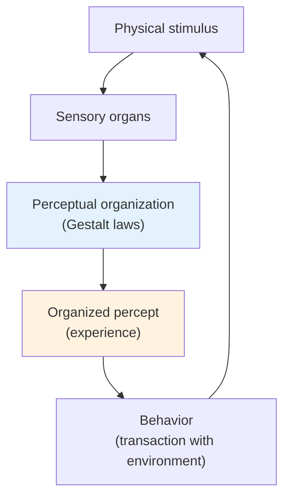

# Chapter 12 · Module 8
# Gestalt Principles and Legacy
## Psychology · Unit 2 · History of Psychology

---

Look at any set of dots arranged in rows and your mind will immediately begin grouping them. If some dots are closer together than others, you see clusters. If some are the same color, you see patterns. You do not decide to do this. You cannot choose to stop. The grouping happens automatically, as if your visual system has rules it follows without consulting you.

The Gestalt psychologists identified these rules and called them laws of perceptual organization. They argued that perception is not a passive recording of sensory data — it is an active process in which the mind imposes structure on experience. The physical world provides the raw materials. The mind builds the house.

This was a direct challenge to what Robinson calls **naive phenomenalism** — the view, held by J. S. Mill, Titchener, and others, that there is a simple relationship between the world of matter and the world of experience. We do not "see" objective stimuli, the Gestaltists argued. We transform them. If we can say, with Mill, that matter is the permanent possibility of sensation, then we must also say that sensation is the permanent possibility of perception.

## The Five Gestalt Theses

The Gestalt position can be summarized in five claims, each supported by experimental evidence.

**First**, organisms do not merely respond to their environments — they have **transactions** with the environment. The relationship is bidirectional. The organism acts on the world, and the world acts on the organism.

**Second**, the "effective stimulus" is not just the physical objects proximate to the animal — it is the outcome of an interaction between the organism's perceptual fields and these physical objects. The effective stimulus must always be specified from the organism's point of view. Ultraviolet radiation, which is central to the environment of the honey bee, does not illuminate the human world.

**Third**, the relationship between experience and brain physiology is **isomorphic**. The structural features of the percept are matched by the structural features of the brain's functional organization. To the extent that experience is not of a reflex nature, the underlying brain physiology also must not be of a reflex nature.

**Fourth**, perception is governed by laws of organization — the organism imposes form (**Gestalt**) or organizational quality (**Gestalt-Qualität**) on the physical environment. By filtering and transforming stimulus elements, the organism deals with the demands of the environment in an economical and orderly way.

**Fifth**, naive phenomenalism must be abandoned. There is not a simple relationship between the world of matter and the world of experience. We do not "see" objective stimuli — we transform them.

*Figure: The Gestalt model of perception — physical stimuli are transformed through perceptual organization into organized percepts, which guide behavior in a continuous transaction with the environment.*

> [!TIP] **Stop and Think**
> The Gestaltists argued that you do not see objective stimuli — you transform them. Dinner plates are seen as round no matter what the angle of regard, even though they project ellipses on the retina. This is **shape constancy** — and it violates the predictions of geometric optics. What does this tell you about the relationship between the physical world and your experience of it?

### Grouping and Constancy

The Gestalt laws of perceptual organization are all around you, operating constantly without your awareness.

**Grouping** is one of the most basic. When you see six lines arranged as three pairs, you do not see six lines — you see three groups of two. Proximity, similarity, closure, continuity, and common fate all determine how elements are grouped. These are not learned associations. They are built into the perceptual system.

**Shape constancy** is another. You see a dinner plate as round even when it projects an ellipse on your retina. You see a door as rectangular even when it is half-open and projects a trapezoid. The perceptual system corrects for the angle of view automatically. This violates the predictions of geometric optics because optics does not take into account the perceptual principle of constancy.

Robinson makes a sharp methodological point: for the behaviorist or introspectionist to dismiss such effects as "illusory" is tantamount to rejecting the bulk of human experience from the domain of psychological inquiry. If your method cannot accommodate shape constancy — the most ordinary of perceptual experiences — then your method is too narrow for the subject matter.

> [!TIP] **Stop and Think**
> Grouping is one of the most basic Gestalt principles. When you see six lines arranged as three pairs, you perceive three groups, not six individual lines. This happens automatically — you cannot choose to see six lines instead of three groups. If perception is organized by principles you cannot control, how much of your experience is really "yours"?

### The Legacy: Piaget and Beyond

Like behaviorism, Gestalt psychology splintered into a generous assortment of derivative enterprises. Not every contemporary cognitive psychologist expresses allegiance to Köhler's formulations, just as many behavioral scientists deny kinship with Watson — and even with Skinner.

But the essentials of the Gestalt system survive and flourish in the work of such European psychologists as Jean Piaget, whose theories of cognitive and moral development take recourse to neo-Hegelian concepts of evolutionary stages and to Gestalt concepts of cognitive organization and neuroperceptual isomorphism. Piaget's stages of development — sensorimotor, preoperational, concrete operational, formal operational — describe how the child's perceptual and cognitive organization becomes increasingly sophisticated. The child does not merely accumulate more information. The child reorganizes the way information is processed.

Psycholinguistics, too, received its impetus from the cognitive elements of the Gestalt psychologists. The idea that language structure is somehow "given" — that the child comes equipped with principles of grammar that cannot be reduced to stimulus-response connections — echoes the Gestalt insistence that the mind imposes structure on experience. Noam Chomsky's critique of behaviorist accounts of language learning in the 1950s was, in a sense, the Gestalt argument applied to a new domain.

Robinson notes that around the world and with ever-increasing comparability, laboratories are engaged in essentially descriptive work designed to establish the extent to which environmental modifications lead to alterations in the measurable features of behavior. Theoretical tensions have subsided, and this must be appreciated as something of a victory for the modern behavioristic injunction against theorizing, physiologizing, and mathematizing. But the victory is incomplete. The mind keeps reasserting itself.

> [!TIP] **Stop and Think**
> Piaget's stages of cognitive development describe how children reorganize their understanding of the world — not just accumulate more facts. A child at the concrete operational stage understands conservation (the amount of water does not change when poured into a different glass) in a way that a preoperational child does not. Is this a Gestalt insight? Or is it something the Gestalt framework cannot fully explain?

> [!TIP] **Stop and Think**
> Chomsky argued that language cannot be learned through stimulus-response conditioning because the input does not contain enough information to explain the output — the "poverty of the stimulus." The child's mind imposes grammatical structure on the language it hears. Is this a modern version of the Gestalt argument? Or is it a fundamentally different claim?

> [!TIP] **Stop and Think**
> Robinson notes that modern laboratories are engaged in essentially descriptive work — establishing how environmental modifications alter measurable behavior. He calls this "something of a victory for the behavioristic injunction against theorizing." But he also notes that the victory is incomplete — the mind keeps reasserting itself. Where do you see the mind reasserting itself in modern psychology?

> [!IMPORTANT]
> The Gestalt principles of perceptual organization — grouping, constancy, closure, continuity — demonstrate that perception is an active process of construction, not a passive recording of stimuli. Shape constancy, transposition, and the phi phenomenon all show that the mind transforms sensory data according to principles that cannot be reduced to stimulus-response connections. The legacy of Gestalt psychology is visible in Piaget's developmental stages, in Chomsky's critique of behaviorist linguistics, and in every contemporary study of how the brain organizes experience. The mind is not a reflex arc. It is a system that imposes order on chaos.

## Speaking of Organization and Legacy...

- A photographer in Buenos Aires composes a shot. She knows that the eye will naturally group nearby objects and follow lines of continuity. She uses these Gestalt principles intuitively — arranging elements so that the viewer's perception does the organizing work. The Gestaltists would recognize her craft immediately.

- A web designer in Seoul arranges elements on a screen. She knows that similar items will be perceived as a group, that proximity creates relationships, that the eye follows paths of continuity. She is applying Gestalt principles every day — principles that were discovered a century ago in Frankfurt laboratories.

- A parent in Nairobi watches her toddler learn to speak. The child does not learn language through stimulus-response conditioning — she learns it by extracting the underlying structure of the language she hears. Chomsky called this the "poverty of the stimulus" argument: the input does not contain enough information to explain the output. The child's mind imposes structure. The Gestaltists would have understood.

---

Gestalt psychology showed that perception is organized by principles that cannot be reduced to stimulus-response connections. But the question remained: how does the brain accomplish this? The answer would come from an unexpected direction — from physiological psychology, and from two researchers whose work on the brain's organization would reshape our understanding of learning and memory: Ivan Pavlov and Karl Lashley.

*[Module 8 of 10.]*

---

## References

1. Köhler, W. (1947). *Gestalt Psychology*. New York: Liveright.
2. Koffka, K. (1935). *Principles of Gestalt Psychology*. New York: Harcourt Brace.
3. Piaget, J. (1952). *The Origins of Intelligence in Children*. New York: International Universities Press.
