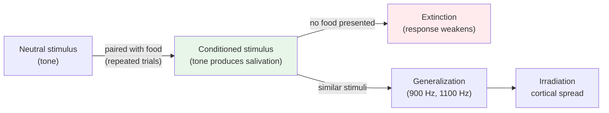

# Chapter 12 · Module 9
# Physiological Psychology — Pavlov and Lashley
## Psychology · Unit 2 · History of Psychology

---

In 1909, Ivan Petrovich Pavlov stood before the Nobel Prize committee in Stockholm and introduced a concept that would reshape the landscape of psychology: the conditioned reflex. Pavlov was being honored for his pioneering research in gastric physiology — his work on the digestive system of dogs. But it was his discovery of a new kind of reflex that would make his name a household word.

"In point of fact," Pavlov told the assembled scientists, "only one thing in life is of actual interest for us — our psychical experience. But its mechanism has been and still remains wrapped in mystery. All human resources — art, religion, literature, philosophy and historical science — have combined to throw light on this darkness. Man has at his disposal yet another powerful resource — natural science with its strictly objective methods."

Pavlov was a physiologist by training and commitment. He was not a behaviorist. His ambition was to articulate the laws of central nervous system function that accounted for the psychological dimensions of life. He had studied in Germany under Carl Ludwig, one of Helmholtz's colleagues, and was a declared physicalist before he ever left Russia. His conditioned reflex was not merely a laboratory technique — it was the foundation of a biological psychology.

## The Pavlovian System

The essentials of Pavlovian conditioning are straightforward. When a neutral stimulus — a tone, a light, a bell — is repeatedly paired with a stimulus that naturally produces a response — food producing salivation — the neutral stimulus acquires the power to elicit the response on its own. The tone becomes a **conditioned stimulus**, and salivation to the tone becomes a **conditioned response**.

But Pavlov's system was far richer than this basic description suggests. He identified several principles that governed the process.

**Extinction** occurs when the conditioned stimulus is presented repeatedly without the unconditioned stimulus. The conditioned response gradually weakens and eventually disappears. The tone, no longer paired with food, loses its power to produce salivation.

**Stimulus generalization** occurs when stimuli physically similar to the conditioned stimulus acquire the power to produce the conditioned response. If a tone of 1000 Hz is conditioned, tones of 900 Hz and 1100 Hz will also produce salivation — but with diminishing magnitude as the frequency difference increases.

**Irradiation** is Pavlov's explanation for generalization. A given stimulus establishes a region of maximum activity within the cortex, and this activity radiates decrementally to adjacent regions. The reflex association is strongest between the original conditioned stimulus and the unconditioned stimulus, and weaker for similar stimuli.

Combined with conditioned excitation, there is **conditioned inhibition** — produced when a second stimulus is presented on all trials when no reward is administered. Responses to the pair of stimuli are weaker than responses to the conditioned stimulus alone.

*Figure: Pavlovian conditioning — a neutral stimulus becomes conditioned through pairing, then generalizes to similar stimuli or extinguishes without reinforcement.*

> [!TIP] **Stop and Think**
> Pavlov's principles — conditioning, extinction, generalization, irradiation — are the central elements of his biological psychology. Robinson notes that conceptually, this is scarcely different from the reflex-association of Hartley or Descartes, with the dualism removed. But procedurally, it is radically different because of its reliance on laboratory investigation and quantitative measurement. Does the method make the science, or does the theory?

### Lashley's Challenge

The case for Pavlovian psychology was stated against the background of data, and criticism was to take an experimental form. It came chiefly from Karl Spencer Lashley, a psychologist trained in anatomy who spent his life studying the brain's role in learning and memory.

Lashley and Watson were colleagues at Johns Hopkins and even coauthored a paper on homing behavior in birds. But Lashley was neither a mentalist nor an idealist. He was, however, quick to discern the deficiencies of the biological associationism fostered by Pavlov and his American disciples. If we were to summarize his role, Robinson suggests, he bore the same relationship to the Pavlovians that Flourens bore to the phrenologists.

Like Flourens, Lashley was familiar with clinical findings in neurology and neurosurgery and knew that no simple relationship existed between a particular locus in the brain and complex psychological processes such as perception, learning, and memory. Like Köhler, he subscribed to a form of isomorphism regarding this relationship. But unlike the Gestaltists, Lashley did not merely speculate about the nervous system — he examined it directly.

His studies of the effects of surgical destruction of brain regions in animals trained to perform various discriminations proved that complex abilities survive the removal or maceration of even extensive amounts of cortical tissue. But other studies also revealed substantial effects when restricted regions were disturbed or removed.

> [!TIP] **Stop and Think**
> Lashley's experiments showed that complex abilities survive the removal of large amounts of cortical tissue — but that restricted damage can also have substantial effects. If the brain is not a telephone switchboard with specific connections for specific functions, how does it work? What does Lashley's evidence suggest about the relationship between brain structure and psychological function?

### Mass Action and Equipotentiality

Lashley framed two broad principles to account for his data.

**Mass action** conveyed the idea that when it comes to complex psychological processes, the brain functions as a whole and is to be understood as a whole. The brain is not a collection of independent modules, each handling a specific function. It is an integrated system whose properties emerge from the interaction of its parts.

**Equipotentiality** was invented to account for the perplexing fact that surgically produced deficits disappear in time. The deficits indicate that particular regions do serve specific functions, but postoperative recovery indicates that other regions are able to assume these functions when the primary area has been destroyed or removed. The brain is plastic — it can reorganize itself.

Lashley's experiments were clever and dramatic. A cat is equipped with an eye patch covering the right eye and learns a visual discrimination — jumping toward a circle but not a triangle. Once the animal has learned to criterion, the patch is switched to the left eye. On the very first test trial, the cat performs as well as it did on the last training trial. Since the optic nerve involved in original learning is not involved in the test, the neural "associations" cannot be specific to one eye's input.

In another experiment, Lashley compressed the motor roots of the spinal cord, paralyzing one limb. The animal learned a task with the other limb. Then Lashley compressed the motor root on the opposite side. The initially treated limb had recovered by now. How did the animal perform? Perfectly. The limb that was not and could not have been involved in the actual learning was used as effectively as the trained limb.

> [!TIP] **Stop and Think**
> Lashley showed that an animal trained with one eye can perform perfectly when tested with the other eye — even though the optic nerves are different. And an animal trained with one limb can perform perfectly with the other limb — even though that limb was not involved in learning. What does this tell you about where learning "lives" in the brain? Is it localized, or distributed?

### The Search for the Engram

Lashley's most significant finding concerned memory. He demonstrated in a variety of experimental settings that the animal's ability to acquire a complex behavioral repertoire and to reproduce it after a long retention interval was not systematically related to specific loci within the cerebral cortex.

He remarked whimsically that, after searching for the **engram** — the physical trace of memory in the brain — for many years, he was forced to conclude that learning was simply not possible! Behind the wry comment was the caveat that the brain is not one of La Mettrie's clocks, nor is man Condillac's sentient statue. The brain is not a machine with specific parts for specific functions. It is a dynamic system whose organization cannot be reduced to the sum of its parts.

Robinson notes that more recent findings have shown that Lashley may have been too pessimistic about localization and was certainly misled by his focus on the cerebral cortex to the exclusion of subcortical mechanisms. But these findings have not led to a rejection of his central message: the brain does not work like a telephone switchboard.

> [!TIP] **Stop and Think**
> Lashley searched for the engram — the physical trace of memory in the brain — and concluded that learning was "simply not possible" (meaning that no specific brain location stores specific memories). Modern neuroscience has found that memories are distributed across neural networks. Was Lashley right? Or was he right about the principle but wrong about the details?

> [!TIP] **Stop and Think**
> Pavlov's system was conceptually similar to the reflex-association theories of Hartley and Descartes, but procedurally different because of its reliance on laboratory investigation and quantitative measurement. Does the method make the science? If Pavlov had described his findings in philosophical language rather than experimental language, would they have been as influential?

> [!IMPORTANT]
> Pavlov's conditioned reflex and Lashley's mass action represent two fundamentally different views of how the brain supports psychology. Pavlov showed that simple associations can be formed through conditioning — a tone paired with food produces salivation. Lashley showed that complex abilities survive the destruction of brain tissue and that learning is not localized to specific neural connections. Together, they demonstrate that the brain is neither a simple reflex machine nor a collection of independent modules. It is a dynamic, plastic, integrated system — capable of reorganization, capable of abstraction, and irreducible to the sum of its parts. The behaviorist hope of reducing psychology to reflex connections was undermined not by philosophers but by physiologists.

## Speaking of Brains and Maps...

- A stroke patient in London loses the ability to speak. Within months, neighboring brain regions assume the function. The patient's speech returns — imperfect, but functional. Lashley's principle of equipotentiality is at work. The brain reorganizes itself.

- A musician in Seoul practices the piano for hours every day. Brain scans show that the regions controlling her fingers have expanded — the brain has physically reorganized in response to experience. This is plasticity, and it is exactly what Lashley described.

- A neuroscientist in São Paulo studies place cells in the hippocampus — neurons that fire when an animal is in a specific location. These cells form a cognitive map of the environment. Tolman predicted such maps in 1948. O'Keefe discovered them in 1971. Pavlov's reflexes and Lashley's mass action are both part of the story — but the story is richer than either alone could tell.

---

Pavlov and Lashley showed that the brain is more complex than any single psychological system has yet captured. The conditioned reflex is real, but it is not the whole story. Mass action is real, but it does not explain everything. The brain is a dynamic system that supports perception, learning, memory, language, and consciousness — and no single framework has yet united all of these into a coherent science. Robinson's final chapter draws the threads together and asks a question that has haunted psychology since its inception: what is psychology, and can it ever be a science?

*[Module 9 of 10.]*

---

## References

1. Pavlov, I. P. (1927). *Conditioned Reflexes*. (G. V. Anrep, Trans.). London: Oxford University Press.
2. Lashley, K. S. (1960). *The Neuropsychology of Lashley: Selected Papers*. (F. A. Beach, Ed.). New York: McGraw-Hill.
3. O'Keefe, J., & Nadel, L. (1978). *The Hippocampus as a Cognitive Map*. Oxford: Clarendon Press.
