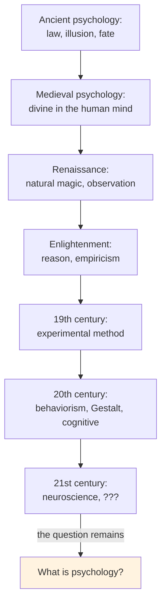

# Chapter 12 · Module 10
# Defining Psychology
## Psychology · Unit 2 · History of Psychology

---

You have spent this book traveling through twenty-five centuries of ideas about the mind, the soul, and the behavior of living things. You have met Aristotle classifying the souls of plants, animals, and humans. Augustine wrestling with the will. Aquinas reconciling faith and reason. Descartes splitting mind from body. Locke filling the empty cabinet. Hume dissolving causation into habit. Kant rebuilding knowledge from the inside out. Darwin placing humans on the same tree of life as every other species. Wundt building the first laboratory. Watson burning the laboratory down. Skinner rebuilding it without a mind. And now you arrive at the end — or rather, at the present — and Robinson asks you to consider a possibility that is both humbling and liberating: psychology is not a science that has not yet matured. It is a human enterprise that has always been, and will always be, a reflection of the civilization that produces it.

## Psychology as the History of Ideas

Robinson's final claim is audacious: psychology is not a discipline waiting to become a science. It is the history of ideas. The systems of psychology we create — behaviorism, psychoanalytic theory, neuropsychology, phrenology, utilitarianism, pragmatism — all reveal those qualities of mind, objects of hope, collections of values and perceptions unique to our species.

This is not a defeat. It is a recognition. Every age finds an idea that seems to reveal something common to the major events that occupy that age. Science both leads and follows the ages in which it is situated. The psychologists of antiquity looked at their age and discovered law, illusion, cultural variety, courage, deception, and fate. Their psychologies made room for all of these. Writers in the Middle Ages believed in a personal God of salvation and justice, and medieval psychology found the divine in the human mind. And so on, down to our own time.

The world we create comes, first, to serve as the metaphor of ourselves and, soon, as the reality of which we are but models or copies. Failing to find purpose and design in our own world, we question the existence of purpose or design in ourselves. Looking everywhere and discovering only matter in motion, we begin to see the same in the mirror.

> [!TIP] **Stop and Think**
> Robinson claims that "psychology is the history of ideas." If he is right, then every psychological system — from Aristotle's tripartite soul to Skinner's operant conditioning — tells us more about the culture that produced it than about the mind it claims to describe. Is this a limitation of psychology, or is it the point of psychology?

### The Danger of Stagnation

Robinson warns of a danger that has haunted psychology throughout its history: the danger of stagnation through complacent certainty.

There is, he writes, a sure road to intellectual atrophy, and it is paved with the complacent certainty that one's methods have already been settled. Consistently, the defenders of a scientific psychology have been ready to dismiss as "idealism" nearly the entire range of competing claims. Equally indiscriminately they have declared physics to be the ultimate arbiter, evolutionary notions to be unimpeachable, and practical success to be the final criterion of validity.

But this cannot succeed. Fundamental debates about the possibility of a scientific understanding of things are not settled by appeals to science — for these are only begging the question. If it were the case that mental events capable of bringing about behavior violated the second law of thermodynamics, then so be it — just in case there are such events and just in case they do, in fact, have behavioral consequences. A fact of experience cannot be undone by a theory that legislates against it.

As for evolutionary theory, it is primarily a narrative account — a kind of natural history of life. There is nothing in the theory that sets limits on the phenotypes that might arise from evolutionary pressures, nor is there any requirement that these phenotypes will be the same throughout phylogeny. Uniformity is not to be expected, and when exceptions arise, they are not to be dismissed but explained. It is the theory that is on trial, not the facts.

*Figure: Psychology's recurring question — from antiquity to the present, each age reinvents the discipline in its own image.*

> [!TIP] **Stop and Think**
> Robinson argues that fundamental debates about the possibility of a scientific psychology cannot be settled by appeals to science itself — that would be begging the question. If he is right, what can settle them? Philosophy? History? Personal experience? Or are they simply undecidable?

### The Mind in the Mirror

Robinson's final pages are both a lament and a celebration. He notes that it is one of the quiet triumphs of the human mind that it can exhaust itself in attempting to refute its existence. With total abandon, we set out to establish the fiction of our autonomy, thereby establishing it still further.

It is not uncommon for the scientifically committed psychologist to express disbelief when scholars entertaining other perspectives insist that a scientific account of human action and human experience is not any nearer than it was in pre-Socratic times. There is, mixed with this disbelief, a conviction that those who do not subscribe to scientific accounts are clutching at the straws of metaphysical dualism and religious mysticism.

But Robinson's point is subtler. He is not rejecting science. He is rejecting the claim that science has settled the question. To believe, for example, that studies of the behavior of nonhuman organisms is not likely to illuminate the factors responsible for human conduct is not a rejection of Darwinian theory. To question whether neurophysiological findings bear directly on the question of psychic causation is not to question determinism.

The danger, Robinson insists, is stagnation — for if there is a sure road to intellectual atrophy, it is paved with the complacent certainty that one's methods have already been settled. Psychology's history is but a profile of the larger history of civilization. As a creation of human intelligence, it teaches by error as well as success.

> [!TIP] **Stop and Think**
> Robinson concludes that "psychology is the history of ideas." You have now traveled through twenty-five centuries of those ideas — from Aristotle's soul to Skinner's operant, from Hippocrates' humors to Lashley's engrams. What have you learned about the mind? What have you learned about the people who studied it? And what question would you ask next?

> [!TIP] **Stop and Think**
> Robinson warns that the danger in psychology is stagnation through complacent certainty — the conviction that one's methods have already been settled. He writes: "A fact of experience cannot be undone by a theory that legislates against it." If you experience free will, and a theory says free will is an illusion, which should you trust — your experience or the theory? Can a theory that denies experience still be a science of experience?

> [!TIP] **Stop and Think**
> Every psychological system you have studied in this book — Aristotle's soul, Descartes's dualism, Watson's behaviorism, Skinner's operant conditioning — was a product of its time. What is the defining psychological idea of your time? Is it the brain as a computer? As a prediction machine? As a social organ? And how will future historians judge it?

> [!IMPORTANT]
> Psychology is not a science that has failed to mature. It is a human enterprise that has always been — and will always be — a reflection of the civilization that produces it. Each age finds in the mind a mirror of its own values: the Greeks found reason and fate; the medievals found the divine; the moderns found mechanism. The danger is not that psychology lacks a unifying theory. The danger is that it mistakes its methods for its subject matter and its metaphysics for its science. The history of psychology teaches that progress is retarded when scholars fail to distinguish between the metaphor and the fact it is intended to represent. The past speaks to the modern world. It tells us not that science has failed but that it has limitations; not that psychology is pointless or immature but that, as with all intellectual ventures, it is incomplete and evolving.

## Speaking of Histories and Mirrors...

- A graduate student in Delhi reads this book and realizes that the "cutting-edge" theories in her textbooks — embodied cognition, predictive processing, Bayesian brain — are echoes of ideas that Aristotle, Kant, and Helmholtz explored centuries ago. The theories are more precise. The questions are the same.

- A philosopher in Lagos asks: "If psychology is the history of ideas, then what is the idea that defines our age?" Is it computation? Is it plasticity? Is it the brain as a prediction machine? Or is it something we cannot yet see — something that future historians will identify as the defining metaphor of the early twenty-first century?

- A teacher in Mexico City finishes this book and thinks about her students. They come to psychology expecting answers — about why people behave as they do, about what makes them who they are. She tells them: "The history of psychology is the history of the questions we have asked about ourselves. The answers change. The questions remain."

---

You have reached the end of this intellectual history — but not the end of the story. Psychology's history is but a profile of the larger history of civilization. As a creation of human intelligence, it teaches by error as well as success. The systems of psychology we create, even when steeped in blunders and contradiction, are our creations and thus teach us something about ourselves. Behaviorism and psychoanalytic theory, neuropsychology and phrenology, utilitarianism and pragmatism — all reveal those qualities of mind, objects of hope, collections of values and perceptions unique to our species, one of myriad species. The present work began as an attempt to locate psychology in the history of ideas. It concludes with the obvious recognition that psychology *is* the history of ideas.

*[Module 10 of 10.]*

---

## References

1. Robinson, D. N. (1995). *An Intellectual History of Psychology* (3rd ed.). Madison: University of Wisconsin Press.
2. Skinner, B. F. (1971). *Beyond Freedom and Dignity*. New York: Knopf.
3. Lashley, K. S. (1960). *The Neuropsychology of Lashley*. (F. A. Beach, Ed.). New York: McGraw-Hill.
